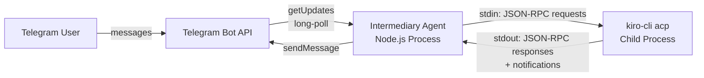
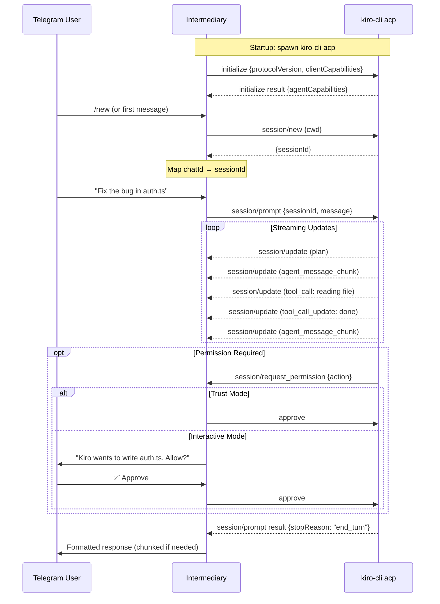

# Design Document: Telegram–Kiro CLI Bridge

## Overview

This is a standalone intermediary agent that bridges Telegram to Kiro CLI via the Agent Client Protocol (ACP). It is not an OpenClaw plugin, not a fork of anything — it's a lean, purpose-built Node.js process where every line is understood by the developer.

The intermediary long-polls Telegram for messages, spawns `kiro-cli acp` as a child process, and translates between Telegram's Bot API and Kiro's ACP (JSON-RPC 2.0 over stdio). Kiro CLI does all the AI work — this bridge is just the secure plumbing.

No MCP integration (forbidden at corporate level). No web server, no exposed ports, no webhooks. Outbound-only network traffic to Telegram's API. Security is enforced by a Telegram user ID whitelist with fail-closed defaults.

## Architecture



```mermaid
graph TD
    subgraph "Intermediary Agent"
        TP[Telegram Poller<br/>Long-poll getUpdates]
        SG[Security Gate<br/>User ID Whitelist]
        SM[Session Manager<br/>Chat ID → ACP Session]
        ACP[ACP Client<br/>JSON-RPC over stdio]
        RF[Response Formatter<br/>Markdown → Telegram]
        PH[Permission Handler<br/>Approve / Forward to User]
    end

    subgraph "External"
        TAPI[Telegram Bot API]
        KIRO[kiro-cli acp]
    end

    TAPI -->|Update[]| TP
    TP -->|message| SG
    SG -->|authorized| SM
    SM -->|session context| ACP
    ACP -->|stdin| KIRO
    KIRO -->|stdout notifications| ACP
    ACP -->|session/request_permission| PH
    PH -->|decision| ACP
    ACP -->|aggregated response| RF
    RF -->|sendMessage| TAPI
    SG -.->|rejected: silent drop| TP
```

## ACP Protocol Flow



## Components and Interfaces

### Component 1: Telegram Poller

**Purpose**: Long-polls Telegram Bot API for incoming messages. No webhooks, no HTTP server, no exposed ports.

**Responsibilities**:
- Call `getUpdates` with offset tracking and configurable timeout (default 30s)
- Parse `Update` objects, extract text messages and commands
- Exponential backoff with jitter on API errors (1s → 2s → 4s → ... → 60s cap)
- Graceful shutdown via AbortController
- Never self-terminates — always retries

### Component 2: Security Gate

**Purpose**: Enforces Telegram user ID whitelist. Every inbound message passes through this gate before anything else happens.

**Responsibilities**:
- Load allowed user IDs from `.env` config (`ALLOWED_USER_IDS`)
- Validate `message.from.id` against the whitelist
- Silent rejection of unauthorized users (no response, no information leakage)
- Empty whitelist = refuse to start (fail-closed)

### Component 3: Session Manager

**Purpose**: Maps Telegram chat IDs to ACP sessions. Handles session lifecycle.

**Responsibilities**:
- Maintain a map of `telegramChatId → SessionState`
- Create new ACP sessions on first message or `/new` command
- Handle `/reset` to destroy session and create fresh one
- Detect stale/crashed sessions and recreate them
- Optionally persist session mappings to disk for restart survival

### Component 4: ACP Client (Kiro Bridge)

**Purpose**: Manages the `kiro-cli acp` child process and handles all JSON-RPC 2.0 communication over stdin/stdout.

**Responsibilities**:
- Spawn `kiro-cli acp` as a child process
- Send JSON-RPC requests (`initialize`, `session/new`, `session/prompt`, `session/cancel`)
- Receive and route JSON-RPC responses and notifications (`session/update`)
- Collect streamed `session/update` notifications and aggregate them
- Handle process crashes: detect exit, notify user, restart process
- Manage request ID tracking for correlating responses

**ACP Client Capabilities Advertised**:
- `fs.readTextFile`: true
- `fs.writeTextFile`: true
- `terminal`: true

### Component 5: Permission Handler

**Purpose**: Handles `session/request_permission` messages from Kiro when it wants to perform dangerous operations (file writes, shell commands).

**Responsibilities**:
- In trust mode (`TRUST_MODE=true`): auto-approve all permission requests
- In interactive mode: forward permission request to Telegram user as inline keyboard (Approve / Deny)
- Wait for user response with configurable timeout (default 60s)
- Auto-deny on timeout
- Respond back to Kiro with the decision via JSON-RPC

### Component 6: Response Formatter

**Purpose**: Converts aggregated ACP responses into Telegram-friendly messages.

**Responsibilities**:
- Collect `agent_message_chunk` notifications into complete responses
- Format tool call status updates (e.g., "🔧 Reading auth.ts..." → "✅ Done")
- Chunk long responses to fit Telegram's 4096-character limit (split at paragraph/code block boundaries)
- Convert Markdown to Telegram MarkdownV2 or HTML parse mode
- Handle plan updates as optional status messages

## Data Models

### Configuration (from .env)

```
TELEGRAM_BOT_TOKEN        # Telegram bot token (required)
ALLOWED_USER_IDS          # Comma-separated Telegram user IDs (required, non-empty)
KIRO_CLI_PATH             # Path to kiro-cli binary (default: "kiro-cli")
WORKING_DIR               # Working directory for Kiro sessions (default: cwd)
TRUST_MODE                # Auto-approve permission requests (default: false)
PERMISSION_TIMEOUT_MS     # Timeout for interactive permission prompts (default: 60000)
POLL_TIMEOUT_S            # Telegram long-poll timeout (default: 30)
```

**Validation Rules**:
- `TELEGRAM_BOT_TOKEN` must be non-empty, match format `\d+:[A-Za-z0-9_-]+`
- `ALLOWED_USER_IDS` must contain at least one valid numeric ID (empty = refuse to start)
- `KIRO_CLI_PATH` must resolve to an executable
- `WORKING_DIR` must be an existing directory

### Session State

```
SessionState {
  telegramChatId    number              // Telegram chat identifier
  acpSessionId      string              // ACP session ID from kiro-cli
  kiroProcess       ChildProcess        // Reference to spawned kiro-cli process
  pendingRequestId  number | null       // Current in-flight JSON-RPC request ID
  isProcessing      boolean             // Whether a prompt is currently being processed
  createdAt         number              // Unix timestamp ms
  lastActivityAt    number              // Unix timestamp ms of last message
}
```

### ACP Message Envelope (JSON-RPC 2.0)

```
Request {
  jsonrpc           "2.0"
  id                number
  method            string              // "initialize" | "session/new" | "session/prompt" | "session/cancel"
  params            object
}

Response {
  jsonrpc           "2.0"
  id                number
  result            object | null
  error             { code, message, data } | null
}

Notification {
  jsonrpc           "2.0"
  method            string              // "session/update" | "session/request_permission"
  params            object
}
```

### Pending Permission Request

```
PendingPermission {
  acpRequestId      string              // ID to respond back to Kiro
  action            string              // What Kiro wants to do (e.g., "write file auth.ts")
  telegramMessageId number              // Message ID of the inline keyboard sent to user
  timeoutHandle     NodeJS.Timeout      // Auto-deny timer
  resolve           (approved: boolean) => void  // Promise resolver
}
```

## Error Handling

### Kiro Process Crash

**Condition**: `kiro-cli acp` child process exits unexpectedly
**Response**: Notify the Telegram user ("Kiro session ended unexpectedly. Starting a fresh session."). Respawn the process and create a new ACP session.
**Recovery**: Automatic. Previous session context is lost (Kiro manages its own session state internally).

### Telegram API Errors

**Condition**: Telegram returns 4xx/5xx or network timeout during polling or sending
**Response**: Exponential backoff with jitter. Log warning.
**Recovery**: Automatic retry. Never self-terminates. After sustained failures, continues retrying indefinitely.

### ACP Protocol Errors

**Condition**: Kiro returns a JSON-RPC error response (invalid session, protocol mismatch, etc.)
**Response**: Log the error. Send a friendly message to the Telegram user explaining the issue.
**Recovery**: For session errors, attempt to create a new session. For protocol errors, restart the Kiro process.

### Permission Timeout

**Condition**: User doesn't respond to a permission prompt within the configured timeout
**Response**: Auto-deny the permission request. Notify the user that the action was denied due to timeout.
**Recovery**: Kiro receives the denial and adjusts its behavior (may ask the user for an alternative approach).

### Message During Active Processing

**Condition**: User sends a new message while a previous prompt is still being processed
**Response**: Queue the message or notify the user that the previous request is still in progress.
**Recovery**: Process queued messages after the current prompt completes.

## Testing Strategy

### Unit Testing

- Security Gate: whitelist enforcement, empty list rejection, unknown user silent drop
- Session Manager: chat-to-session mapping, stale session detection, `/new` and `/reset` handling
- ACP Client: JSON-RPC message framing, request ID correlation, notification routing
- Response Formatter: Markdown → Telegram conversion, chunking at 4096-char boundaries, code block preservation
- Permission Handler: trust mode auto-approve, interactive mode flow, timeout auto-deny

### Integration Testing

- Full message flow with mocked Telegram API and mocked kiro-cli process
- ACP protocol handshake (initialize → session/new → session/prompt → collect updates)
- Permission request round-trip (Kiro requests → user approves via Telegram → Kiro receives approval)
- Process crash recovery: kill kiro-cli, verify restart and user notification
- Multi-turn conversation: verify session reuse across messages

### Property-Based Testing

**Library**: fast-check

- Response chunking: all chunks ≤ 4096 chars, concatenation equals original
- Security gate is pure: same user ID always produces same authorization result
- JSON-RPC framing: any valid message serializes and deserializes to the same structure
- Session manager never maps two chat IDs to the same ACP session

## Security Considerations

### Zero Network Surface

- No HTTP server, no webhooks, no WebSocket listeners, no exposed ports
- All communication is outbound-only: Telegram Bot API + kiro-cli stdio
- The process has no attack surface from the network

### Secret Management

- All secrets in `.env` file (bot token, user IDs)
- No hardcoded keys anywhere in the codebase
- No LLM API keys needed — Kiro CLI handles its own authentication

### Access Control

- Telegram user ID whitelist is the sole authentication mechanism
- Empty whitelist = process refuses to start (fail-closed)
- Unauthorized messages are silently dropped (no error response, no information leakage)
- No admin escalation — all whitelisted users have equal access

### No MCP

- MCP is explicitly forbidden at corporate level
- This project uses ACP (Agent Client Protocol) exclusively
- ACP communicates over local stdio only — no network protocol involved

### Permission Gating

- Kiro's own permission system gates dangerous operations (file writes, shell commands)
- The intermediary adds a second layer: forwarding permission requests to the Telegram user
- Trust mode available for personal use where auto-approval is practical
- Default is interactive mode (safer)

## Dependencies

### Runtime

- Node.js 22+ (native `fetch`, `child_process`, ES modules)
- `kiro-cli` binary installed and accessible in PATH (or configured via `KIRO_CLI_PATH`)

### NPM Packages

- None required for core functionality
- Native `fetch` for Telegram API calls
- `node:child_process` for spawning kiro-cli
- `node:readline` for parsing newline-delimited JSON-RPC from stdout
- `node:fs/promises` for optional session persistence
- `dotenv` for `.env` loading (single external dependency, or use Node 22's `--env-file`)

### What This Project Does NOT Need

- No LLM API keys (Kiro handles that)
- No external HTTP libraries
- No MCP servers or clients
- No web framework
- No database

## Design Decisions

| Decision | Rationale |
|----------|-----------|
| ACP over stdio | Standard protocol Kiro CLI supports for programmatic integration. Local-only, no network surface. |
| Long-polling over webhooks | Avoids exposing any ports or network surface. Simpler deployment. |
| One kiro-cli process per session | Process isolation between sessions. Clean restart on crash. |
| Trust mode option | For personal use, auto-approving permissions is practical and avoids friction. |
| No MCP | Corporate-level prohibition. ACP provides everything needed. |
| Standalone project (not OpenClaw plugin) | Full control, no framework dependencies, every line understood. |
| Minimal dependencies | Native Node.js APIs cover all needs. Only `dotenv` (or `--env-file`) as optional external dep. |
| Fail-closed security | Empty whitelist = refuse to start. Unauthorized = silent drop. No information leakage. |


## Correctness Properties

*A property is a characteristic or behavior that should hold true across all valid executions of a system — essentially, a formal statement about what the system should do. Properties serve as the bridge between human-readable specifications and machine-verifiable correctness guarantees.*

### Property 1: Offset tracking after updates

*For any* sequence of Telegram updates with arbitrary `update_id` values, after the Telegram_Poller processes them, the next `getUpdates` call offset should equal `max(update_id) + 1`.

**Validates: Requirement 1.1**

### Property 2: Exponential backoff bounds

*For any* number of consecutive failures N, the computed backoff delay should be at most `min(2^N * 1000, 60000)` milliseconds, and the jittered delay should be in the range `[0, base_delay]`.

**Validates: Requirement 1.3**

### Property 3: Security gate whitelist enforcement

*For any* user ID and any non-empty whitelist, the Security_Gate authorizes the message if and only if the user ID is present in the whitelist. Unauthorized messages produce no output or side effects visible to the sender.

**Validates: Requirements 2.2, 2.3, 2.4, 9.4**

### Property 4: Session routing correctness

*For any* sequence of messages from distinct Telegram chat IDs, the Session_Manager creates a new ACP session on the first message from each chat ID and reuses the existing session for all subsequent messages from the same chat ID.

**Validates: Requirements 3.1, 3.2**

### Property 5: Session uniqueness invariant

*For any* sequence of session creation and reset operations across multiple chat IDs, no two distinct Telegram chat IDs are ever mapped to the same ACP session ID simultaneously.

**Validates: Requirement 3.5**

### Property 6: Reset produces a new session

*For any* chat ID with an existing session, executing a `/reset` command results in the chat ID being mapped to a different ACP session ID than before the reset.

**Validates: Requirement 3.3**

### Property 7: JSON-RPC request ID correlation

*For any* sequence of JSON-RPC requests sent to `kiro-cli acp`, each response received is correlated to the correct originating request by matching the `id` field.

**Validates: Requirement 4.6**

### Property 8: JSON-RPC message round-trip

*For any* valid JSON-RPC message (request, response, or notification), serializing to a newline-delimited string and parsing back produces an equivalent structured object.

**Validates: Requirement 4.4**

### Property 9: Trust mode always approves

*For any* `session/request_permission` notification received while Trust_Mode is enabled, the Permission_Handler responds with an approval decision.

**Validates: Requirement 5.1**

### Property 10: Response chunk size limit

*For any* string input, all chunks produced by the Response_Formatter are at most 4096 characters in length.

**Validates: Requirement 6.2**

### Property 11: Response chunking preserves content

*For any* string input, concatenating all chunks produced by the Response_Formatter yields the original input string.

**Validates: Requirements 6.1, 6.2**

### Property 12: Code block integrity in chunks

*For any* input containing fenced code blocks, no chunk produced by the Response_Formatter contains an unmatched code fence (every opening fence within a chunk has a corresponding closing fence, or the chunk boundary aligns with a code block boundary).

**Validates: Requirement 6.3**

### Property 13: Bot token validation

*For any* string, the configuration validator accepts it as a valid `TELEGRAM_BOT_TOKEN` if and only if it matches the pattern `\d+:[A-Za-z0-9_-]+`.

**Validates: Requirement 7.1**

### Property 14: User ID list validation

*For any* string, the configuration validator accepts it as a valid `ALLOWED_USER_IDS` if and only if, after splitting on commas and trimming whitespace, it contains at least one non-empty numeric value.

**Validates: Requirement 7.2**

### Property 15: Invalid configuration prevents startup

*For any* configuration where at least one required field is missing or invalid, the Bridge refuses to start and produces an error message identifying the invalid field.

**Validates: Requirement 7.5**
