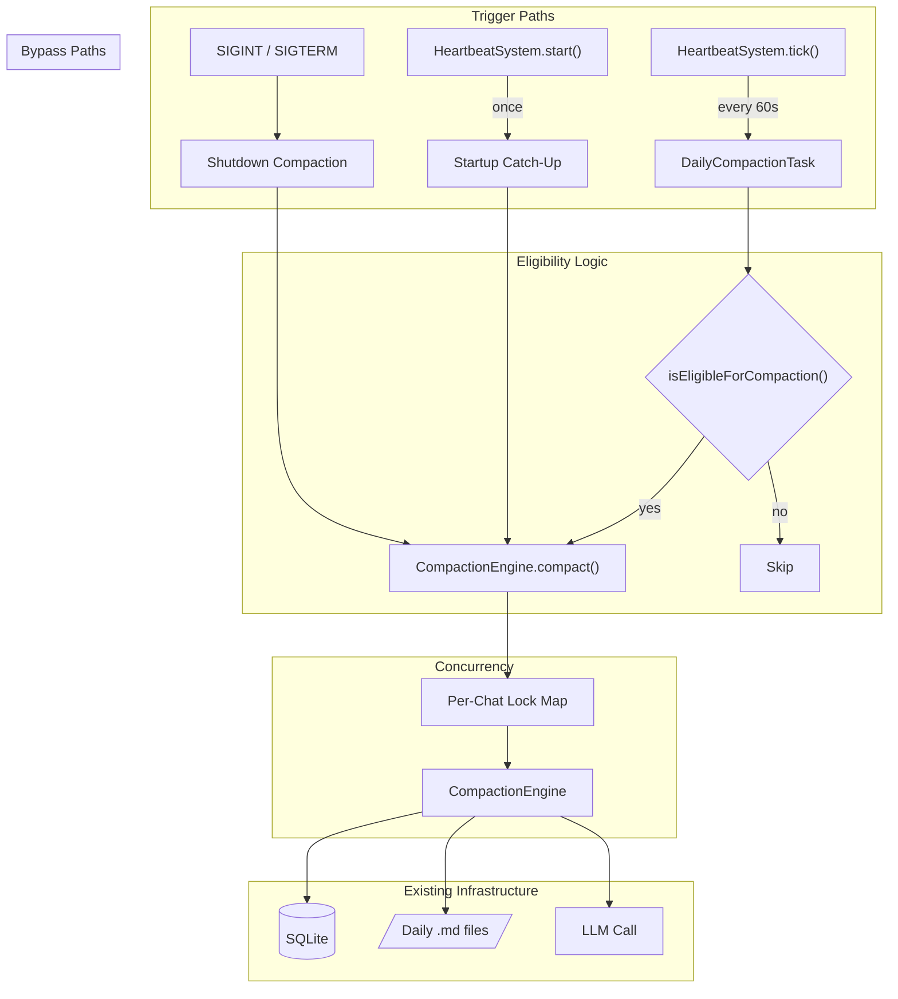

# Design Document: Auto Daily Compaction

## Overview

This feature adds automatic daily compaction triggering to the existing heartbeat loop. Currently, `CompactionEngine.compact()` exists but requires manual invocation. We introduce three automatic trigger paths:

1. **Heartbeat-driven**: A new `daily-compaction` heartbeat task checks every 60s whether any chat has crossed its inactivity-gap day boundary and compacts eligible sessions.
2. **Startup catch-up**: On `HeartbeatSystem.start()`, all chats are scanned for uncompacted sessions from previous calendar days and compacted immediately (skipping the inactivity gap).
3. **Shutdown compaction**: On SIGINT/SIGTERM, all active sessions are compacted before the process exits (skipping both gap and midnight checks).

The design reuses `CompactionEngine.compact()` as-is (it already handles appending to existing daily files with `---` separators). The key new logic is the **eligibility check** — a pure function that determines whether a session should be compacted based on current time, last message timestamp, and the configured inactivity gap.

### Key Design Decisions

| Decision | Rationale |
|---|---|
| Inactivity gap measured from last message, not midnight | Late-night sessions (e.g., 2am) shouldn't be split mid-conversation |
| File naming uses message date, not execution date | Already handled by modifying `CompactionEngine.compact()` to accept an optional date override |
| Startup catch-up skips inactivity gap | Previous-day messages are definitively "done" — no reason to wait |
| Shutdown compaction skips all checks | User is leaving; compact everything to avoid data loss |
| Per-chat mutex via `Map<number, Promise>` | Lightweight, no external deps, prevents duplicate compactions |
| `shutdown()` becomes async | Required to `await` compaction before `process.exit()` |

## Architecture



### Integration Points

- **HeartbeatSystem**: New task registered between `memory-extraction` and `consolidation`.
- **MemoryManager**: Gains `dayBoundaryHours` config field, `shutdownCompaction()` async method, and the per-chat lock map.
- **CompactionEngine.compact()**: Modified to accept an optional `compactionDate` parameter for message-date-based file naming.
- **main.ts `shutdown()`**: Becomes `async` to await `MemoryManager.shutdownCompaction()`.
- **memory-config.ts**: New `MEMORY_DAY_BOUNDARY_HOURS` env var parsed via `parseNumberEnvSafe`.

## Components and Interfaces

### 1. `DailyCompactionTask` (new module)

A standalone module exporting a factory function that creates the heartbeat task and the startup catch-up runner.

```typescript
// src/components/daily-compaction-task.ts

export type DailyCompactionDeps = {
  db: Database.Database;
  config: MemoryConfig;
  transcriptParser: TranscriptParser;
  memoryIndex: MemoryIndex;
  getLlmCall: () => ((prompt: string, content: string) => Promise<string>) | null;
  acquireLock: (chatId: number) => Promise<() => void> | null;
};

/** Pure eligibility check — exported for testing. */
export function isEligibleForCompaction(params: {
  lastMessageTimestamp: number;
  now: number;
  dayBoundaryHours: number;
}): boolean;

/** Get uncompacted sessions for a given chat. */
export function getUncompactedSessions(
  db: Database.Database,
  chatId: number,
): Array<{ sessionId: string; lastMessageTimestamp: number }>;

/** Create the heartbeat task for daily compaction. */
export function createDailyCompactionTask(
  deps: DailyCompactionDeps,
): HeartbeatTask;

/** Run startup catch-up: compact all previous-day uncompacted sessions. */
export async function runStartupCatchUp(
  deps: DailyCompactionDeps,
): Promise<void>;
```

### 2. `isEligibleForCompaction` (pure function)

The core eligibility logic, fully deterministic and easy to property-test:

```typescript
export function isEligibleForCompaction(params: {
  lastMessageTimestamp: number; // ms epoch
  now: number;                  // ms epoch
  dayBoundaryHours: number;     // e.g. 4
}): boolean {
  const { lastMessageTimestamp, now, dayBoundaryHours } = params;
  const gapMs = dayBoundaryHours * 3_600_000;

  // Condition 1: current time must be after midnight (i.e., last message is from a previous calendar day)
  const lastMsgDate = new Date(lastMessageTimestamp);
  const nowDate = new Date(now);

  // Last message and now must be on different calendar days
  const lastDay = new Date(lastMsgDate.getFullYear(), lastMsgDate.getMonth(), lastMsgDate.getDate());
  const today = new Date(nowDate.getFullYear(), nowDate.getMonth(), nowDate.getDate());
  if (lastDay.getTime() >= today.getTime()) return false; // same day — not past midnight boundary

  // Condition 2: inactivity gap must have elapsed since last message
  if (now - lastMessageTimestamp < gapMs) return false;

  return true;
}
```

### 3. Per-Chat Lock Map (on MemoryManager)

```typescript
// Added to MemoryManager
private compactionLocks = new Map<number, Promise<void>>();

/** Acquire a per-chat compaction lock. Returns a release function, or null if already locked. */
acquireCompactionLock(chatId: number): Promise<() => void> | null {
  if (this.compactionLocks.has(chatId)) return null;

  let release!: () => void;
  const promise = new Promise<void>((resolve) => { release = resolve; });
  this.compactionLocks.set(chatId, promise);

  return Promise.resolve(() => {
    this.compactionLocks.delete(chatId);
    release();
  });
}

/** Wait for any in-progress compaction for a chat to finish. */
async waitForCompaction(chatId: number): Promise<void> {
  const pending = this.compactionLocks.get(chatId);
  if (pending) await pending;
}
```

### 4. `CompactionEngine.compact()` Modification

Add an optional `compactionDate` parameter to override the file naming date:

```typescript
async compact(params: {
  chatId: number;
  sessionId: string;
  llmCall: (prompt: string, content: string) => Promise<string>;
  compactionDate?: Date; // NEW: override date for file naming
}): Promise<CompactedMemory | null> {
  // ... existing logic ...
  const dateStr = params.compactionDate
    ? params.compactionDate.toISOString().slice(0, 10)
    : now.toISOString().slice(0, 10);
  // ... rest unchanged ...
}
```

### 5. `MemoryManager.shutdownCompaction()` (new method)

```typescript
async shutdownCompaction(): Promise<void> {
  if (!this.config.memoryEnabled || !this.db || !this.transcriptParser || !this.memoryIndex) return;
  if (!this.llmCall) {
    logWarn(TAG, "LLM call unavailable — skipping shutdown compaction");
    return;
  }

  const rows = this.db
    .prepare("SELECT DISTINCT telegram_chat_id, acp_session_id FROM sessions WHERE is_active = 1")
    .all() as Array<{ telegram_chat_id: number; acp_session_id: string }>;

  for (const row of rows) {
    try {
      // Wait for any in-progress compaction, then compact
      await this.waitForCompaction(row.telegram_chat_id);

      // Skip if already compacted
      const existing = this.db!.prepare(
        "SELECT 1 FROM compactions WHERE chat_id = ? AND source_session_id = ? AND tier = 'daily'"
      ).get(row.telegram_chat_id, row.acp_session_id);
      if (existing) continue;

      const engine = new CompactionEngine(this.db!, this.transcriptParser!, this.memoryIndex!, this.config);
      // Derive compaction date from earliest message in session
      const compactionDate = this.getSessionMessageDate(row.telegram_chat_id, row.acp_session_id);
      await engine.compact({
        chatId: row.telegram_chat_id,
        sessionId: row.acp_session_id,
        llmCall: this.llmCall!,
        compactionDate,
      });
    } catch (err) {
      logError(TAG, `Shutdown compaction failed for chat ${row.telegram_chat_id} session ${row.acp_session_id}`, err);
      // Continue with remaining sessions
    }
  }
}
```

### 6. `main.ts shutdown()` Change

```typescript
// Before (synchronous):
function shutdown(): void { ... memory?.close(); process.exit(0); }

// After (async):
async function shutdown(): Promise<void> {
  logInfo("main", "🛑 Shutting down...");
  if (telegramPoller) telegramPoller.stop();
  if (discordPoller) discordPoller.stop();
  transport.destroy();
  try {
    await memory?.shutdownCompaction();
  } catch (err) {
    logWarn("main", `Shutdown compaction error: ${err instanceof Error ? err.message : String(err)}`);
  }
  memory?.close();
  process.exit(0);
}

process.on("SIGINT", () => void shutdown());
process.on("SIGTERM", () => void shutdown());
```

### 7. Config Addition

```typescript
// In MemoryConfig type:
dayBoundaryHours: number;

// In MEMORY_CONFIG_DEFAULTS:
dayBoundaryHours: 4,

// In loadMemoryConfig():
dayBoundaryHours: parseNumberEnvSafe("MEMORY_DAY_BOUNDARY_HOURS", MEMORY_CONFIG_DEFAULTS.dayBoundaryHours),
```

## Data Models

### Existing Tables (unchanged)

**`sessions`** — tracks active chat sessions:
| Column | Type | Description |
|---|---|---|
| telegram_chat_id | INTEGER | Chat identifier |
| acp_session_id | TEXT | Session identifier |
| is_active | INTEGER | 1 = active, 0 = inactive |
| last_activity_at | INTEGER | Unix ms timestamp |

**`compactions`** — tracks completed compactions:
| Column | Type | Description |
|---|---|---|
| id | INTEGER PK | Auto-increment |
| chat_id | INTEGER | Chat identifier |
| source_session_id | TEXT | Session that was compacted |
| tier | TEXT | 'daily', 'weekly', etc. |
| timestamp | INTEGER | When compaction ran (ms) |
| summary | TEXT | LLM-generated summary |
| file_path | TEXT | Path to .md file |

**`messages`** — stores indexed messages:
| Column | Type | Description |
|---|---|---|
| id | INTEGER PK | Auto-increment |
| chat_id | INTEGER | Chat identifier |
| session_id | TEXT | Session identifier |
| timestamp | INTEGER | Message timestamp (ms) |

### Queries Used by Daily Compaction Task

1. **Get active chats**: `SELECT DISTINCT telegram_chat_id FROM sessions WHERE is_active = 1`
2. **Get uncompacted sessions**: 
   ```sql
   SELECT s.acp_session_id, MAX(m.timestamp) as last_message_ts
   FROM sessions s
   JOIN messages m ON m.chat_id = s.telegram_chat_id AND m.session_id = s.acp_session_id
   WHERE s.telegram_chat_id = ?
     AND s.acp_session_id NOT IN (
       SELECT source_session_id FROM compactions WHERE chat_id = ? AND tier = 'daily'
     )
   GROUP BY s.acp_session_id
   ```
3. **Get earliest message date for file naming**:
   ```sql
   SELECT MIN(timestamp) as earliest_ts
   FROM messages
   WHERE chat_id = ? AND session_id = ?
   ```

### File System Layout (unchanged)

```
{memoryDir}/
  memory/
    daily/{chatId}/YYYY-MM-DD.md    ← named by message date
  transcripts/{chatId}/{sessionId}.jsonl
```


## Correctness Properties

*A property is a characteristic or behavior that should hold true across all valid executions of a system — essentially, a formal statement about what the system should do. Properties serve as the bridge between human-readable specifications and machine-verifiable correctness guarantees.*

### Property 1: Configuration Parsing Resilience

*For any* string value assigned to the `MEMORY_DAY_BOUNDARY_HOURS` environment variable, `loadMemoryConfig().dayBoundaryHours` should equal the parsed finite number if the string represents a valid finite number, and should equal the default value of 4 otherwise.

**Validates: Requirements 1.2, 1.3**

### Property 2: Eligibility Equivalence

*For any* triple of (now, lastMessageTimestamp, dayBoundaryHours) where all are valid timestamps and dayBoundaryHours > 0, `isEligibleForCompaction` returns `true` if and only if:
- `now` falls on a strictly later calendar day than `lastMessageTimestamp`, AND
- `now - lastMessageTimestamp >= dayBoundaryHours * 3_600_000`

**Validates: Requirements 2.1, 2.2, 2.3**

### Property 3: Compaction File Named by Message Date

*For any* session with messages, when `CompactionEngine.compact()` is called with a `compactionDate` derived from the earliest message timestamp, the resulting file path should contain a date string matching the calendar date of that earliest message (YYYY-MM-DD), not the current execution date.

**Validates: Requirements 3.1, 3.2, 3.3**

### Property 4: Already-Compacted Sessions Are Skipped

*For any* set of sessions where some have existing daily-tier compaction records and some do not, running the daily compaction task should produce new compaction records only for sessions that had no prior daily-tier record and that meet the eligibility criteria.

**Validates: Requirements 5.2, 5.3**

### Property 5: Error Resilience Across Sessions

*For any* list of sessions where the LLM call throws an error for a subset of them, the compaction task (heartbeat or shutdown) should still successfully compact all sessions for which the LLM call succeeds.

**Validates: Requirements 4.4, 7.5**

### Property 6: Startup Catch-Up Ignores Inactivity Gap

*For any* set of sessions whose messages are entirely from previous calendar days, `runStartupCatchUp` should compact all of them regardless of whether the inactivity gap has elapsed, and should not compact sessions whose messages are from the current calendar day.

**Validates: Requirements 6.1, 6.3**

### Property 7: Shutdown Compaction Bypasses All Checks

*For any* active session — regardless of whether the current time is before midnight or the inactivity gap has not elapsed — `shutdownCompaction()` should compact the session (provided the LLM call is available and no prior daily compaction record exists).

**Validates: Requirements 7.2**

### Property 8: Per-Chat Lock Prevents Concurrent Compaction

*For any* chat ID, if a compaction lock is held, a second attempt to acquire the lock for the same chat should return `null`. After the first lock is released, `waitForCompaction` should resolve and a new lock should be acquirable.

**Validates: Requirements 8.1, 8.2**

## Error Handling

| Scenario | Behavior | Recovery |
|---|---|---|
| LLM call throws during heartbeat compaction | Log error, skip session, continue to next | Session remains uncompacted; retried on next tick |
| LLM call throws during shutdown compaction | Log error, skip session, continue to next | Session remains uncompacted; caught on next startup catch-up |
| LLM call unavailable (null) at shutdown | Log warning, skip all compaction | Sessions caught on next startup catch-up |
| LLM call unavailable (null) during heartbeat | Skip task entirely (debug log) | Retried when LLM becomes available |
| Database query fails in eligibility check | Log error, skip chat | Retried on next heartbeat tick |
| Transcript file missing or unreadable | `CompactionEngine.compact()` returns null (existing behavior) | Session skipped; no crash |
| Lock acquisition returns null (concurrent) | Skip chat (already being compacted) | No action needed — compaction in progress |
| Shutdown compaction times out | Not enforced — we await all compactions | Process exits after all complete or error |
| `parseNumberEnvSafe` gets invalid value | Log warning, return default 4 | Graceful degradation |

### Shutdown Safety

The async shutdown handler has a natural timeout: if the LLM call hangs, the process will remain alive. This is acceptable because:
1. A second SIGINT/SIGTERM will force-kill the process (Node.js default behavior).
2. The uncompacted sessions will be caught by startup catch-up on next launch.

## Testing Strategy

### Property-Based Testing

All correctness properties (1–8) will be implemented as property-based tests using `fast-check` with vitest, consistent with the project's existing test patterns (see `memory-properties.test.ts`, `intent-detector.test.ts`).

Configuration:
- Minimum 100 iterations per property test (`{ numRuns: 100 }`)
- Each test tagged with: `Feature: auto-daily-compaction, Property {N}: {title}`
- Each correctness property maps to exactly one property-based test

Key generators needed:
- **Timestamp pairs**: Generate `(lastMessageTimestamp, now)` pairs with controlled calendar-day relationships
- **Config values**: Generate valid/invalid env var strings for dayBoundaryHours
- **Session lists**: Generate arrays of `{ sessionId, lastMessageTimestamp, hasCompactionRecord }` for skip/compact tests
- **Error injection**: Generate boolean arrays indicating which sessions throw errors

### Unit Tests

Unit tests complement property tests for specific examples and edge cases:
- Requirement 1.1, 1.4: Default config value is 4
- Requirement 2.4: 2:35am message → eligible at 6:35am with 4h gap
- Requirement 2.5: 11:00pm message → eligible at 3:00am with 4h gap
- Requirement 4.1, 4.2: Task registration order (memory-extraction, daily-compaction, consolidation)
- Requirement 4.3: Integration test — eligible chat triggers compact() with correct params
- Requirement 6.4: Startup catch-up completes before first tick (integration)
- Requirement 7.1: Signal handler calls shutdownCompaction() before close()
- Requirement 7.4: Null LLM call → graceful skip

### Test File Organization

```
src/components/daily-compaction-task.test.ts     — unit + property tests for eligibility and task logic
src/components/compaction-engine.test.ts         — extended with compactionDate file naming tests
src/components/memory-manager.test.ts            — shutdown compaction + lock mechanism tests
```
