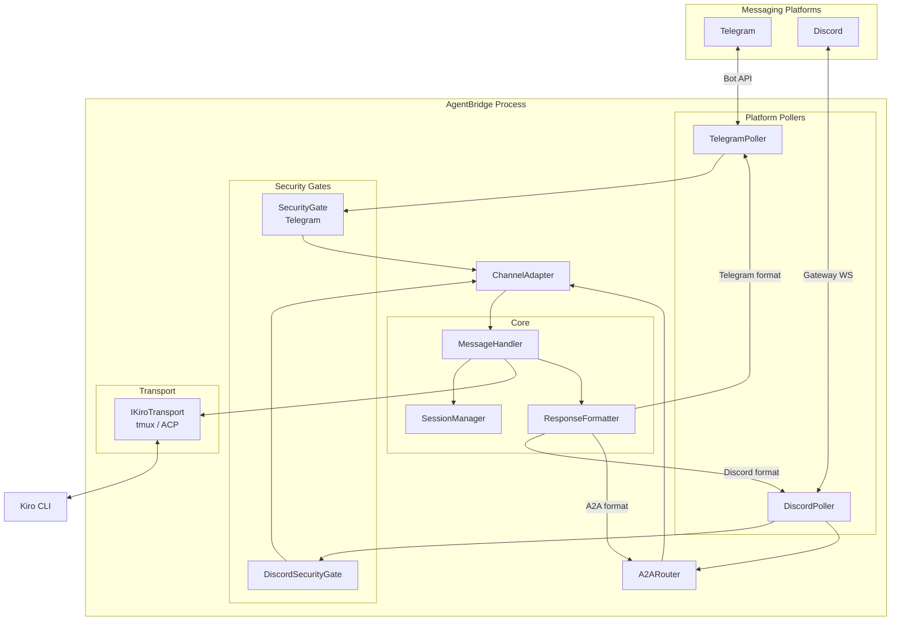
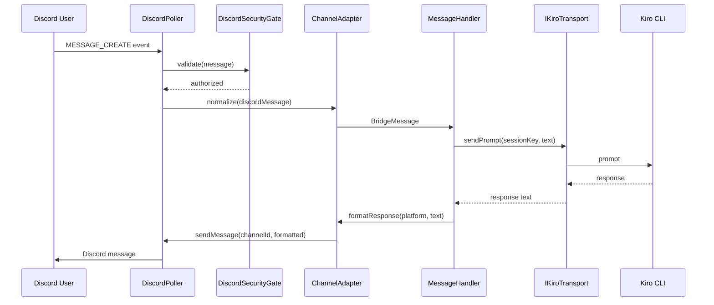

# Design Document: Discord Bot Communication

## Overview

This design extends AgentBridge to support Discord as a second messaging platform alongside Telegram, and introduces bot-to-bot (A2A) communication with Molty — a remote AgentBridge instance. The design follows the existing architecture patterns: thin API wrappers, event-driven pollers, fail-closed security, and a shared `IKiroTransport` interface.

Three major capabilities are added:

1. **Discord channel** — A `DiscordApi`, `DiscordPoller`, and `DiscordSecurityGate` that mirror the Telegram equivalents, connecting Discord users to Kiro CLI via the existing transport layer.
2. **Channel Adapter abstraction** — A `ChannelAdapter` that normalizes inbound/outbound messages across platforms into a common `BridgeMessage` format, making the transport and session layers platform-agnostic.
3. **Bot-to-Bot (A2A) communication** — A `A2ARouter` that monitors a dedicated Discord channel for messages from Molty, routes them through a dedicated Kiro session, and replies using a simple tag-based protocol (`[REQUEST]`, `[RESPONSE]`, `[STATUS]`).

The existing `ResponseFormatter` is extended to support Discord's 2000-character limit and Discord Markdown. The `SessionManager` is updated to use platform-prefixed session keys (`discord:channelId`, `telegram:chatId`, `a2a:channelId`) for cross-platform isolation. Configuration validation is extended to handle optional Discord env vars at startup.

## Architecture

### High-Level Architecture



### Message Flow



### Design Decisions

1. **Discord.js vs raw REST/Gateway**: Use the `discord.js` library. It handles Gateway heartbeat, reconnection, intent management, and rate limiting out of the box — reimplementing these from scratch would be error-prone and wasteful.
2. **ChannelAdapter as a stateless normalizer**: The adapter is a pure function layer (normalize in, format out) with no state. This keeps it testable and avoids coupling platform logic to session management.
3. **A2A uses the same transport**: A2A messages go through the same `IKiroTransport` as human messages, using a dedicated session key. This avoids duplicating transport logic.
4. **Platform-prefixed session keys**: Session keys become strings like `discord:123456` or `telegram:789`. This replaces the current `number`-typed `chatId` in the transport interface with a `string` session key, providing natural namespace isolation.
5. **A2A rate limiting in the router**: Rate limiting is applied at the `A2ARouter` level (outbound only) rather than in the transport, since it's specific to the A2A channel's anti-flood requirement.


## Components and Interfaces

### 1. DiscordApi (`src/components/discord-api.ts`)

Thin wrapper around `discord.js` `Client`. Mirrors `TelegramApi` in spirit — provides typed methods for sending messages, managing the Gateway connection, and listening for events.

```typescript
import { Client, GatewayIntentBits, type Message, type TextChannel } from "discord.js";

export class DiscordApi {
  private client: Client;
  private ready = false;

  constructor(botToken: string) {
    this.client = new Client({
      intents: [
        GatewayIntentBits.Guilds,
        GatewayIntentBits.GuildMessages,
        GatewayIntentBits.MessageContent,
      ],
    });
  }

  /** Connect to the Discord Gateway. Resolves when the client is ready. */
  async connect(): Promise<void>;

  /** Register a handler for MESSAGE_CREATE events. */
  onMessage(handler: (message: Message) => void | Promise<void>): void;

  /** Send a text message to a channel. Returns the sent message ID. */
  async sendMessage(channelId: string, text: string): Promise<string>;

  /** Gracefully close the Gateway connection. */
  async disconnect(): Promise<void>;

  /** Whether the client is connected and ready. */
  get isReady(): boolean;

  /** Get the bot's own user ID (for filtering self-messages). */
  get botUserId(): string | null;
}
```

### 2. DiscordPoller (`src/components/discord-poller.ts`)

Event-driven listener (not a true poller — Discord uses WebSocket push). Mirrors `TelegramPoller` in lifecycle (`start`/`stop`) but internally uses `discord.js` event handlers. Handles reconnection via `discord.js` built-in auto-reconnect with exponential backoff.

```typescript
export class DiscordPoller {
  constructor(
    api: DiscordApi,
    onMessage: (message: DiscordInboundMessage) => void | Promise<void>,
  );

  /** Connect to Gateway and start listening. Non-blocking. */
  async start(): Promise<void>;

  /** Disconnect from Gateway cleanly. */
  stop(): void;
}
```

### 3. DiscordSecurityGate (`src/components/discord-security-gate.ts`)

Fail-closed security gate for Discord. Validates both user ID and channel ID against whitelists. Mirrors `SecurityGate` pattern.

```typescript
export class DiscordSecurityGate {
  constructor(allowedUserIds: Set<string>, allowedChannelIds: Set<string>);

  /** Returns true iff the author is in the user whitelist AND the channel is in the channel whitelist. */
  authorize(authorId: string, channelId: string): boolean;
}
```

### 4. ChannelAdapter (`src/components/channel-adapter.ts`)

Stateless normalizer that converts platform-specific messages to/from a common `BridgeMessage` format.

```typescript
export type Platform = "telegram" | "discord";

export type BridgeMessage = {
  platform: Platform;
  channelId: string;        // platform-prefixed: "discord:123" or "telegram:456"
  senderId: string;
  senderDisplayName: string;
  text: string;
  timestamp: number;
  rawPlatformData?: unknown; // original message for platform-specific needs
};

export class ChannelAdapter {
  /** Normalize a Telegram message into a BridgeMessage. */
  fromTelegram(message: TelegramMessage): BridgeMessage;

  /** Normalize a Discord message into a BridgeMessage. */
  fromDiscord(message: DiscordInboundMessage): BridgeMessage;

  /** Generate a platform-prefixed session key. */
  sessionKey(platform: Platform, channelId: string): string;
}
```

### 5. A2ARouter (`src/components/a2a-router.ts`)

Monitors the A2A Discord channel for messages from the configured peer bot (Molty). Parses the tag-based protocol, routes requests to the transport, and sends responses back.

```typescript
export type A2AMessageTag = "REQUEST" | "RESPONSE" | "STATUS";

export class A2ARouter {
  constructor(config: {
    discordApi: DiscordApi;
    a2aChannelId: string;
    peerBotId: string;
    rateLimitMs: number;
    onPrompt: (sessionKey: string, text: string) => Promise<string>;
  });

  /** Process an inbound Discord message from the A2A channel. */
  async handleMessage(message: DiscordInboundMessage): Promise<void>;

  /** Parse a A2A message tag from the message text. Returns tag and content. */
  parseTag(text: string): { tag: A2AMessageTag; content: string };

  /** Format an outbound A2A message with the given tag. */
  formatOutbound(tag: A2AMessageTag, content: string): string;

  /** Send a message to the A2A channel, respecting rate limits. */
  async sendToA2A(text: string): Promise<void>;
}
```

### 6. Extended ResponseFormatter (`src/components/response-formatter.ts`)

The existing `ResponseFormatter` is extended with Discord-specific chunking (2000-char limit) and platform detection.

```typescript
// New methods added to existing ResponseFormatter class:

/** Split text into chunks for Discord's 2000-char limit. */
chunkTextForDiscord(text: string): string[];

/** Split text for the appropriate platform. */
chunkForPlatform(text: string, platform: Platform): string[];

/** Convert standard Markdown to Discord-compatible Markdown (mostly passthrough). */
toDiscordMarkdown(text: string): string;
```

### 7. Extended Config (`src/types/config.ts`)

New optional fields added to the `Config` type:

```typescript
// Added to Config type:
discordBotToken?: string;
discordAllowedUserIds?: Set<string>;    // Discord snowflake IDs (strings)
discordAllowedChannelIds?: Set<string>;
discordA2aChannelId?: string;
discordA2aPeerBotId?: string;
discordA2aRateLimitMs: number;          // default: 5000
discordEnabled: boolean;                 // derived: true if discordBotToken is set
discordA2aEnabled: boolean;              // derived: true if a2aChannelId is set
```

### 8. Updated IKiroTransport Interface

The transport interface signature changes from `chatId: number` to `sessionKey: string` to support platform-prefixed keys:

```typescript
export interface IKiroTransport {
  initialize(): Promise<void>;
  sendPrompt(sessionKey: string, message: string): Promise<string>;
  resetSession(sessionKey: string): Promise<void>;
  sendInterrupt(): Promise<void>;
  destroy(): void;
  readonly isReady: boolean;
}
```

### 9. Updated main.ts

The `main()` function is extended to:
- Load and validate Discord config alongside Telegram config
- Conditionally create `DiscordApi`, `DiscordPoller`, `DiscordSecurityGate`, and `A2ARouter`
- Wire both pollers through the `ChannelAdapter` to a shared message handler
- Shut down both pollers on SIGINT/SIGTERM
- Continue operating if one platform errors while the other is healthy


## Data Models

### BridgeMessage (Common Internal Format)

```typescript
type Platform = "telegram" | "discord";

type BridgeMessage = {
  platform: Platform;
  channelId: string;         // platform-prefixed: "discord:123456" or "telegram:789"
  senderId: string;          // platform user ID as string
  senderDisplayName: string; // human-readable name
  text: string;              // message content
  timestamp: number;         // Unix ms
  rawPlatformData?: unknown; // original platform message object
};
```

### DiscordInboundMessage (Discord-specific)

```typescript
type DiscordInboundMessage = {
  id: string;                // Discord message snowflake ID
  channelId: string;         // Discord channel snowflake ID
  authorId: string;          // Discord user snowflake ID
  authorUsername: string;     // Discord username
  authorIsBot: boolean;      // whether the author is a bot
  content: string;           // message text content
  timestamp: number;         // Unix ms
};
```

### A2A Message Protocol

Messages in the A2A channel use a simple text-based tag protocol:

| Tag | Direction | Purpose |
|-----|-----------|---------|
| `[REQUEST]` | Molty → Bridge | Task request to be routed to Kiro |
| `[RESPONSE]` | Bridge → Molty | Kiro's response to a request |
| `[STATUS]` | Either direction | Status updates, errors |

Format: `[TAG] <content>`

If no tag is present, the message is treated as `[REQUEST]` by default.

### Extended Config Type

```typescript
type Config = {
  // ... existing Telegram fields ...

  // Discord (optional — all disabled if discordBotToken is absent)
  discordBotToken?: string;
  discordAllowedUserIds?: Set<string>;
  discordAllowedChannelIds?: Set<string>;
  discordA2aChannelId?: string;
  discordA2aPeerBotId?: string;
  discordA2aRateLimitMs: number;  // default: 5000
  discordEnabled: boolean;         // derived
  discordA2aEnabled: boolean;      // derived
};
```

### Environment Variables

| Variable | Required | Format | Description |
|----------|----------|--------|-------------|
| `DISCORD_BOT_TOKEN` | No | String | Discord bot token. Enables Discord features when set. |
| `DISCORD_ALLOWED_USER_IDS` | If Discord enabled | Comma-separated snowflakes | Allowed Discord user IDs |
| `DISCORD_ALLOWED_CHANNEL_IDS` | If Discord enabled | Comma-separated snowflakes | Allowed Discord channel IDs |
| `DISCORD_A2A_CHANNEL_ID` | No | Snowflake | Dedicated A2A channel ID |
| `DISCORD_A2A_PEER_BOT_ID` | If A2A enabled | Snowflake | Molty's bot user ID |
| `DISCORD_A2A_RATE_LIMIT_MS` | No | Number | Min ms between outbound A2A messages (default: 5000) |

### Session Key Format

Session keys are platform-prefixed strings used throughout the transport and session layers:

- `telegram:<chatId>` — Telegram user/group sessions
- `discord:<channelId>` — Discord user/channel sessions  
- `a2a:<channelId>` — Bot-to-bot session (exactly one)

### Discord Snowflake Validation

Discord IDs (snowflakes) are validated with: `/^\d{17,20}$/`

This matches Discord's snowflake format — a 64-bit integer represented as a string of 17–20 digits.


## Correctness Properties

*A property is a characteristic or behavior that should hold true across all valid executions of a system — essentially, a formal statement about what the system should do. Properties serve as the bridge between human-readable specifications and machine-verifiable correctness guarantees.*

### Property 1: Dual-whitelist authorization

*For any* Discord user ID and channel ID, `DiscordSecurityGate.authorize()` should return `true` if and only if the user ID is in the allowed user set AND the channel ID is in the allowed channel set. If either is missing from its whitelist, the result must be `false`.

**Validates: Requirements 2.2, 2.3, 2.4**

### Property 2: Platform-prefixed session key uniqueness

*For any* two messages from different platforms (Telegram vs Discord vs A2A) that happen to share the same numeric channel/chat ID, the `ChannelAdapter.sessionKey()` function must produce distinct session keys. Conversely, two messages from the same platform and same channel must produce identical session keys.

**Validates: Requirements 3.1, 5.4, 8.1, 10.2**

### Property 3: Busy channel notification

*For any* channel that is currently processing a prompt (busy), a new inbound message for that channel must result in a "still in progress" notification rather than being routed to the transport.

**Validates: Requirements 3.5**

### Property 4: Platform-aware response chunking

*For any* response string and any target platform, all chunks produced by `ResponseFormatter.chunkForPlatform()` must be within the platform's character limit (4096 for Telegram, 2000 for Discord), and concatenating all chunks must reproduce the original text content (no data loss).

**Validates: Requirements 4.1, 4.4**

### Property 5: Response splitting preserves code blocks

*For any* response string containing fenced code blocks (triple backticks), the Discord chunker must never split in the middle of a code block — every chunk must have balanced code block delimiters.

**Validates: Requirements 4.2**

### Property 6: Channel adapter normalization completeness

*For any* valid Telegram message or Discord message, the `ChannelAdapter.fromTelegram()` or `ChannelAdapter.fromDiscord()` output must contain all required `BridgeMessage` fields: `platform`, `channelId` (platform-prefixed), `senderId`, `senderDisplayName`, `text`, and `timestamp` — all non-empty.

**Validates: Requirements 5.1**

### Property 7: A2A peer bot identification

*For any* message in the A2A channel, the `A2ARouter` should process it if and only if the author's bot user ID matches the configured `peerBotId`. Messages from any other author (including other bots) must be ignored.

**Validates: Requirements 6.2, 6.5**

### Property 8: A2A tag protocol round-trip

*For any* A2A message tag (`REQUEST`, `RESPONSE`, `STATUS`) and any content string, formatting with `formatOutbound(tag, content)` then parsing with `parseTag()` must return the original tag and content. Additionally, *for any* string that does not start with a recognized tag prefix, `parseTag()` must return `REQUEST` as the default tag.

**Validates: Requirements 7.1, 7.2, 7.3, 7.5**

### Property 9: A2A sequential message processing

*For any* sequence of A2A messages arriving while a prompt is being processed, the A2A router must queue them and process them one at a time — no two A2A prompts may be in-flight simultaneously.

**Validates: Requirements 8.4**

### Property 10: A2A outbound rate limiting

*For any* sequence of outbound A2A messages, the elapsed time between consecutive `sendToA2A()` calls must be greater than or equal to the configured `rateLimitMs`.

**Validates: Requirements 8.5**

### Property 11: Discord snowflake validation

*For any* string, the snowflake validator must return `true` if and only if the string matches the pattern `/^\d{17,20}$/` (17 to 20 digits). All valid Discord IDs must pass, and all non-matching strings must fail.

**Validates: Requirements 9.2, 9.3**


## Error Handling

### Discord Gateway Errors

| Error | Handling |
|-------|----------|
| Gateway connection failure | `discord.js` auto-reconnects with exponential backoff. Log warning. |
| Gateway heartbeat timeout | `discord.js` handles reconnection. Log warning. |
| Invalid bot token | `discord.js` emits an error event on login. Bridge logs descriptive error and continues with Telegram only. |
| Rate limited by Discord API | `discord.js` handles rate limiting internally (queues requests). Log debug. |
| Message send failure | Log error, notify user via fallback text if possible. Do not crash. |

### Security Gate Errors

| Error | Handling |
|-------|----------|
| Empty user whitelist at startup | Throw at construction time — Bridge refuses to start with descriptive error. |
| Unauthorized message | Silently drop. No response, no side effects. Log at debug level only. |

### A2A Communication Errors

| Error | Handling |
|-------|----------|
| Transport error during A2A prompt | Send `[STATUS] error: <description>` to A2A channel. Dequeue and continue. |
| A2A channel not found | Log error at startup. Disable A2A features. Continue with human channels. |
| Peer bot sends malformed message | Treat as `[REQUEST]` (default tag). If content is empty, ignore. |
| Rate limit queue overflow | Cap queue at 50 messages. Drop oldest if exceeded. Log warning. |

### Configuration Errors

| Error | Handling |
|-------|----------|
| `DISCORD_BOT_TOKEN` absent | Discord disabled entirely. Bridge runs Telegram-only. No error. |
| `DISCORD_BOT_TOKEN` present but `DISCORD_ALLOWED_USER_IDS` empty | Bridge refuses to start. Descriptive error logged. |
| `DISCORD_A2A_CHANNEL_ID` set without `DISCORD_A2A_PEER_BOT_ID` | Bridge refuses to start. Descriptive error logged. |
| Invalid snowflake format | Bridge refuses to start. Error identifies the invalid value. |

### Platform Isolation Errors

| Error | Handling |
|-------|----------|
| Discord crashes while Telegram is running | Log error. Telegram continues unaffected. Attempt Discord reconnect. |
| Telegram crashes while Discord is running | Log error. Discord continues unaffected. Telegram poller retries. |
| Transport (tmux/ACP) crashes | Both platforms affected. Both report error to their users. Transport auto-recovery as per existing behavior. |

## Testing Strategy

### Testing Framework

- **Unit/integration tests**: Vitest (already configured in the project)
- **Property-based tests**: fast-check (already in devDependencies)
- **Mocking**: Vitest built-in mocking (`vi.fn()`, `vi.mock()`)

### Unit Tests

Unit tests cover specific examples, edge cases, and integration points:

- `discord-security-gate.test.ts` — Constructor validation (empty whitelist throws), specific authorize examples
- `discord-api.test.ts` — Message sending, connection lifecycle (with mocked discord.js Client)
- `discord-poller.test.ts` — Start/stop lifecycle, message dispatch to handler
- `channel-adapter.test.ts` — Specific normalization examples for Telegram and Discord messages, edge cases (missing fields)
- `a2a-router.test.ts` — Command parsing examples, error message formatting, rate limit edge cases, `/a2a-reset` command handling
- `response-formatter.test.ts` — Extended with Discord chunking examples, code block boundary splitting examples
- `config.test.ts` — Extended with Discord config validation examples (missing token, invalid snowflakes, A2A without peer ID)

### Property-Based Tests

Each correctness property is implemented as a single property-based test using `fast-check`. Each test runs a minimum of 100 iterations and is tagged with a comment referencing the design property.

- `discord-security-gate.property.test.ts`
  - **Feature: discord-bot-communication, Property 1: Dual-whitelist authorization**

- `channel-adapter.property.test.ts`
  - **Feature: discord-bot-communication, Property 2: Platform-prefixed session key uniqueness**
  - **Feature: discord-bot-communication, Property 6: Channel adapter normalization completeness**

- `response-formatter.property.test.ts`
  - **Feature: discord-bot-communication, Property 4: Platform-aware response chunking**
  - **Feature: discord-bot-communication, Property 5: Response splitting preserves code blocks**

- `a2a-router.property.test.ts`
  - **Feature: discord-bot-communication, Property 7: A2A peer bot identification**
  - **Feature: discord-bot-communication, Property 8: A2A tag protocol round-trip**
  - **Feature: discord-bot-communication, Property 10: A2A outbound rate limiting**

- `config.property.test.ts`
  - **Feature: discord-bot-communication, Property 11: Discord snowflake validation**

### Test Configuration

```typescript
// Example property test structure
import { describe, it, expect } from "vitest";
import fc from "fast-check";

describe("DiscordSecurityGate properties", () => {
  // Feature: discord-bot-communication, Property 1: Dual-whitelist authorization
  it("authorizes iff both user and channel are whitelisted", () => {
    fc.assert(
      fc.property(
        fc.uniqueArray(fc.string(), { minLength: 1, maxLength: 5 }),  // user whitelist
        fc.uniqueArray(fc.string(), { minLength: 1, maxLength: 5 }),  // channel whitelist
        fc.string(),  // test user ID
        fc.string(),  // test channel ID
        (userList, channelList, userId, channelId) => {
          const gate = new DiscordSecurityGate(new Set(userList), new Set(channelList));
          const expected = userList.includes(userId) && channelList.includes(channelId);
          expect(gate.authorize(userId, channelId)).toBe(expected);
        },
      ),
      { numRuns: 100 },
    );
  });
});
```

### What Is NOT Tested

- Actual Discord Gateway WebSocket connections (external dependency)
- discord.js internal reconnection/heartbeat logic
- Real Kiro CLI transport interactions (mocked in tests)
- Visual formatting aesthetics (subjective)
- Multi-process concurrency between Bridge and Molty (integration/E2E scope)

