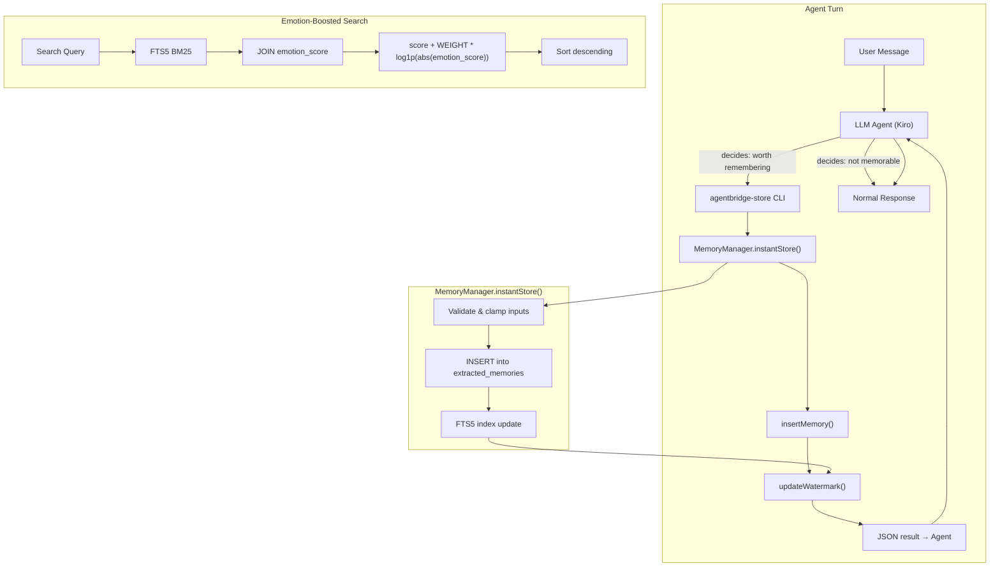

# Design Document: Instant Memory Store

## Overview

This feature adds immediate memory persistence when the LLM agent determines that a user message contains information worth remembering. Instead of regex-based cue phrase detection, the agent itself — with its full understanding of context, emotion, and intent — decides when to invoke the `instant_store` tool.

It introduces three interconnected capabilities:

1. **Agent-Initiated Storage**: The agent calls `agentbridge-store` (a CLI tool, same pattern as `agentbridge-recall`) when it judges a message contains memorable information. The agent provides the memory content, type, emotion score, and language.
2. **Immediate Persistence**: The CLI command writes directly to the `extracted_memories` table and advances the extraction watermark to prevent heartbeat re-extraction.
3. **Emotion Score**: A new `emotion_score` field (-5 to +5) on all extracted memories, assessed by the agent during storage and by the LLM during heartbeat extraction. Emotionally significant memories receive a `log1p`-based ranking boost in search.

### Key Design Decisions

| Decision | Rationale |
|---|---|
| Agent decides when to store, not regex | The LLM already processes every message. It understands context, emotion, sarcasm, implicit importance — things regex can never capture. "Na ez az ami egy faszsag!" gets a -3 from the LLM; regex sees nothing. |
| CLI tool (`agentbridge-store`), same pattern as `agentbridge-recall` | Consistent with existing architecture. Agent invokes shell commands for both recall and storage. No new transport mechanism needed. |
| No `StoreIntentDetector` component | Eliminated. The agent IS the intent detector. Regex-based detection was solving a problem the LLM already solves better. |
| Agent provides `emotion_score` directly | The agent assesses emotion while reading the message — no separate LLM call needed. For heartbeat extraction, the existing LLM prompt handles it. |
| Agent provides both `content_en` and `content_original` | The agent naturally understands both languages. No separate translation step needed for instant storage. |
| Confirmation woven into agent response | Instead of a separate "📝 Megjegyeztem!" message from the pipeline, the agent naturally acknowledges storage in its response. More natural, less robotic. |
| `emotion_score` uses integer scale [-5, +5] | Matches the VAD valence dimension. Integer avoids floating-point noise in SQLite. Clamping ensures values stay in range. |
| `log1p(abs(emotion_score))` for ranking boost | Industry-standard dampening. `log1p(0) = 0` means neutral memories get zero boost. `log1p(5) ≈ 1.79` provides moderate, non-linear amplification. |
| Emotion boost is additive, not multiplicative | Additive boost preserves BM25 ordering for equally-emotional results. Multiplicative would distort relevance scores for low-BM25 matches. |
| Emotion boost applied in application layer | FTS5 returns BM25 rank; we join `emotion_score` from `extracted_memories` and add the boost post-query. No custom FTS5 ranking function needed. |

## Architecture



### Integration Points

- **SKILL.md**: `skills/instant-store/SKILL.md` tells the agent when and how to use the tool, with emotion score scale and usage guidelines.
- **CLI**: `src/cli/agentbridge-store.ts` — parses args, calls `MemoryManager.instantStore()`, outputs JSON result.
- **MemoryManager**: New `instantStore()` method validates inputs, inserts memory, advances watermark. Returns `InstantStoreResult`.
- **MemoryExtractor**: Extraction prompt updated to include `emotion_score` field for heartbeat-driven extraction.
- **MemoryIndex**: `searchExtracted()` and `searchOriginal()` updated to join `emotion_score` and apply the additive boost.
- **Schema migration**: `ALTER TABLE extracted_memories ADD COLUMN emotion_score INTEGER DEFAULT 0`.

## Components and Interfaces

### 1. `agentbridge-store` CLI (new module)

CLI entry point for agent-initiated memory storage. Follows the same pattern as `agentbridge-recall`.

```typescript
// src/cli/agentbridge-store.ts

// Usage:
// agentbridge-store \
//   --content-en "User prefers dark mode" \
//   --content-original "A user dark mode-ot preferálja" \
//   --memory-type preference \
//   --emotion-score 0 \
//   --chat-id 7773842843 \
//   --keyword "dark mode"

// Output (success):
// { "stored": true, "memoriesCount": 1 }

// Output (error):
// { "stored": false, "error": "content-en is required" }
```

### 2. `MemoryManager.instantStore()` (new method)

```typescript
export type InstantStoreParams = {
  chatId: number;
  contentEn: string;
  contentOriginal: string;
  memoryType: "fact" | "decision" | "preference" | "event";
  emotionScore: number;
  keyword?: string;
};

export type InstantStoreResult = {
  stored: boolean;
  memoriesCount: number;
  error?: string;
};

// Added to MemoryManager class:
async instantStore(params: InstantStoreParams): Promise<InstantStoreResult>;
```

Orchestration flow:
1. Validate inputs: `contentEn` and `contentOriginal` must be non-empty strings
2. Clamp `emotionScore` to [-5, +5], default to 0 if non-integer
3. Insert into `extracted_memories` with `preserve_original = true`
4. Update FTS5 index
5. Advance watermark to `Date.now()`
6. Return `{ stored: true, memoriesCount: 1 }`
7. On error: log, return `{ stored: false, error: message }`

### 3. Updated `MemoryExtractor` (modified)

Changes to the existing class:

- **Extraction prompt**: Add `emotion_score` field to the output format specification with the [-5, +5] scale description and examples.
- **`parseResponse()`**: Parse `emotion_score` from each LLM response object. Clamp to [-5, +5]. Default to 0 if missing or non-integer.
- **`insertMemories()`**: Add `emotion_score` to the INSERT statement.

Updated prompt addition:
```
  - "emotion_score": integer from -5 to +5 representing emotional valence
    -5 = angry, -3 = frustrated, -1 = slightly negative,
     0 = neutral, +1 = slightly positive, +3 = pleased, +5 = happy
```

Updated INSERT:
```sql
INSERT INTO extracted_memories
  (chat_id, content_original, content_en, memory_type, source_timestamp,
   preserve_original, preserved_keyword, emotion_score, created_at)
VALUES (?, ?, ?, ?, ?, ?, ?, ?, ?)
```

### 4. Updated `MemoryIndex` search methods (modified)

Both `searchExtracted()` and `searchOriginal()` are updated to:
1. Include `em.emotion_score` in the SELECT
2. Apply additive emotion boost: `score + EMOTION_BOOST_WEIGHT * Math.log(1 + Math.abs(emotion_score))`

```typescript
// src/components/memory-index.ts — new constant
export const EMOTION_BOOST_WEIGHT = 0.5;
```

### 5. Skill Definition (new file)

```markdown
# skills/instant-store/SKILL.md
```

Tells the agent:
- How to invoke `agentbridge-store` with all parameters
- When to use: explicit storage requests, frustration signals, emotionally significant statements, important facts/decisions/preferences
- When NOT to use: routine messages, greetings, confirmations, info already in context
- Emotion score scale with examples
- Follows same format as `skills/memory-search/SKILL.md`

### 6. `clampEmotionScore` utility

```typescript
// src/components/emotion-utils.ts

/** Clamp a value to [-5, +5]. Non-integer or missing values default to 0. */
export function clampEmotionScore(value: unknown): number {
  if (value === null || value === undefined) return 0;
  const n = Number(value);
  if (!Number.isInteger(n)) return 0;
  return Math.max(-5, Math.min(5, n));
}
```

Shared by both `agentbridge-store` CLI and `MemoryExtractor.parseResponse()`.

## Data Models

### Schema Migration

```sql
ALTER TABLE extracted_memories ADD COLUMN emotion_score INTEGER DEFAULT 0;
```

### Updated `ExtractedMemory` Type

```typescript
export type ExtractedMemory = {
  id?: number;
  chat_id: number;
  content_original: string;
  content_en: string;
  memory_type: "fact" | "decision" | "preference" | "event";
  source_timestamp: number;
  preserve_original: boolean;
  preserved_keyword?: string;
  emotion_score: number;  // NEW: -5 to +5
  created_at: number;
};
```

### `InstantStoreParams` Type

```typescript
export type InstantStoreParams = {
  chatId: number;
  contentEn: string;
  contentOriginal: string;
  memoryType: "fact" | "decision" | "preference" | "event";
  emotionScore: number;
  keyword?: string;
};
```

### `InstantStoreResult` Type

```typescript
export type InstantStoreResult = {
  stored: boolean;
  memoriesCount: number;
  error?: string;
};
```

## Correctness Properties

### Property 1: Emotion score clamping

*For any* value provided as `emotion_score`, the `clampEmotionScore()` function shall return a value within [-5, +5]. Integer values within range are preserved exactly; values outside are clamped to the nearest boundary (-5 or +5). Non-integer, NaN, null, or undefined values default to 0.

**Validates: Requirements 7.3, 7.7**

### Property 2: Instant store persists valid memories

*For any* valid `InstantStoreParams` (non-empty `contentEn`, non-empty `contentOriginal`, valid `memoryType`, `emotionScore` in [-5, +5]), `instantStore()` shall insert exactly one row into `extracted_memories` with `preserve_original = true` and all fields matching the input.

**Validates: Requirements 3.1, 3.2, 3.3, 3.4**

### Property 3: Instant store rejects invalid inputs

*For any* `InstantStoreParams` where `contentEn` is empty or `contentOriginal` is empty, `instantStore()` shall return `{ stored: false }` and not insert any row.

**Validates: Requirements 2.2, 3.1**

### Property 4: Watermark advance prevents heartbeat re-extraction

*For any* chat where `instantStore()` successfully stores a memory, the extraction watermark shall be advanced such that a subsequent `processTranscripts()` call does not re-extract messages up to that timestamp.

**Validates: Requirements 4.1, 4.2**

### Property 5: Emotion boost formula correctness

*For any* BM25 score and any `emotion_score` in [-5, +5], the final search score shall equal `bm25_score + EMOTION_BOOST_WEIGHT * Math.log(1 + Math.abs(emotion_score))`. When `emotion_score` is 0, the boost is exactly 0 (no change to BM25 score).

**Validates: Requirements 8.1, 8.2, 8.3**

### Property 6: Emotional memories rank higher than neutral ones

*For any* two memories with identical BM25 scores where one has `emotion_score = 0` and the other has `|emotion_score| > 0`, the emotional memory shall have a strictly higher final score.

**Validates: Requirements 8.1**

### Property 7: Emotion score storage round-trip

*For any* memory stored via `instantStore()` with a non-zero `emotion_score`, retrieving it via search shall preserve the `emotion_score` value exactly.

**Validates: Requirements 7.6**

### Property 8: CLI argument validation

*For any* invocation of `agentbridge-store` missing a required parameter (`--content-en`, `--content-original`, `--memory-type`, `--emotion-score`, `--chat-id`), the command shall output `{ "stored": false, "error": "..." }` and not modify the database.

**Validates: Requirements 2.2**

## Error Handling

| Scenario | Behavior |
|---|---|
| Missing required CLI argument | Return `{ stored: false, error: "<param> is required" }` |
| Invalid `memory_type` value | Return `{ stored: false, error: "invalid memory_type" }` |
| `emotion_score` outside [-5, +5] | Clamp to nearest boundary, proceed with storage |
| `emotion_score` not a valid integer | Default to 0, proceed with storage |
| `content_en` or `content_original` empty | Return `{ stored: false, error: "content cannot be empty" }` |
| Database write fails | Log error, return `{ stored: false, error: "database error" }`, do not advance watermark |
| Memory disabled | `instantStore()` returns `{ stored: false, error: "memory disabled" }` |
| `chat_id` not a valid number | Return `{ stored: false, error: "invalid chat-id" }` |

## Testing Strategy

### Property-Based Testing

Library: **fast-check** (already available in the project's test infrastructure)

Each correctness property maps to a single property-based test with minimum 100 iterations.

| Property | Test Approach |
|---|---|
| P1: Emotion clamping | Generate random values (integers, floats, null, undefined, NaN, strings). Assert clamped output is in [-5, +5] and follows the rules. |
| P2: Valid memory persistence | Generate valid `InstantStoreParams` with random content. Use in-memory SQLite. Assert row inserted with correct fields. |
| P3: Invalid input rejection | Generate params with empty `contentEn` or `contentOriginal`. Assert `stored: false` and no DB row. |
| P4: Watermark prevents re-extraction | Use in-memory SQLite. Store via `instantStore()`, then run `processTranscripts()`. Assert no duplicate. |
| P5: Emotion boost formula | Generate random BM25 scores and emotion_scores. Assert final score matches formula exactly. |
| P6: Emotional > neutral ranking | Generate pairs with same BM25, one neutral and one emotional. Assert emotional ranks higher. |
| P7: Emotion score round-trip | Use in-memory SQLite. Store memory, search for it, assert `emotion_score` preserved. |
| P8: CLI argument validation | Generate invocations with random missing required params. Assert error JSON and no DB modification. |

### Unit Tests

- **`clampEmotionScore`**: Edge cases — exactly -5, 0, +5, NaN, undefined, null, float values, strings
- **`agentbridge-store` CLI**: Argument parsing, JSON output format, error messages
- **`instantStore` integration**: Full flow from params through DB insertion and watermark advance
- **`MemoryExtractor` emotion parsing**: Heartbeat extraction with emotion_score in LLM response
- **Schema migration**: Verify `emotion_score` column exists with default 0 after migration
- **Search ranking**: Verify emotion boost applied correctly in L2 and L4 layers
