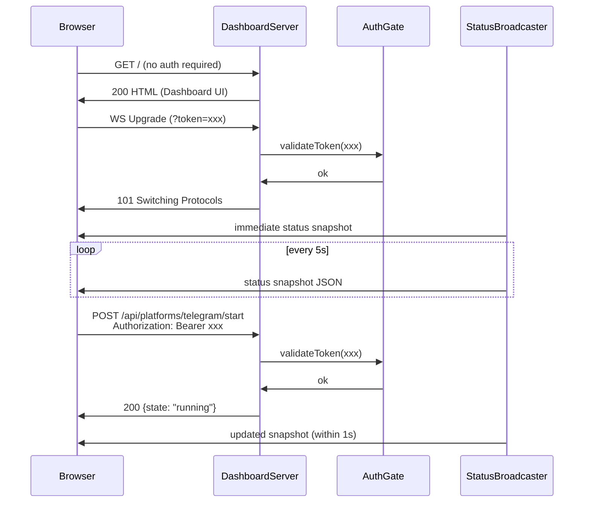

# Design Document: Kiro Professor Web UI Dashboard

## Overview

The Web UI Dashboard is an operations/admin panel embedded in the AgentBridge process, activated via the `--web` CLI flag. It provides real-time monitoring and control of all bridge subsystems through a browser-based single-page application.

The dashboard is built entirely on Node.js built-in modules (`node:http` for HTTP, manual WebSocket upgrade via `node:crypto` for the handshake) with zero external web framework dependencies. Authentication uses a shared bearer token (`WEB_AUTH_TOKEN`) validated with constant-time comparison. The frontend is a single self-contained HTML file with inline CSS and JS, served directly from the HTTP handler — no build step, no static file directory.

The system follows a push-based architecture: a `StatusBroadcaster` collects metrics from all subsystems on a configurable interval and pushes JSON snapshots to connected WebSocket clients. Control operations (platform toggles, transport switching, memory search) are exposed as REST API endpoints.

## Architecture

```mermaid
graph TB
    subgraph "AgentBridge Process (main.ts)"
        CLI["CLI Flag Parser<br/>--web / --all"]
        DS["DashboardServer<br/>(node:http)"]
        AG["AuthGate<br/>(token validation)"]
        SB["StatusBroadcaster<br/>(WebSocket push)"]
        PC["PlatformController"]
        TC["TransportController"]
        MSC["MemorySearchController"]

        CLI -->|starts| DS
        DS -->|validates via| AG
        DS -->|upgrades to WS| SB
        DS -->|routes /api/platforms/*| PC
        DS -->|routes /api/transport/*| TC
        DS -->|routes /api/memory/*| MSC
    end

    subgraph "Existing Subsystems"
        TP["TelegramPoller"]
        DP["DiscordPoller"]
        TR["IKiroTransport<br/>(TmuxClient / AcpTransport)"]
        MM["MemoryManager"]
        HB["HeartbeatSystem"]
        MI["MemoryIndex"]
    end

    PC -->|.start() / .stop()| TP
    PC -->|.start() / .stop()| DP
    TC -->|destroy / create / initialize| TR
    TC -->|setLlmCall| MM
    MSC -->|search / substringSearch / searchExtracted / searchOriginal| MI
    SB -->|getStats()| MM
    SB -->|running, tasks, intervalMs| HB
    SB -->|isReady, contextPercent| TR
    SB -->|running state| TP
    SB -->|started state| DP

    Browser["Browser (Dashboard UI)"] -->|HTTP + WS| DS
```

### Request Flow



## Components and Interfaces

### DashboardServer

The HTTP server component. Created in `src/components/dashboard-server.ts`.

```typescript
export type DashboardServerDeps = {
  config: DashboardConfig;
  getStatus: () => StatusSnapshot;
  platformController: PlatformController;
  transportController: TransportController;
  memorySearchController: MemorySearchController | null;
};

export class DashboardServer {
  constructor(deps: DashboardServerDeps);
  /** Start listening. Throws if port in use. */
  start(): Promise<void>;
  /** Close all WS connections and stop listening. Returns when closed. */
  stop(): Promise<void>;
  /** Access the broadcaster for pushing ad-hoc updates. */
  get broadcaster(): StatusBroadcaster;
}
```

Responsibilities:
- Creates `http.Server`, listens on `WEB_HOST:WEB_PORT`
- Routes `GET /` → inline HTML dashboard
- Routes `GET /api/*` and `POST /api/*` → controllers (after auth)
- Handles WebSocket upgrade manually (SHA-1 accept key via `node:crypto`)
- Delegates auth to `AuthGate` for all `/api/*` and WS upgrade requests
- `GET /` is unauthenticated (the HTML page itself is public; the WS connection and API calls require auth)

### AuthGate

Token validation component. Created in `src/components/auth-gate.ts`.

```typescript
export class AuthGate {
  constructor(token: string);
  /** Constant-time token comparison. Returns true if valid. */
  validate(provided: string): boolean;
  /** Extract token from request (Authorization header or query param). */
  extractToken(req: http.IncomingMessage): string | null;
  /** Middleware-style: returns true if authorized, sends 401 if not. */
  guard(req: http.IncomingMessage, res: http.ServerResponse): boolean;
}
```

Uses `crypto.timingSafeEqual` for comparison. Extracts from `Authorization: Bearer <token>` header for API routes, and from `?token=<token>` query parameter for WebSocket upgrades.

### StatusBroadcaster

WebSocket broadcast component. Created in `src/components/status-broadcaster.ts`.

```typescript
export class StatusBroadcaster {
  constructor(getStatus: () => StatusSnapshot, intervalMs: number);
  /** Add a connected WebSocket client. Sends immediate snapshot. */
  addClient(socket: WebSocket): void;
  /** Remove a client (on close/error). Stops interval if no clients. */
  removeClient(socket: WebSocket): void;
  /** Force-push a snapshot to all clients now (e.g., after state change). */
  pushNow(): void;
  /** Stop broadcasting and close all clients. */
  shutdown(): void;
}
```

The broadcaster uses a lazy interval: starts the `setInterval` when the first client connects, stops when the last disconnects. `pushNow()` is called by controllers after state-changing operations to deliver sub-1-second updates.

WebSocket framing is implemented manually using `node:net` sockets from the HTTP upgrade — no `ws` library. Only text frames are needed (JSON payloads). The implementation handles ping/pong for keepalive and close frames for clean disconnect.

### PlatformController

Handles platform start/stop API requests. Created in `src/components/platform-controller.ts`.

```typescript
export type PlatformRefs = {
  telegramPoller: TelegramPoller | null;
  discordPoller: DiscordPoller | null;
};

export class PlatformController {
  constructor(refs: PlatformRefs);
  /** Handle POST /api/platforms/:platform/:action */
  handle(platform: string, action: string): Promise<{ status: number; body: object }>;
  /** Get current platform states for status snapshot. */
  getStates(): PlatformStates;
}
```

Returns HTTP 409 if the poller is `null` (platform not configured at startup). The controller does not create pollers — it only calls `.start()` / `.stop()` on existing instances.

### TransportController

Handles transport mode switching. Created in `src/components/transport-controller.ts`.

```typescript
export type TransportSwitchDeps = {
  config: Config;
  getCurrentTransport: () => IKiroTransport;
  setTransport: (t: IKiroTransport) => void;
  platformRefs: PlatformRefs;
  memory: MemoryManager | null;
};

export class TransportController {
  constructor(deps: TransportSwitchDeps);
  /** Handle POST /api/transport/switch {mode: "tmux"|"acp"} */
  handle(mode: "tmux" | "acp"): Promise<{ status: number; body: object }>;
  /** Get current transport info for status snapshot. */
  getTransportStatus(): TransportStatus;
}
```

Switch sequence:
1. If requested mode === current mode → return 200 no-op
2. Stop all running platform pollers
3. `currentTransport.destroy()`
4. Create new transport (TmuxClient or AcpTransport) from config
5. `newTransport.initialize()`
6. If memory enabled, re-register LLM callback on new transport
7. Update shared transport reference via `setTransport()`
8. Restart previously-running pollers
9. On failure: attempt rollback to previous transport, return 500

### MemorySearchController

Handles memory keyword search API. Created in `src/components/memory-search-controller.ts`.

```typescript
export type MemorySearchDeps = {
  memoryManager: MemoryManager;
};

export class MemorySearchController {
  constructor(deps: MemorySearchDeps);
  /** Handle GET /api/memory/search?keywords=...&chatId=...&layers=...&original=...&timeStart=...&timeEnd=... */
  handle(params: URLSearchParams): Promise<{ status: number; body: object }>;
}
```

Layer mapping:
- **L1** (Raw Messages): `MemoryIndex.search()` (FTS5) + relaxed FTS5 + `MemoryIndex.substringSearch()`
- **L2** (Extracted Memories): `MemoryIndex.searchExtracted()`
- **L3** (Compaction Summaries): Direct SQL `LIKE` query on `compactions` table for weekly/quarterly tiers
- **L4** (Original Language): `MemoryIndex.searchOriginal()` — only when `original` param is also provided
- **L5** (Cloud): Returns `[]` with `"status": "not_implemented"`

Results are deduplicated by `timestamp + content_prefix`, scored, sorted descending, and limited to 10.

### DashboardConfig

Added to the existing config system.

```typescript
export type DashboardConfig = {
  webPort: number;        // WEB_PORT, default 3000
  webHost: string;        // WEB_HOST, default "0.0.0.0"
  webAuthToken: string;   // WEB_AUTH_TOKEN, required
  webPushIntervalMs: number; // WEB_PUSH_INTERVAL_MS, default 5000
};
```

Loaded in `loadAndValidateConfig()` alongside existing config. Validation: if `--web` flag is present and `WEB_AUTH_TOKEN` is not set, log error and `process.exit(1)`.

### Dashboard UI (Inline HTML)

The frontend is a single HTML string embedded in `src/components/dashboard-ui.ts` as a template literal export. No separate static files.

```typescript
export function renderDashboardHtml(logoBase64: string): string;
```

The logo (`logo/KiroProfessor.jpg`) is read at server startup, base64-encoded, and embedded as a data URI in the HTML. This avoids needing a static file serving route for the logo.

The HTML includes:
- Inline `<style>` with dark theme CSS, responsive grid layout
- Inline `<script>` with WebSocket connection, reconnect logic, and DOM updates
- Cards: Bridge Health, Platforms (3 groups), Transport, Memory (with search), Heartbeat
- Platform groups render "coming soon" items as disabled/greyed toggles
- Memory search box with L1-L5 layer toggle buttons (L5 disabled)
- Connection-lost banner with exponential backoff reconnect (1s → 30s max)

## Data Models

### StatusSnapshot

The JSON object pushed to WebSocket clients:

```typescript
export type StatusSnapshot = {
  timestamp: string;           // ISO 8601
  uptimeMs: number;            // process uptime
  platforms: PlatformStates;
  transport: TransportStatus;
  memory: MemoryStatus;
  heartbeat: HeartbeatStatus;
};

export type PlatformStates = {
  telegram: { configured: boolean; running: boolean };
  discord: { configured: boolean; running: boolean };
  // Future platforms represented as static entries
};

export type TransportStatus = {
  type: "tmux" | "acp";
  ready: boolean;
  contextPercent: number;      // -1 if unavailable
};

export type MemoryStatus = {
  enabled: boolean;
  stats: {
    totalMessages: number;
    extractedMemories: number;
    extractedByType: Record<string, number>;
    preservedKeywords: number;
    compactions: { daily: number; weekly: number; quarterly: number };
    ingestedDocuments: number;
    dbSizeBytes: number;
  } | null;                    // null when memory disabled or stats fetch fails
  error?: string;              // present when getStats() throws
};

export type HeartbeatStatus = {
  running: boolean;
  intervalMs: number;
  taskNames: string[];
};
```

### MemorySearchResult (API Response)

```typescript
export type WebSearchResult = {
  content: string;
  date: string;                // ISO 8601
  source: string;              // e.g. "L1:fts", "L2:extracted", "L3:compaction:weekly", "L4:original"
  score: number;
};

// GET /api/memory/search response
export type MemorySearchResponse = {
  results: WebSearchResult[];
  layers: Record<string, { status: "ok" | "not_implemented" | "skipped" }>;
};
```

### API Routes Summary

| Method | Path | Auth | Description |
|--------|------|------|-------------|
| GET | `/` | No | Dashboard HTML |
| GET | `/api/memory/search` | Yes | Memory keyword search |
| POST | `/api/platforms/:platform/start` | Yes | Start a platform poller |
| POST | `/api/platforms/:platform/stop` | Yes | Stop a platform poller |
| POST | `/api/transport/switch` | Yes | Switch transport mode |
| WS | `/ws` | Yes (query param) | Real-time status push |


## Correctness Properties

*A property is a characteristic or behavior that should hold true across all valid executions of a system — essentially, a formal statement about what the system should do. Properties serve as the bridge between human-readable specifications and machine-verifiable correctness guarantees.*

### Property 1: CLI flag parsing determines web enablement

*For any* set of CLI arguments, the parsed result should have `web: true` if and only if the arguments contain `--web` or `--all`. For all other argument combinations, `web` should be `false`.

**Validates: Requirements 1.1, 1.2**

### Property 2: Token extraction from requests

*For any* HTTP request containing a token in either the `Authorization: Bearer <token>` header or the `?token=<token>` query parameter, `AuthGate.extractToken()` should return that exact token string. For requests with neither, it should return `null`.

**Validates: Requirements 3.1, 3.2**

### Property 3: Token validation correctness

*For any* two non-empty strings A and B, `AuthGate.validate(A)` with configured token B should return `true` if and only if A === B. For empty or missing tokens, it should always return `false`.

**Validates: Requirements 3.3, 3.4**

### Property 4: Status snapshot completeness

*For any* combination of subsystem states (memory enabled/disabled, heartbeat running/stopped, transport tmux/acp, platforms configured/unconfigured), the generated `StatusSnapshot` should contain all required top-level fields (`timestamp`, `uptimeMs`, `platforms`, `transport`, `memory`, `heartbeat`) with correct types. When memory is disabled, `memory.enabled` should be `false` and `memory.stats` should be `null`. When a subsystem's `getStats()` throws, the snapshot should include an `error` field for that subsystem while still containing data from other subsystems.

**Validates: Requirements 4.3, 6.1, 6.2, 7.1, 9.1, 11.1, 14.2**

### Property 5: Platform toggle state consistency

*For any* configured platform (telegram or discord) and action (start or stop), after the `PlatformController` handles the request, the platform's reported running state should be `true` after a start action and `false` after a stop action. For any unconfigured platform (poller is `null`), the controller should return HTTP 409 regardless of the action. When the platform operation throws an error, the controller should return HTTP 500 with an error message.

**Validates: Requirements 5.2, 5.3, 5.4, 5.5, 5.6, 14.3**

### Property 6: Memory search layer selection

*For any* subset of layers `{L1, L2, L3, L4, L5}` passed to the `MemorySearchController`, only the search stages corresponding to the selected layers should execute. Specifically: L1 selected → FTS5 + substring on raw messages runs; L2 selected → `searchExtracted` runs; L3 selected → compaction LIKE runs; L4 selected (with `original` param) → `searchOriginal` runs; L5 selected → returns empty array with `"status": "not_implemented"`. Unselected layers should produce no results.

**Validates: Requirements 8.3, 8.4**

### Property 7: Search result deduplication and ordering

*For any* set of search results from multiple memory layers, the merged output should contain no duplicate entries (by timestamp + content prefix), be sorted by score in descending order, and contain at most 10 results. For empty keyword queries, the controller should return HTTP 400. When memory is disabled, it should return HTTP 409.

**Validates: Requirements 8.5, 8.7, 8.8**

### Property 8: Transport switch no-op for same mode

*For any* transport switch request where the requested mode equals the currently active transport mode, the controller should return HTTP 200 without destroying or reinitializing the transport. The transport reference should remain the same object.

**Validates: Requirements 10.4**

### Property 9: Unknown route returns 404

*For any* HTTP request path that does not match `/`, `/ws`, or any `/api/*` route, the server should respond with HTTP 404.

**Validates: Requirements 2.3**

### Property 10: Dashboard config parsing with defaults

*For any* set of environment variable values (including missing/empty), the dashboard config should parse `WEB_PORT` to a number (default 3000), `WEB_HOST` to a string (default "0.0.0.0"), and `WEB_PUSH_INTERVAL_MS` to a number (default 5000). Invalid numeric values should fall back to defaults.

**Validates: Requirements 13.1, 13.3, 13.4**

### Property 11: Uptime formatting

*For any* non-negative millisecond value, the `formatUptime()` function should produce a human-readable string containing appropriate time units (hours, minutes, seconds) that, when parsed back, represents the same duration (within 1-second precision).

**Validates: Requirements 11.2**

### Property 12: WebSocket client list consistency

*For any* sequence of `addClient` and `removeClient` operations on the `StatusBroadcaster`, the number of tracked clients should equal the number of adds minus the number of removes (clamped to 0). Broadcasting should be active if and only if at least one client is connected.

**Validates: Requirements 4.4, 14.1**

### Property 13: Reconnect exponential backoff

*For any* sequence of N consecutive reconnection attempts (N ≥ 1), the delay for attempt N should be `min(1000 * 2^(N-1), 30000)` milliseconds. The delay should never exceed 30 seconds and should reset to 1 second after a successful connection.

**Validates: Requirements 12.4**

## Error Handling

### Server-Level Errors

| Error | Handling |
|-------|----------|
| Port already in use (`EADDRINUSE`) | Log error via `logError`, `process.exit(1)` |
| `WEB_AUTH_TOKEN` not set with `--web` | Log error via `logError`, `process.exit(1)` |
| Unhandled exception in request handler | Catch at top level, respond 500, log error, continue serving |
| WebSocket frame parse error | Close that socket with 1002 (protocol error), remove from broadcaster |

### Controller-Level Errors

| Error | Handling |
|-------|----------|
| Platform poller `.start()` throws | Return 500 with `{ error: message }` |
| Platform not configured (null) | Return 409 with `{ error: "platform not configured" }` |
| Transport `.initialize()` fails | Attempt rollback to previous transport, return 500 |
| Transport rollback also fails | Return 500, log critical error, transport left in broken state |
| Memory search on disabled memory | Return 409 with `{ error: "memory not enabled" }` |
| Empty search query | Return 400 with `{ error: "keywords required" }` |
| `MemoryIndex` search throws | Catch, include partial results from other layers, log error |

### Broadcaster-Level Errors

| Error | Handling |
|-------|----------|
| `getStats()` throws for a subsystem | Include `error` field in that subsystem's snapshot section, continue |
| WebSocket send fails (broken pipe) | Remove client from list, continue broadcasting to others |
| All clients disconnect | Stop broadcast interval (lazy stop) |

## Testing Strategy

### Property-Based Testing

Use **fast-check** (already in the project) for property-based tests. Each property test runs a minimum of 100 iterations.

Property tests target pure logic components:
- `AuthGate`: token extraction and validation (Properties 2, 3)
- `StatusSnapshot` builder: field completeness and error isolation (Property 4)
- `PlatformController`: state transitions and error responses (Property 5)
- `MemorySearchController`: layer selection, deduplication, ordering (Properties 6, 7)
- `TransportController`: no-op detection (Property 8)
- Route matching: 404 for unknown paths (Property 9)
- Config parsing: defaults and type coercion (Property 10)
- `formatUptime`: round-trip correctness (Property 11)
- `StatusBroadcaster`: client list invariants (Property 12)
- Reconnect backoff: delay calculation (Property 13)
- CLI flag parsing (Property 1)

Each test must be tagged with a comment:
```typescript
// Feature: kiro-professor-webui, Property 1: CLI flag parsing determines web enablement
```

### Unit Testing

Unit tests complement property tests for specific examples and edge cases:
- WebSocket handshake accept key computation (SHA-1 of key + magic GUID)
- Specific API route matching (exact paths)
- Transport switch rollback scenario (mock transport that fails on initialize)
- Memory search with L5 layer returns `not_implemented` status
- Config validation: `WEB_AUTH_TOKEN` required when `--web` is set
- HTML response contains expected structure (title, cards, script)
- Status snapshot with all subsystems null/disabled

### Integration Testing

Manual or scripted integration tests (not automated in CI):
- Start server, connect WebSocket, verify snapshot arrives
- Toggle platform via API, verify WebSocket receives update
- Transport switch end-to-end with mock transports
- Memory search with real SQLite database

### Test File Organization

```
src/components/auth-gate.test.ts
src/components/status-broadcaster.test.ts
src/components/platform-controller.test.ts
src/components/transport-controller.test.ts
src/components/memory-search-controller.test.ts
src/components/dashboard-server.test.ts
src/components/dashboard-config.test.ts
```
