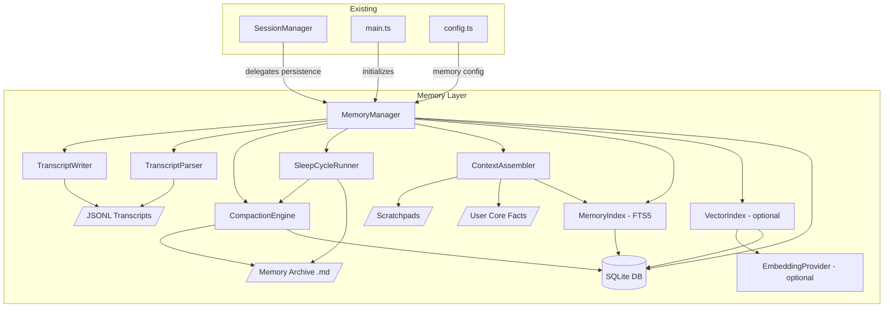

# Design Document: Local Memory

## Overview

This design adds a local-only, human-brain-inspired hierarchical memory layer to agentbridge, replacing the ephemeral in-memory `Map<number, SessionState>` in `SessionManager` with SQLite-backed persistence, JSONL transcript files, tiered memory consolidation (daily → weekly → monthly → yearly), FTS5 full-text search, optional local-model vector search, and dynamic context assembly with token budgets. The architecture is inspired by openclaw's memory system and the biological process of memory consolidation during sleep, but avoids all cloud API dependencies.

The memory layer is an opt-in enhancement (enabled by default via `MEMORY_ENABLED=true`). When enabled, it persists session state across restarts, records every conversation turn to disk, consolidates summaries into hierarchical tiers, and provides BM25-ranked keyword search over history. When disabled or when SQLite initialization fails, the bridge falls back to its current in-memory-only behavior with zero functional regression.

### Key Design Decisions

1. **better-sqlite3 over node:sqlite** — `node:sqlite` is still experimental in Node 22. `better-sqlite3` is mature, synchronous (simpler error handling, no async overhead for local disk I/O), and widely used. All database operations are synchronous, which simplifies the persistence layer and avoids race conditions.

2. **JSONL transcripts as source of truth** — The SQLite database is a derived index. Transcripts on disk are the durable record. This means the FTS index can be rebuilt from transcripts if the database is corrupted or deleted.

3. **Composition over inheritance** — Unlike openclaw's `MemoryManagerSyncOps → MemoryManagerEmbeddingOps → MemoryIndexManager` class hierarchy, we use composition: `MemoryManager` owns a `TranscriptWriter`, `TranscriptParser`, `MemoryIndex`, and optionally a `VectorIndex`. This is simpler and more testable.

4. **Graceful degradation everywhere** — Every persistence operation is wrapped in try/catch. Failures are logged but never block the Telegram ↔ Kiro message flow.

5. **Hierarchical memory consolidation** — Inspired by biological sleep cycles, raw transcripts are compacted into daily summaries, which roll up into weekly, monthly, and yearly tiers. This provides temporal decay: recent details are preserved, older interactions are progressively condensed. A year of interaction compresses to a few paragraphs.

6. **Lazy consolidation over cron** — Instead of cron-based sleep cycles, consolidation triggers lazily on session start. This avoids wasted compute for sporadic Telegram usage while still ensuring timely rollups.

7. **Tiered context assembly** — The LLM context window is built from fixed-budget tiers (Soul → Scratchpad → Recalled Memories → Working Memory → Input), ensuring maximum relevant context without exceeding token limits.

## Architecture



### Data Flow

1. **Message arrives** → `main.ts` handles it → calls `SessionManager.getOrCreateSession()` → `SessionManager` calls `MemoryManager.persistSession()` (fire-and-forget)
2. **Message recorded** → `main.ts` calls `MemoryManager.recordMessage()` → `TranscriptWriter` appends to JSONL → `MemoryIndex.index()` adds to FTS5 → optionally `VectorIndex.index()` stores embedding
3. **Search** → `MemoryManager.search(query, opts)` → `MemoryIndex.search()` returns BM25 results → optionally merges with `VectorIndex.search()` via reciprocal rank fusion
4. **Startup restore** → `MemoryManager.restoreSessions()` → queries SQLite for recent sessions → `TranscriptParser` loads last N messages per session
5. **Compaction (/compact)** → `CompactionEngine` loads transcript via `TranscriptParser` → sends to LLM with daily compaction prompt → stores summary as `{baseDir}/memory/daily/{chatId}/YYYY-MM-DD.md` + SQLite row → indexes in FTS5
6. **Session reset with auto-compact** → `/new` command → if `MEMORY_COMPACT_ON_RESET=true`, triggers compaction first → then resets session
7. **Sleep cycle (lazy consolidation)** → on session start, `SleepCycleRunner` checks pending rollups → daily→weekly (7+ daily files in same week) → weekly→monthly (4+ weekly files in same month) → monthly→yearly (12+ monthly files in same year) → each step sends source content to LLM for progressive summarization → deletes source files, writes consolidated file
8. **Mid-session auto-compact** → after each `recordMessage()`, `MemoryManager` estimates the current session transcript's token count → if it exceeds `autoCompactThreshold` (default 3000), silently triggers daily compaction of the oldest messages up to the threshold boundary → compacted messages are removed from the working-memory window but retained in the JSONL transcript on disk → appends to existing daily file if present
9. **Yearly essence extraction** → during yearly consolidation, LLM also extracts permanent user facts → reads existing `user_core_facts.md` → merges and deduplicates holistically → writes the merged result
10. **Context assembly** → `ContextAssembler.assemble(chatId, userInput)` → injects Soul+UserCoreFacts (500 tokens) → Scratchpad (300 tokens) → top-3 hybrid search results from archive (600 tokens) → last N raw messages (2000 tokens) → user input

## Components and Interfaces

### MemoryConfig

Extracted from environment variables, added to the existing `Config` type.

```typescript
type MemoryConfig = {
  memoryEnabled: boolean;        // MEMORY_ENABLED, default true
  memoryDir: string;             // MEMORY_DIR, default ~/.agentbridge/memory
  maxMessagesPerChat: number;    // MEMORY_MAX_MESSAGES_PER_CHAT, default 1000
  diskBudgetBytes: number;       // MEMORY_DISK_BUDGET_MB * 1024 * 1024, default 500MB
  vectorEnabled: boolean;        // MEMORY_VECTOR_ENABLED, default false
  stalenessThresholdMs: number;  // MEMORY_STALENESS_HOURS * 3600000, default 24h
  restoreMessageCount: number;   // MEMORY_RESTORE_MESSAGES, default 50
  compactOnReset: boolean;       // MEMORY_COMPACT_ON_RESET, default false
  autoCompactThreshold: number;  // MEMORY_AUTO_COMPACT_THRESHOLD, default 3000 tokens
  contextBudget: {
    soul: number;                // MEMORY_CONTEXT_BUDGET_SOUL, default 500 tokens
    scratchpad: number;          // MEMORY_CONTEXT_BUDGET_SCRATCHPAD, default 300 tokens
    recalled: number;            // MEMORY_CONTEXT_BUDGET_RECALLED, default 600 tokens
    working: number;             // MEMORY_CONTEXT_BUDGET_WORKING, default 2000 tokens
  };
};
```

### MessageRecord

The core data unit for conversation history.

```typescript
type MessageRecord = {
  role: "user" | "assistant" | "compaction";
  content: string;
  timestamp: number;   // Unix ms
  chatId: number;
  sessionId: string;
};
```

### TranscriptWriter

Appends `MessageRecord` objects as JSON lines to disk.

```typescript
class TranscriptWriter {
  constructor(baseDir: string);

  /** Append a message to the transcript file for this chat/session. */
  append(record: MessageRecord): void;

  /** Get the file path for a given chat/session transcript. */
  getPath(chatId: number, sessionId: string): string;
}
```

- File path: `{baseDir}/transcripts/{chatId}/{sessionId}.jsonl`
- Uses `appendFileSync` for atomic-ish line writes (same pattern as `logger.ts`)
- Creates directories with `mkdirSync({ recursive: true })` on first write

### TranscriptParser

Reads JSONL transcript files back into `MessageRecord` arrays.

```typescript
class TranscriptParser {
  /** Parse a JSONL file into an ordered array of MessageRecords. */
  parse(filePath: string): MessageRecord[];

  /** Parse only the last N records from a file (for restore). */
  parseTail(filePath: string, count: number): MessageRecord[];
}
```

- Reads file with `readFileSync`, splits on `\n`
- Skips malformed lines with a warning log
- `parseTail` reads the full file but returns only the last `count` entries (simple approach; files are bounded by disk budget)

### MemoryIndex (FTS5)

SQLite FTS5 full-text search index over message content.

```typescript
class MemoryIndex {
  constructor(db: BetterSqlite3.Database);

  /** Create FTS5 table if not exists. */
  initialize(): void;

  /** Index a message for full-text search. */
  index(record: MessageRecord): void;

  /** Search messages by query, returning ranked results. */
  search(query: string, opts?: {
    chatId?: number;
    startTime?: number;
    endTime?: number;
    limit?: number;
  }): SearchResult[];

  /** Remove all indexed entries for a session. */
  removeSession(chatId: number, sessionId: string): void;

  /** Remove oldest entries for a chat beyond the limit. */
  prune(chatId: number, maxMessages: number): void;
}

type SearchResult = {
  record: MessageRecord;
  score: number;  // BM25 rank
};
```

**SQLite Schema:**

```sql
-- Session state table
CREATE TABLE IF NOT EXISTS sessions (
  telegram_chat_id INTEGER NOT NULL,
  acp_session_id TEXT NOT NULL,
  is_active INTEGER NOT NULL DEFAULT 1,
  created_at INTEGER NOT NULL,
  last_activity_at INTEGER NOT NULL,
  PRIMARY KEY (telegram_chat_id, acp_session_id)
);

CREATE INDEX IF NOT EXISTS idx_sessions_active
  ON sessions(is_active, last_activity_at);

-- Messages table (source for FTS)
CREATE TABLE IF NOT EXISTS messages (
  id INTEGER PRIMARY KEY AUTOINCREMENT,
  chat_id INTEGER NOT NULL,
  session_id TEXT NOT NULL,
  role TEXT NOT NULL,
  content TEXT NOT NULL,
  timestamp INTEGER NOT NULL
);

CREATE INDEX IF NOT EXISTS idx_messages_chat_ts
  ON messages(chat_id, timestamp);

-- FTS5 virtual table
CREATE VIRTUAL TABLE IF NOT EXISTS messages_fts USING fts5(
  content,
  content=messages,
  content_rowid=id,
  tokenize='porter unicode61'
);

-- Triggers to keep FTS in sync
CREATE TRIGGER IF NOT EXISTS messages_ai AFTER INSERT ON messages BEGIN
  INSERT INTO messages_fts(rowid, content) VALUES (new.id, new.content);
END;

CREATE TRIGGER IF NOT EXISTS messages_ad AFTER DELETE ON messages BEGIN
  INSERT INTO messages_fts(messages_fts, rowid, content) VALUES('delete', old.id, old.content);
END;
```

### VectorIndex (Optional)

SQLite-backed vector store for semantic search. Only initialized when `MEMORY_VECTOR_ENABLED=true`.

```typescript
class VectorIndex {
  constructor(db: BetterSqlite3.Database, embeddingProvider: EmbeddingProvider);

  initialize(): void;

  /** Store embedding for a message. */
  index(messageId: number, content: string): Promise<void>;

  /** Find semantically similar messages. */
  search(query: string, opts?: {
    chatId?: number;
    limit?: number;
  }): Promise<VectorSearchResult[]>;

  /** Remove embeddings for a session. */
  removeSession(chatId: number, sessionId: string): void;
}

type VectorSearchResult = {
  messageId: number;
  score: number;  // cosine similarity
};
```

**Additional Schema:**

```sql
-- Embedding cache (keyed by SHA-256 hash of source text)
CREATE TABLE IF NOT EXISTS embeddings (
  content_hash TEXT PRIMARY KEY,
  message_id INTEGER REFERENCES messages(id) ON DELETE CASCADE,
  vector BLOB NOT NULL
);
```

Cosine similarity is computed in JavaScript since SQLite doesn't have native vector ops. The embedding vectors are stored as `Float32Array` serialized to `Buffer`.

### EmbeddingProvider

Local-only embedding generation using `@xenova/transformers`.

```typescript
class EmbeddingProvider {
  constructor(modelName?: string);  // default: "Xenova/all-MiniLM-L6-v2"

  /** Load the ONNX model. Call once at startup. */
  initialize(): Promise<void>;

  /** Generate embedding vector for text. Uses SHA-256 content hash as cache key — identical text returns cached vector, edited text triggers re-embedding. */
  embed(text: string, db: BetterSqlite3.Database): Promise<Float32Array>;

  /** Check if the model is loaded and ready. */
  readonly isReady: boolean;
}
```

### CompactedMemory

The data model for a compaction summary at any tier.

```typescript
type MemoryTier = "daily" | "weekly" | "monthly" | "yearly";

type CompactedMemory = {
  id: number;              // Auto-increment from SQLite
  chatId: number;
  sourceSessionId: string; // Session that was compacted (or "consolidation" for rollups)
  tier: MemoryTier;
  timestamp: number;       // Unix ms when compaction was created
  summary: string;         // LLM-generated summary text
  filePath: string;        // Path to the .md file on disk
};
```

### CompactionEngine

Handles the `/compact` flow and individual tier compaction: loading transcripts, calling the LLM, and persisting results.

```typescript
class CompactionEngine {
  constructor(
    db: BetterSqlite3.Database,
    transcriptParser: TranscriptParser,
    memoryIndex: MemoryIndex,
    config: MemoryConfig,
  );

  /** Run daily compaction for a chat session. Sends transcript to LLM, stores result. */
  compact(params: {
    chatId: number;
    sessionId: string;
    llmCall: (prompt: string, content: string) => Promise<string>;
  }): Promise<CompactedMemory | null>;

  /** Consolidate source files into a higher tier. */
  consolidate(params: {
    chatId: number;
    sourceTier: MemoryTier;
    targetTier: MemoryTier;
    sourceFiles: string[];
    llmCall: (prompt: string, content: string) => Promise<string>;
  }): Promise<CompactedMemory | null>;

  /** Load compactions for a chat, optionally filtered by tier. */
  getCompactions(chatId: number, opts?: { tier?: MemoryTier; limit?: number }): CompactedMemory[];
}
```

The `llmCall` parameter is a callback injected by `MemoryManager` — this keeps the compaction engine decoupled from the specific LLM transport (ACP client). Tier-specific compaction prompts:

**Daily (raw → daily):**
```
Extract the key facts learned about the user today, major decisions made, and tasks completed.
Discard pleasantries, formatting, and minor step-by-step reasoning. Output a dense summary.
```

**Weekly (daily → weekly):**
```
Synthesize these daily summaries into a single weekly summary. Identify overarching themes,
completed projects, and persistent user preferences. Drop transient details that no longer matter.
```

**Monthly (weekly → monthly):**
```
Consolidate these weekly summaries into a monthly overview. Focus on major accomplishments,
evolving preferences, and significant decisions. Remove week-level granularity.
```

**Yearly (monthly → yearly):**
```
Create a yearly summary from these monthly summaries. Capture the most important themes,
long-term preferences, and significant milestones. Also extract a list of permanent, immutable
facts about the user that should be remembered forever.

You will also receive the current User_Core_Facts file. Merge the newly extracted facts with
the existing ones, producing a single holistically deduplicated list. Remove redundant or
contradictory entries while preserving all unique facts. Output the merged facts separately.
```

**Additional Schema:**

```sql
-- Compaction summaries (all tiers)
CREATE TABLE IF NOT EXISTS compactions (
  id INTEGER PRIMARY KEY AUTOINCREMENT,
  chat_id INTEGER NOT NULL,
  source_session_id TEXT NOT NULL,
  tier TEXT NOT NULL DEFAULT 'daily',
  timestamp INTEGER NOT NULL,
  summary TEXT NOT NULL,
  file_path TEXT NOT NULL
);

CREATE INDEX IF NOT EXISTS idx_compactions_chat_tier_ts
  ON compactions(chat_id, tier, timestamp DESC);
```

Compaction summaries are also indexed in the existing `messages_fts` FTS5 table (inserted into `messages` with `role = 'compaction'`) so they're searchable alongside regular messages.

### SleepCycleRunner

Handles lazy-triggered hierarchical consolidation on session start.

```typescript
class SleepCycleRunner {
  constructor(
    compactionEngine: CompactionEngine,
    config: MemoryConfig,
  );

  /** Check and run any pending consolidations for a chat. Called on session start. */
  runPendingConsolidations(params: {
    chatId: number;
    llmCall: (prompt: string, content: string) => Promise<string>;
  }): Promise<void>;

  /** Check if daily→weekly rollup is needed. */
  private needsWeeklyRollup(chatId: number): { needed: boolean; files: string[] };

  /** Check if weekly→monthly rollup is needed. */
  private needsMonthlyRollup(chatId: number): { needed: boolean; files: string[] };

  /** Check if monthly→yearly rollup is needed. */
  private needsYearlyRollup(chatId: number): { needed: boolean; files: string[] };
}
```

Consolidation is lazy: it runs on session start (not via cron), checking if enough source files exist at each tier to trigger a rollup. This avoids wasted compute for sporadic usage.

### ContextAssembler

Builds the LLM context window from tiered memory sources with fixed token budgets.

```typescript
class ContextAssembler {
  constructor(
    memoryManager: MemoryManager,
    config: MemoryConfig,
  );

  /** Assemble the full context for an LLM call. */
  assemble(params: {
    chatId: number;
    userInput: string;
    systemPrompt: string;
    workingMemory: MessageRecord[];
  }): AssembledContext;
}

type AssembledContext = {
  /** The full assembled context string, ready for the LLM. */
  text: string;
  /** Token usage breakdown per tier. */
  usage: {
    soul: number;
    scratchpad: number;
    recalled: number;
    working: number;
    input: number;
    total: number;
  };
};
```

**Assembly order (priority):**

| Order | Component | Source | Token Budget |
|-------|-----------|--------|-------------|
| 1 | Soul + User Core Facts | System prompt + `core/{chatId}/user_core_facts.md` | 500 (configurable) |
| 2 | Scratchpad | `scratchpads/{chatId}/scratchpad.md` | 300 (configurable) |
| 3 | Recalled Memories | Top-3 hybrid search results from memory archive | 600 (configurable) |
| 4 | Working Memory | Last N raw messages from current session | 2000 (configurable) |
| 5 | New Input | User's latest query | Variable |

Token estimation uses a simple `chars / 4` heuristic (good enough for English text). When a tier exceeds its budget, content is truncated (oldest messages for working memory, lowest-scored results for recalled memories).

### MemoryManager

Top-level coordinator that owns all sub-components.

```typescript
class MemoryManager {
  constructor(config: MemoryConfig);

  /** Initialize database, create schema, optionally load embedding model. */
  initialize(): Promise<void>;

  /** Persist a session state row. */
  persistSession(session: SessionState): void;

  /** Update lastActivityAt for a session. */
  touchSession(chatId: number, sessionId: string): void;

  /** Mark a session as inactive. */
  deactivateSession(chatId: number, sessionId: string): void;

  /** Record a conversation message (transcript + index). Checks auto-compact threshold. */
  recordMessage(record: MessageRecord): void;

  /** Search conversation history. */
  search(query: string, opts?: SearchOptions): Promise<SearchResult[]>;

  /** Restore recent sessions from the database. */
  restoreSessions(stalenessMs: number): StoredSession[];

  /** Load recent messages for a session from transcript. */
  loadRecentMessages(chatId: number, sessionId: string, count: number): MessageRecord[];

  /** Run disk budget enforcement. */
  enforceDiskBudget(): void;

  /** Compact the current session into a daily memory snapshot. */
  compactSession(params: {
    chatId: number;
    sessionId: string;
    llmCall: (prompt: string, content: string) => Promise<string>;
  }): Promise<CompactedMemory | null>;

  /** Run pending sleep cycle consolidations for a chat. */
  runConsolidation(params: {
    chatId: number;
    llmCall: (prompt: string, content: string) => Promise<string>;
  }): Promise<void>;

  /** Check if the current session transcript exceeds the auto-compact threshold and silently compact if needed. */
  checkAutoCompact(params: {
    chatId: number;
    sessionId: string;
    llmCall: (prompt: string, content: string) => Promise<string>;
  }): Promise<void>;

  /** Assemble the full context for an LLM call. */
  assembleContext(params: {
    chatId: number;
    userInput: string;
    systemPrompt: string;
    workingMemory: MessageRecord[];
  }): AssembledContext;

  /** Read the scratchpad for a chat. */
  readScratchpad(chatId: number): string;

  /** Write to the scratchpad for a chat. */
  writeScratchpad(chatId: number, content: string): void;

  /** Read user core facts for a chat. */
  readUserCoreFacts(chatId: number): string;

  /** Close database and clean up. */
  close(): void;
}

type StoredSession = {
  telegramChatId: number;
  acpSessionId: string;
  createdAt: number;
  lastActivityAt: number;
};

type SearchOptions = {
  chatId?: number;
  startTime?: number;
  endTime?: number;
  limit?: number;
};
```

### Integration with SessionManager

`SessionManager` gains an optional `MemoryManager` dependency:

```typescript
class SessionManager {
  private sessions = new Map<number, SessionState>();
  private readonly acpClient: AcpClient;
  private readonly workingDir: string;
  private readonly memory?: MemoryManager;  // NEW

  constructor(acpClient: AcpClient, workingDir: string, memory?: MemoryManager);

  // Existing methods enhanced:
  // - getOrCreateSession: also calls memory.persistSession() and memory.touchSession()
  // - resetSession: also calls memory.deactivateSession()
  // - NEW: restoreFromMemory(): loads sessions from SQLite on startup
}
```

### Integration with main.ts

```typescript
// In main():
const memoryConfig = loadMemoryConfig(config);
let memory: MemoryManager | undefined;

if (memoryConfig.memoryEnabled) {
  memory = new MemoryManager(memoryConfig);
  await memory.initialize();
  // Restore sessions
  const restored = memory.restoreSessions(memoryConfig.stalenessThresholdMs);
  logInfo("main", `Restored ${restored.length} sessions from memory`);
}

// Pass memory to SessionManager
const sessionManager = new SessionManager(acpClient, config.workingDir, memory);

// On session start, run lazy consolidation (sleep cycles)
const llmCall = (prompt: string, content: string) =>
  acpClient.sendPrompt(sessionId, `${prompt}\n\n${content}`);
await memory?.runConsolidation({ chatId, llmCall });

// In handleUpdate, after sending/receiving messages:
memory?.recordMessage({ role: "user", content: text, timestamp: Date.now(), chatId, sessionId });
// ... after response:
memory?.recordMessage({ role: "assistant", content: response, timestamp: Date.now(), chatId, sessionId });

// Check mid-session auto-compact threshold after each message:
await memory?.checkAutoCompact({ chatId, sessionId, llmCall });

// On /compact command:
if (text === "/compact" && memory) {
  const result = await memory.compactSession({ chatId, sessionId, llmCall });
  if (result) {
    await telegram.sendMessage(chatId, "✅ Session compacted and saved to memory.");
  }
}

// On /new command (with auto-compact):
if (text === "/new") {
  if (memoryConfig.compactOnReset && memory) {
    await memory.compactSession({ chatId, sessionId, llmCall });
  }
  await sessionManager.resetSession(chatId);
}

// Assemble context before sending to LLM:
const context = memory?.assembleContext({
  chatId,
  userInput: text,
  systemPrompt: soulPrompt,
  workingMemory: recentMessages,
});
// Use context.text as the full prompt to the LLM

// Scratchpad commands:
if (text === "/scratchpad" && memory) {
  const pad = memory.readScratchpad(chatId);
  await telegram.sendMessage(chatId, pad || "(empty scratchpad)");
}

// Facts command:
if (text === "/facts" && memory) {
  const facts = memory.readUserCoreFacts(chatId);
  await telegram.sendMessage(chatId, facts || "(no core facts yet)");
}
```

## Data Models

### SQLite Database

Location: `{MEMORY_DIR}/memory.db`

**Tables:**

| Table | Purpose |
|-------|---------|
| `sessions` | Persisted session state (replaces in-memory Map) |
| `messages` | Message content for FTS source and history queries |
| `messages_fts` | FTS5 virtual table for BM25 search |
| `embeddings` | Cached embedding vectors (optional) |
| `compactions` | Compacted memory summaries across all tiers (daily/weekly/monthly/yearly) |

### File System Layout

```
~/.agentbridge/memory/
├── memory.db                          # SQLite database
├── transcripts/
│   └── {chatId}/
│       └── {sessionId}.jsonl          # One file per session (raw working memory)
├── memory/
│   ├── daily/
│   │   └── {chatId}/
│   │       └── YYYY-MM-DD.md          # Daily compaction summaries
│   ├── weekly/
│   │   └── {chatId}/
│   │       └── YYYY-Wxx.md            # Weekly consolidated summaries
│   ├── monthly/
│   │   └── {chatId}/
│   │       └── YYYY-MM.md             # Monthly consolidated summaries
│   └── yearly/
│       └── {chatId}/
│           └── YYYY.md                # Yearly consolidated summaries
├── scratchpads/
│   └── {chatId}/
│       └── scratchpad.md              # Mutable active-task scratchpad
└── core/
    └── {chatId}/
        └── user_core_facts.md         # Permanent user facts (never-forget tier)
```

### MessageRecord JSONL Format

Each line in a `.jsonl` file is a single JSON object:

```json
{"role":"user","content":"Hello, how are you?","timestamp":1718000000000,"chatId":12345,"sessionId":"abc-123"}
{"role":"assistant","content":"I'm doing well! How can I help?","timestamp":1718000001000,"chatId":12345,"sessionId":"abc-123"}
```

### Disk Budget Enforcement

The `MemoryManager` tracks total disk usage as:
- Sum of all `.jsonl` file sizes under `transcripts/`
- Size of `memory.db`

When budget is exceeded, it deletes the oldest transcript files (by directory mtime) and removes corresponding index entries. The check runs:
- Once at startup
- After every 100 `recordMessage()` calls (tracked by a simple counter)


## Correctness Properties

*A property is a characteristic or behavior that should hold true across all valid executions of a system — essentially, a formal statement about what the system should do. Properties serve as the bridge between human-readable specifications and machine-verifiable correctness guarantees.*

### Property 1: Session Persistence Round-Trip

*For any* valid `SessionState` (with arbitrary telegramChatId, acpSessionId, createdAt, lastActivityAt), persisting it via `MemoryManager.persistSession()` and then querying the database should return a row with identical field values. Furthermore, calling `touchSession()` with a new timestamp and re-querying should reflect the updated `lastActivityAt`.

**Validates: Requirements 1.1, 1.2**

### Property 2: Session Restore Respects Staleness Threshold

*For any* set of sessions in the database with varying `lastActivityAt` timestamps and *for any* staleness threshold, `restoreSessions(threshold)` should return exactly those sessions whose `lastActivityAt` is within `Date.now() - threshold`, and no others.

**Validates: Requirements 1.3, 8.1**

### Property 3: Session Reset Marks Inactive

*For any* active session in the database, after calling `deactivateSession()`, querying the database for that session should show `is_active = 0`, and it should not appear in `restoreSessions()` results.

**Validates: Requirements 1.4**

### Property 4: Transcript Serialization Round-Trip

*For any* array of valid `MessageRecord` objects (with arbitrary role, content, timestamp, chatId, sessionId), writing them via `TranscriptWriter.append()` and then reading the file via `TranscriptParser.parse()` should produce an equivalent array with identical field values in the same order.

**Validates: Requirements 2.1, 2.2, 2.4, 2.5, 11.1, 11.2, 11.3**

### Property 5: Transcript File Path Structure

*For any* chatId (number) and sessionId (string), `TranscriptWriter.getPath(chatId, sessionId)` should return a path matching the pattern `{baseDir}/transcripts/{chatId}/{sessionId}.jsonl`.

**Validates: Requirements 2.3**

### Property 6: Indexed Messages Are Searchable

*For any* `MessageRecord` that is recorded via `MemoryManager.recordMessage()`, searching for a distinctive word from that message's content via `MemoryIndex.search()` should return a result containing that message.

**Validates: Requirements 3.1**

### Property 7: Search Results Ordered by BM25 Score

*For any* set of indexed messages and *for any* search query that returns multiple results, the results should be ordered by descending BM25 relevance score (i.e., `results[i].score >= results[i+1].score` for all valid `i`).

**Validates: Requirements 3.2**

### Property 8: Search Filters Are Respected

*For any* search query with a `chatId` filter, all returned results should have a matching `chatId`. *For any* search query with a date range `[startTime, endTime]`, all returned results should have `startTime <= timestamp <= endTime`.

**Validates: Requirements 3.3, 3.4**

### Property 9: Session Deletion Removes Index Entries

*For any* session with indexed messages, after calling `MemoryIndex.removeSession(chatId, sessionId)`, searching for content from those messages filtered by that session should return zero results.

**Validates: Requirements 3.6**

### Property 10: Vector Search Ordered by Cosine Similarity

*For any* set of embedded messages and *for any* query embedding, `VectorIndex.search()` results should be ordered by descending cosine similarity score.

**Validates: Requirements 4.2, 4.3**

### Property 11: Reciprocal Rank Fusion Correctness

*For any* two ranked lists of results (FTS and vector), the reciprocal rank fusion output should assign each result a score equal to `1/(k + rank_fts) + 1/(k + rank_vector)` (where k is a constant, and rank is ∞ for items not in a list), and the output should be sorted by descending fused score.

**Validates: Requirements 4.4**

### Property 12: Embedding Cache Consistency

*For any* text string, calling `EmbeddingProvider.embed(text)` twice should return identical vectors, and the second call should retrieve from the SQLite cache (keyed by SHA-256 hash of the text) rather than recomputing. If the text is modified (even by one character), the hash changes and a fresh embedding is computed.

**Validates: Requirements 4.7**

### Property 13: Pruning Preserves Most Recent Messages

*For any* chat with N indexed messages and a configured limit L (where N > L), after pruning, the index should contain exactly L messages, and they should be the L messages with the highest timestamps. If vector search is enabled, the same should hold for the embeddings table.

**Validates: Requirements 5.2, 5.3**

### Property 14: Pruning Preserves Transcript Files

*For any* pruning operation on the index, the corresponding JSONL transcript files on disk should remain unchanged (same content, same size).

**Validates: Requirements 5.4**

### Property 15: Disk Budget Enforcement

*For any* set of transcript files and database whose total size exceeds the configured disk budget, after calling `enforceDiskBudget()`, the total size should be at or below the budget. The deleted files should be the oldest ones (by file modification time). All index entries corresponding to deleted transcripts should also be removed.

**Validates: Requirements 6.2, 6.3**

### Property 16: Configuration Parsing

*For any* set of valid environment variable values for `MEMORY_ENABLED`, `MEMORY_DIR`, `MEMORY_MAX_MESSAGES_PER_CHAT`, `MEMORY_DISK_BUDGET_MB`, and `MEMORY_VECTOR_ENABLED`, parsing should produce a `MemoryConfig` with matching values. *For any* invalid value, the parser should fall back to the documented default for that field.

**Validates: Requirements 7.1, 7.4**

### Property 17: Restore Loads Most Recent N Messages

*For any* transcript file with M messages and a restore count N, `loadRecentMessages(chatId, sessionId, N)` should return `min(M, N)` messages, and they should be the last `min(M, N)` messages from the transcript in chronological order.

**Validates: Requirements 8.2**

### Property 18: Malformed JSONL Lines Are Skipped

*For any* JSONL file containing a mix of valid JSON lines and malformed lines (arbitrary non-JSON strings), `TranscriptParser.parse()` should return only the valid `MessageRecord` objects in their original order, skipping all malformed lines.

**Validates: Requirements 11.4**

### Property 19: Compaction Persistence Round-Trip

*For any* valid compaction summary string, chatId, and sessionId, calling `CompactionEngine.compact()` (with a mock LLM that returns the summary) and then `CompactionEngine.getCompactions(chatId, { tier: "daily" })` should return a `CompactedMemory` containing the exact summary text, correct chatId, correct sourceSessionId, and tier "daily".

**Validates: Requirements 10.1, 10.2, 10.3**

### Property 20: Daily Compaction File Written to Disk

*For any* successful daily compaction, a markdown file should exist at `{baseDir}/memory/daily/{chatId}/YYYY-MM-DD.md` containing the summary text.

**Validates: Requirements 10.2**

### Property 21: Consolidation Reduces File Count

*For any* chat with N daily files (N ≥ 7) within the same ISO week, after running weekly consolidation, exactly 1 weekly file should exist for that week and the N source daily files should be deleted. The same property holds for weekly→monthly (4+ files) and monthly→yearly (12+ files).

**Validates: Requirements 12.2, 12.3, 12.4**

### Property 22: Consolidation Preserves Information

*For any* set of source tier files consolidated into a higher tier, the resulting summary file should be non-empty and the corresponding SQLite row should exist with the correct tier, chatId, and a non-empty summary.

**Validates: Requirements 12.5**

### Property 23: Compaction Is Searchable via FTS

*For any* compaction summary that has been persisted, searching for a distinctive word from that summary via `MemoryIndex.search()` should return a result containing that compaction.

**Validates: Requirements 10.6**

### Property 24: Scratchpad Persistence Round-Trip

*For any* non-empty string written to the scratchpad via `writeScratchpad(chatId, content)`, reading it back via `readScratchpad(chatId)` should return the identical string. The scratchpad should survive session resets.

**Validates: Requirements 13.1, 13.5**

### Property 25: User Core Facts Are Deduplicated on Yearly Consolidation

*For any* sequence of yearly consolidation operations, the resulting User_Core_Facts file should contain no duplicate facts. The LLM is instructed to read existing facts, merge with newly extracted facts, and produce a holistically deduplicated rewrite. All unique facts from prior consolidations should still be present.

**Validates: Requirements 14.2, 14.4**

### Property 26: Context Assembly Respects Token Budgets

*For any* assembled context, each tier's token usage should be at or below its configured budget. The total should equal the sum of all tier usages.

**Validates: Requirements 15.2, 15.4**

### Property 27: Context Assembly Order Is Deterministic

*For any* two calls to `assembleContext()` with identical inputs (same chatId, userInput, systemPrompt, workingMemory), the output text should be identical.

**Validates: Requirements 15.1**

### Property 28: Mid-Session Auto-Compaction Triggers at Threshold

*For any* session whose transcript token estimate exceeds the configured `autoCompactThreshold`, calling `checkAutoCompact()` should produce a daily-tier compaction of the oldest messages. After auto-compaction, the working-memory window should contain fewer tokens than the threshold, while the JSONL transcript on disk retains all original messages.

**Validates: Requirements 16.1, 16.2, 16.3, 16.4**

## Error Handling

All persistence operations follow the same pattern: **try, log on failure, continue**. The bridge must never crash or block due to a memory layer failure.

| Scenario | Behavior |
|----------|----------|
| SQLite DB cannot be opened/created | Log error, set `MemoryManager` to disabled mode, bridge runs in-memory only |
| Write to SQLite fails (disk full, locked) | Log error, skip persistence, continue processing messages |
| Transcript file write fails | Log error, skip transcript append, continue (message still indexed if DB write succeeded) |
| FTS5 index operation fails | Log error, message is still in transcript but not searchable |
| Embedding model fails to load | Log warning, disable vector search, use FTS-only |
| Embedding computation fails for a message | Log warning, skip vector indexing for that message, FTS still works |
| Transcript file is corrupted/malformed | Parser skips bad lines, logs warnings, returns valid records |
| Disk budget check fails (can't stat files) | Log error, skip budget enforcement this cycle |
| Session restore finds unreachable ACP backend | Mark session inactive, create new ACP session, preserve history |
| LLM compaction call fails (timeout, error) | Log error, skip compaction, continue without producing a summary |
| Compaction markdown file write fails | Log error, compaction is still in SQLite (DB is primary) |
| Consolidation LLM call fails | Log error, retain source files unchanged, retry on next session start |
| Scratchpad file read/write fails | Log error, return empty string / skip write |
| User core facts file read/write fails | Log error, return empty string / skip append |
| Context assembly fails | Log error, fall back to working memory + user input only |

### Error Propagation Rules

1. **Never throw from persistence methods** — All `MemoryManager`, `TranscriptWriter`, `MemoryIndex`, and `VectorIndex` public methods catch exceptions internally.
2. **Always log** — Every caught error is logged via the existing `logError`/`logWarn` functions with a `"memory"` tag.
3. **Degrade gracefully** — If the entire memory layer fails to initialize, `MemoryManager` enters a no-op mode where all methods return immediately without error.

## Testing Strategy

### Property-Based Testing

Use `fast-check` (already in devDependencies) for property-based tests. Each property from the Correctness Properties section maps to one `fast-check` test.

**Configuration:**
- Minimum 100 iterations per property test (`{ numRuns: 100 }`)
- Each test tagged with: `Feature: local-memory, Property {N}: {title}`

**Generators needed:**
- `MessageRecord` generator: random role (user/assistant), random non-empty content string, random positive timestamp, random positive chatId, random UUID-like sessionId
- `SessionState` generator: random telegramChatId, random acpSessionId, random timestamps
- `MemoryConfig` generator: random booleans, random paths, random positive numbers within reasonable bounds
- Malformed JSONL generator: mix of valid JSON lines and random non-JSON strings

**Key property tests:**
- Property 4 (transcript round-trip): Generate random `MessageRecord[]`, write via `TranscriptWriter`, read via `TranscriptParser`, assert deep equality
- Property 11 (reciprocal rank fusion): Generate two random ranked lists, compute fusion, verify ordering and score formula
- Property 16 (config parsing): Generate random valid env vars, parse, verify matching config
- Property 18 (malformed JSONL): Generate mixed valid/invalid lines, parse, verify only valid records returned
- Property 19 (compaction round-trip): Generate random summary strings, compact with mock LLM, verify getCompactions returns matching data
- Property 21 (consolidation reduces files): Create N daily files, run weekly consolidation, verify 1 weekly file and N dailies deleted
- Property 24 (scratchpad round-trip): Generate random strings, write/read scratchpad, assert equality
- Property 26 (context budget): Generate context with varying content sizes, verify each tier stays within budget

### Unit Testing

Unit tests complement property tests for specific examples, edge cases, and integration points.

**TranscriptWriter/Parser:**
- Empty file produces empty array
- Single record round-trip
- File with only malformed lines returns empty array

**MemoryIndex:**
- Search with no indexed messages returns empty
- Index one message, search for exact word, verify found
- Remove session, verify search returns nothing
- Prune with limit=0 removes all

**VectorIndex:**
- Cosine similarity of identical vectors = 1.0
- Cosine similarity of orthogonal vectors = 0.0

**MemoryManager:**
- Initialize creates database and schema
- `recordMessage` with memory disabled is a no-op
- Disk budget enforcement with no files is a no-op

**CompactionEngine:**
- Compact with mock LLM stores summary in DB and writes daily .md file
- getCompactions returns empty array for chat with no compactions
- Multiple compactions on same day append to existing daily file
- LLM failure returns null without throwing

**SleepCycleRunner:**
- No rollup needed when fewer than 7 daily files
- Weekly rollup triggered with 7+ daily files in same ISO week
- Monthly rollup triggered with 4+ weekly files in same month
- Yearly rollup triggered with 12+ monthly files in same year
- Failed consolidation retains source files unchanged

**ContextAssembler:**
- Assembly with empty memory returns only soul + input
- Each tier respects its token budget
- Working memory truncates oldest messages when over budget
- Recalled memories capped at top-3 results

**Scratchpad:**
- Read from non-existent file returns empty string and creates file
- Write and read round-trip preserves content
- Scratchpad survives session reset

**UserCoreFacts:**
- Read from non-existent file returns empty string and creates file
- Yearly consolidation merges new facts with existing ones and deduplicates
- Manual edit via `/facts` command preserves content

**Config:**
- Default values when no env vars set
- `MEMORY_ENABLED=false` disables memory
- Invalid `MEMORY_DISK_BUDGET_MB` falls back to default
- `MEMORY_COMPACT_ON_RESET=true` enables auto-compaction
- `MEMORY_AUTO_COMPACT_THRESHOLD` parsed correctly, default 3000
- Context budget env vars parsed correctly

**Mid-Session Auto-Compact:**
- No compaction triggered when transcript is below threshold
- Compaction triggered when transcript exceeds threshold
- Compacted messages removed from working memory but retained in JSONL
- Appends to existing daily file if one exists
- LLM failure logs error and skips compaction gracefully

**SessionManager integration:**
- `getOrCreateSession` persists to memory
- `resetSession` marks inactive in memory
- Restore on startup loads sessions from DB

### Test File Organization

```
agentbridge/src/components/
├── transcript-writer.test.ts
├── transcript-parser.test.ts
├── memory-index.test.ts
├── vector-index.test.ts
├── compaction-engine.test.ts
├── sleep-cycle-runner.test.ts
├── context-assembler.test.ts
├── scratchpad.test.ts
├── memory-manager.test.ts
├── memory-config.test.ts
└── session-manager.test.ts  (extended with memory tests)
```

### Dependencies for Testing

- `fast-check` — already in devDependencies, used for all property-based tests
- `better-sqlite3` — real SQLite in tests (no mocking the DB; use temp directories)
- `vitest` — already in devDependencies, test runner
- Tests use `tmp` directories created with `mkdtempSync` and cleaned up in `afterEach`
