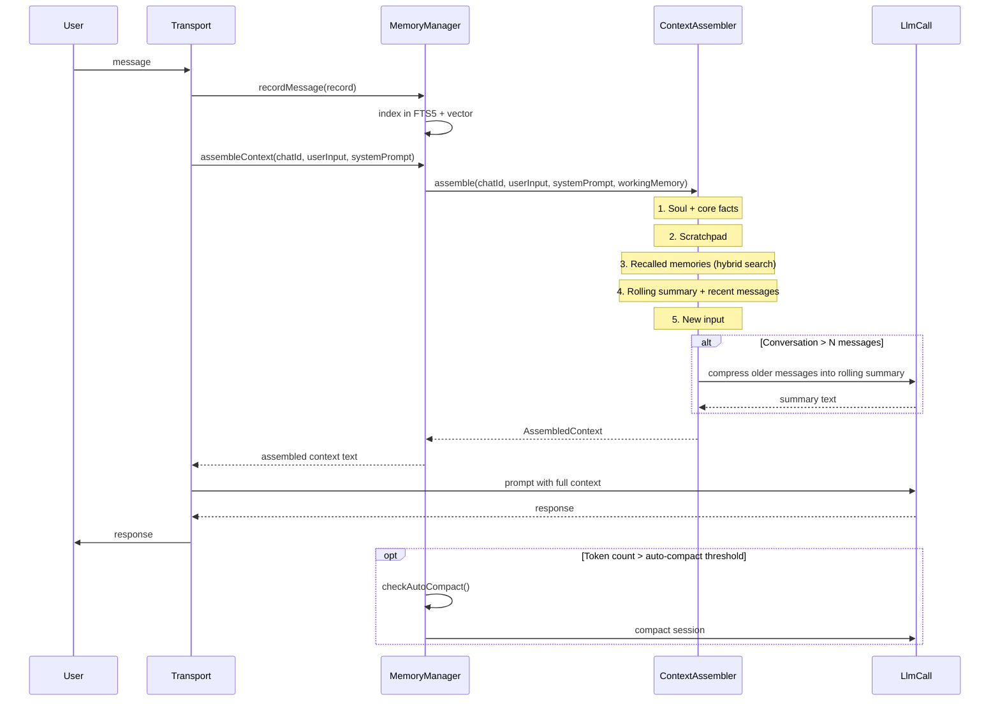

# Design Document: Memory Enhancements

## Overview

This design extends the existing AgentBridge local memory system across three phases to transform it from a passive recording layer into an active, intelligent memory system. The current system already provides SQLite-backed persistence, JSONL transcripts, FTS5 full-text search, optional local-model vector search, hierarchical compaction (daily → weekly → monthly → yearly), and tiered context assembly with token budgets — but several components are dormant (not wired into the hot path).

Three phases of work:

1. **Phase 1 — Wire the Foundation**: Connect the existing dormant CompactionEngine (with real LLM calls), wire ContextAssembler into the prompt flow, and add a rolling summary to the ConversationBuffer. This is integration work — all components exist, they just need wiring.
2. **Phase 2 — Command-Based Features**: Add opt-in slash commands for document ingestion (`/ingest`), reflections (`/reflect`), embedding model hot-swap (`/reembed`), and selective forgetting (`/forget`). Zero risk to the hot path since they're user-initiated.
3. **Phase 3 — Intelligence Layer**: Add autonomous behaviors to the message processing pipeline — proactive recall, importance scoring with decay, contradiction detection, cross-channel memory linking, context assembly feedback loop, and topic-based chunking for compaction.

Each phase is independently shippable. Phase 1 is prerequisite for Phases 2 and 3. Phase 2 and 3 are independent of each other but Phase 3 benefits from Phase 2's embedding hot-swap and ingestion pipeline.

### Design Decisions

1. **LlmCall callback pattern**: The existing `CompactionEngine` and `SleepCycleRunner` already accept an `llmCall` callback. We continue this pattern for all new components that need LLM inference (ReflectionEngine, ContradictionDetector, ImportanceScorer, RollingSummary generation). The callback is provided by the transport layer, keeping memory components transport-agnostic.

2. **SQLite as the single source of truth**: All new data (importance scores, feedback signals, model versions, ingested document metadata) lives in SQLite alongside existing tables. No new databases or storage engines. This keeps the system simple and transactional.

3. **Extend, don't replace**: Existing components (ContextAssembler, CompactionEngine, EmbeddingProvider, VectorIndex, MemoryIndex) are extended with new methods/fields rather than replaced. This minimizes risk to the existing working system.

4. **New components are injected into MemoryManager**: All new components (IngestionPipeline, ReflectionEngine, ImportanceScorer, ContradictionDetector, FeedbackTracker) are created and owned by MemoryManager, following the existing coordinator pattern.

5. **Graceful degradation everywhere**: Every new feature follows the existing "try, log, continue" error handling pattern. If any enhancement fails, the system falls back to the previous behavior. The core Q→A pipeline never breaks due to an enhancement failure.

6. **Config via env vars**: All new configuration follows the existing `MEMORY_*` env var pattern parsed in `loadMemoryConfig()`.

## Architecture

### High-Level System Architecture

```mermaid
graph TB
    subgraph "Transport Layer"
        TG[Telegram Poller]
        DC[Discord Poller]
    end

    subgraph "MemoryManager — Coordinator"
        direction TB
        RM[recordMessage]
        AC[assembleContext]
        HS[hybridSearch]
        CMD[Command Handlers]
    end

    subgraph "Phase 1 — Foundation"
        CE[CompactionEngine<br/>+ real LlmCall]
        CA[ContextAssembler<br/>+ rolling summary]
        SCR[SleepCycleRunner<br/>+ real LlmCall]
        RS[RollingSummary<br/>generation]
    end

    subgraph "Phase 2 — Commands"
        IP[IngestionPipeline<br/>/ingest]
        RE[ReflectionEngine<br/>/reflect]
        EHS[EmbeddingProvider<br/>hot-swap + /reembed]
        SF[Selective Forgetting<br/>/forget]
    end

    subgraph "Phase 3 — Intelligence"
        PR[Proactive Recall]
        IS[ImportanceScorer]
        CD[ContradictionDetector]
        XCL[Cross-Channel Linking]
        FT[FeedbackTracker]
        TC[Topic Chunking]
    end

    subgraph "Storage"
        DB[(SQLite<br/>messages, embeddings,<br/>compactions, feedback,<br/>ingested_docs)]
        FS[File System<br/>transcripts, compactions,<br/>reflections, core facts]
    end

    TG --> RM
    DC --> RM
    TG --> CMD
    DC --> CMD

    RM --> IS
    RM --> CD
    RM --> CA
    AC --> CA
    AC --> PR
    AC --> FT

    CE --> DB
    CE --> FS
    CA --> HS
    RS --> CA

    IP --> DB
    RE --> FS
    EHS --> DB
    SF --> DB
    SF --> FS

    PR --> HS
    IS --> DB
    CD --> FS
    XCL --> DB
    FT --> DB
    TC --> CE
end
```

### Phase 1: Message Flow (After Wiring)



### Phase 3: Enhanced Message Flow (Intelligence Layer)

```mermaid
sequenceDiagram
    participant U as User
    participant T as Transport
    participant MM as MemoryManager
    participant IS as ImportanceScorer
    participant CD as ContradictionDetector
    participant PR as Proactive Recall
    participant CA as ContextAssembler
    participant FT as FeedbackTracker
    participant LLM as LlmCall

    U->>T: message
    T->>MM: recordMessage(record)
    MM->>IS: scoreImportance(record)
    IS-->>MM: importance: 0.0–1.0
    MM->>MM: index in FTS5 + vector (with importance)

    MM->>CD: checkContradictions(record, coreFacts)
    alt Contradiction detected
        CD-->>T: prompt user to resolve
    end

    T->>MM: assembleContext(chatId, userInput, systemPrompt)
    MM->>PR: findProactiveRecalls(userInput, chatId)
    PR-->>MM: proactive results (max 3, threshold 0.7)
    MM->>CA: assemble(chatId, userInput, systemPrompt, workingMemory, proactiveRecalls)
    CA-->>MM: AssembledContext
    MM-->>T: assembled context text
    T->>LLM: prompt with full context
    LLM-->>T: response

    T->>FT: trackFeedback(recalledMemoryIds, response)
    FT->>FT: positive if referenced, neutral if ignored
end
```


## Components and Interfaces

### Phase 1 Components

#### 1.1 MemoryManager Extensions (`src/components/memory-manager.ts`)

The existing MemoryManager is extended to wire the LlmCall callback through to CompactionEngine and SleepCycleRunner, and to call ContextAssembler in the prompt flow.

```typescript
// New field on MemoryManager
private llmCall: ((prompt: string, content: string) => Promise<string>) | null = null;

/** Register the LLM callback. Called once from main.ts after transport is ready. */
setLlmCall(llmCall: (prompt: string, content: string) => Promise<string>): void;

/** 
 * Build assembled context for a user message. Called by transport before sending to LLM.
 * Falls back to raw userInput if assembly fails.
 */
async assembleContext(params: {
  chatId: number;
  userInput: string;
  systemPrompt: string;
}): Promise<string>;
```

#### 1.2 CompactionEngine — LLM Wiring (`src/components/compaction-engine.ts`)

No structural changes. The existing `compact()` and `consolidate()` methods already accept an `llmCall` parameter. The change is in `main.ts` and `MemoryManager` — they now pass a real LlmCall callback instead of a placeholder.

#### 1.3 SleepCycleRunner — LLM Wiring (`src/components/sleep-cycle-runner.ts`)

No structural changes. `runPendingConsolidations()` already accepts `llmCall`. The change is that MemoryManager now provides the real callback.

#### 1.4 ContextAssembler — Rolling Summary (`src/components/context-assembler.ts`)

Extended to support rolling summary generation and inclusion in the working memory tier.

```typescript
// New fields
private rollingSummaries: Map<string, string>; // channelKey → summary text

/** 
 * Set the LLM callback for rolling summary generation.
 * Without this, falls back to simple truncation.
 */
setLlmCall(llmCall: (prompt: string, content: string) => Promise<string>): void;

/**
 * Updated assemble() — now includes rolling summary before recent messages
 * in the working memory tier. Messages beyond the buffer window are compressed.
 */
async assemble(params: {
  chatId: number;
  userInput: string;
  systemPrompt: string;
  workingMemory: MessageRecord[];
  rollingSummary?: string;
  proactiveRecalls?: SearchResult[];  // Phase 3
}): Promise<AssembledContext>;

/**
 * Incrementally update the rolling summary when messages fall out of the buffer window.
 * Uses LlmCall to compress displaced messages into the existing summary.
 */
async updateRollingSummary(params: {
  channelKey: string;
  displacedMessages: MessageRecord[];
  existingSummary: string;
}): Promise<string>;
```

#### 1.5 Updated main.ts Wiring

```typescript
// In main.ts message handler (both Telegram and Discord):
// BEFORE (current):
//   const response = await transport.sendPrompt(sessionKey, userMessage);
// AFTER:
//   const context = await memory.assembleContext({ chatId, userInput: userMessage, systemPrompt });
//   const response = await transport.sendPrompt(sessionKey, context);

// In main.ts initialization:
//   memory.setLlmCall((prompt, content) => transport.sendPrompt(systemSessionKey, `${prompt}\n\n${content}`));
```

### Phase 2 Components

#### 2.1 IngestionPipeline (`src/components/ingestion-pipeline.ts`)

New component that accepts external documents and vectorizes them into long-term memory.

```typescript
export type IngestionSource = {
  type: "youtube" | "pdf" | "text" | "markdown";
  identifier: string;  // URL or filename
};

export type IngestionResult = {
  sourceType: string;
  identifier: string;
  chunkCount: number;
  timestamp: number;
};

export type IngestedDocument = {
  id: number;
  sourceType: string;
  identifier: string;
  chunkCount: number;
  ingestedAt: number;
};

export class IngestionPipeline {
  constructor(
    db: Database.Database,
    embeddingProvider: EmbeddingProvider,
    vectorIndex: VectorIndex,
    config: MemoryConfig,
  );

  /** Ingest a document from a URL or file path. */
  async ingest(source: IngestionSource, chatId: number): Promise<IngestionResult>;

  /** List all previously ingested documents. */
  listIngested(chatId?: number): IngestedDocument[];

  /** Extract text from a YouTube URL (via transcript API). */
  private async extractYouTube(url: string): Promise<string>;

  /** Extract text from a PDF file. */
  private async extractPdf(filePath: string): Promise<string>;

  /** Split text into chunks of configurable max token size. */
  private chunkText(text: string, maxTokens: number): string[];
}
```

#### 2.2 ReflectionEngine (`src/components/reflection-engine.ts`)

New component that generates human-readable meta-summaries.

```typescript
export type Reflection = {
  channelKey: string;
  date: string;       // YYYY-MM-DD
  content: string;    // markdown prose
  preview: string;    // one-line summary
  filePath: string;
};

export class ReflectionEngine {
  constructor(
    db: Database.Database,
    compactionEngine: CompactionEngine,
    config: MemoryConfig,
  );

  /** Generate a reflection for the given channel over a time window. */
  async reflect(params: {
    channelKey: string;
    llmCall: (prompt: string, content: string) => Promise<string>;
    windowDays?: number;  // default: 7
  }): Promise<Reflection>;

  /** List available reflections for a channel. */
  listReflections(channelKey: string): Array<{ date: string; preview: string }>;
}
```

#### 2.3 EmbeddingProvider — Hot-Swap Extensions (`src/components/embedding-provider.ts`)

Extended to track model versions and support re-embedding.

```typescript
// New methods added to existing EmbeddingProvider:

/** Get the current model name/version identifier. */
get modelVersion(): string;

/** 
 * Detect if the configured model differs from the stored model version.
 * Compares MEMORY_EMBEDDING_MODEL env var against the model version stored in DB.
 */
detectModelChange(db: Database.Database): boolean;

/**
 * Re-embed all stored content with the current model.
 * Yields progress callbacks during processing.
 */
async reembed(params: {
  db: Database.Database;
  onProgress: (processed: number, total: number) => void;
}): Promise<void>;
```

#### 2.4 Selective Forgetting — MemoryManager Extensions (`src/components/memory-manager.ts`)

```typescript
export type ForgetResult = {
  messagesRemoved: number;
  embeddingsRemoved: number;
  compactionsRemoved: number;
  transcriptEntriesRemoved: number;
};

// New methods on MemoryManager:

/** Forget all memories semantically related to a topic. */
async forgetTopic(chatId: number, topic: string, threshold?: number): Promise<ForgetResult>;

/** Forget all memories within a date range. */
forgetRange(chatId: number, startDate: Date, endDate: Date): ForgetResult;

/** Forget all memories for a specific session. */
forgetSession(chatId: number, sessionId: string): ForgetResult;

/** Cascade deletion through all storage layers. */
private cascadeDelete(messageIds: number[], chatId: number): ForgetResult;
```

### Phase 3 Components

#### 3.1 ImportanceScorer (`src/components/importance-scorer.ts`)

New component that classifies message importance and applies time-based decay.

```typescript
export class ImportanceScorer {
  constructor(config: MemoryConfig);

  /**
   * Score a message's importance based on content characteristics.
   * Returns a value between 0.0 and 1.0.
   * 
   * High importance: decisions, action items, facts, preferences, instructions
   * Low importance: greetings, acknowledgments, filler
   */
  score(content: string, role: MessageRecord["role"]): number;

  /**
   * Apply time-based decay to an importance score.
   * Uses exponential decay with configurable half-life.
   * Core facts (isCoreFact=true) are exempt from decay.
   */
  applyDecay(params: {
    baseScore: number;
    messageTimestamp: number;
    now: number;
    isCoreFact?: boolean;
  }): number;

  /**
   * Compute a combined ranking score from relevance, importance, and usefulness.
   * Used by MemoryManager when ranking search results.
   */
  computeRankingScore(params: {
    relevanceScore: number;
    importanceScore: number;
    usefulnessScore?: number;  // Phase 3 feedback loop
    decayedImportance: number;
  }): number;
}
```

#### 3.2 ContradictionDetector (`src/components/contradiction-detector.ts`)

New component that detects factual contradictions against stored core facts.

```typescript
export type Contradiction = {
  newAssertion: string;
  existingFact: string;
  confidence: number;  // 0.0–1.0
};

export type ContradictionResolution = "keep_new" | "keep_existing";

export class ContradictionDetector {
  constructor(
    embeddingProvider: EmbeddingProvider,
    config: MemoryConfig,
  );

  /**
   * Check if a message contradicts any existing core facts.
   * Returns null if no contradiction detected or confidence is too low.
   */
  async detect(params: {
    message: string;
    coreFacts: string;
    llmCall: (prompt: string, content: string) => Promise<string>;
  }): Promise<Contradiction | null>;

  /**
   * Apply a contradiction resolution — update or preserve core facts.
   */
  resolve(params: {
    contradiction: Contradiction;
    resolution: ContradictionResolution;
    coreFactsPath: string;
  }): void;
}
```

#### 3.3 FeedbackTracker (`src/components/feedback-tracker.ts`)

New component that tracks whether recalled memories were useful.

```typescript
export type FeedbackSignal = "positive" | "neutral";

export class FeedbackTracker {
  constructor(db: Database.Database);

  /** Record a feedback signal for a recalled memory. */
  recordSignal(memoryId: number, signal: FeedbackSignal): void;

  /** Get the usefulness score for a memory (0.0–1.0). */
  getUsefulnessScore(memoryId: number): number;

  /** 
   * Analyze an LLM response to determine if recalled memories were referenced.
   * Returns memory IDs that were positively referenced.
   */
  analyzeResponse(params: {
    response: string;
    recalledMemoryIds: number[];
    recalledContents: string[];
  }): number[];
}
```

#### 3.4 Cross-Channel Search Extensions

Extensions to existing MemoryManager, VectorIndex, and MemoryIndex:

```typescript
// MemoryManager — updated search signature
async hybridSearch(query: string, opts?: SearchOptions & {
  crossChannel?: boolean;  // default: true in Phase 3
}): Promise<SearchResult[]>;

// VectorIndex — already searches across all channels by default (no chatId filter = cross-channel)
// MemoryIndex — updated search to support omitting chatId filter
search(query: string, opts?: {
  chatId?: number;       // omit for cross-channel
  startTime?: number;
  endTime?: number;
  limit?: number;
}): SearchResult[];

// ContextAssembler — annotate recalled memories with source channel
// In buildRecalledSection(), add channel identifier to each snippet:
// "- [user @telegram:123] content..." or "- [PROACTIVE @discord:456] content..."
```

#### 3.5 Topic-Based Chunking Extensions (`src/components/compaction-engine.ts`)

Extensions to the existing CompactionEngine:

```typescript
export type TopicChunk = {
  messages: MessageRecord[];
  topicLabel: string;
  startTimestamp: number;
  endTimestamp: number;
};

// New methods on CompactionEngine:

/**
 * Identify topic boundaries using semantic similarity between consecutive message groups.
 * Falls back to time-based chunking if embeddings unavailable or chunks too small.
 */
async identifyTopicChunks(params: {
  messages: MessageRecord[];
  embeddingProvider: EmbeddingProvider;
  db: Database.Database;
  minChunkSize: number;  // from MEMORY_MIN_TOPIC_CHUNK_SIZE
}): Promise<TopicChunk[]>;

/**
 * Generate one compaction summary per TopicChunk instead of per time window.
 */
async compactByTopic(params: {
  chatId: number;
  chunks: TopicChunk[];
  llmCall: (prompt: string, content: string) => Promise<string>;
}): Promise<CompactedMemory[]>;
```


## Data Models

### New and Extended Types (`src/types/memory.ts`)

```typescript
/** Extended MessageRecord — adds importance score (Phase 3). */
export type MessageRecord = {
  role: "user" | "assistant" | "compaction";
  content: string;
  timestamp: number;
  chatId: number;
  sessionId: string;
  importance?: number;  // 0.0–1.0, assigned by ImportanceScorer
};

/** A semantically coherent segment of conversation (Phase 3). */
export type TopicChunk = {
  messages: MessageRecord[];
  topicLabel: string;
  startTimestamp: number;
  endTimestamp: number;
};

/** Extended CompactedMemory — adds optional topic label (Phase 3). */
export type CompactedMemory = {
  id: number;
  chatId: number;
  sourceSessionId: string;
  tier: MemoryTier;
  timestamp: number;
  summary: string;
  filePath: string;
  topicLabel?: string;  // set when compacted by topic rather than time
};

/** Result of an ingestion operation (Phase 2). */
export type IngestionResult = {
  sourceType: string;
  identifier: string;
  chunkCount: number;
  timestamp: number;
};

/** A previously ingested document record (Phase 2). */
export type IngestedDocument = {
  id: number;
  sourceType: string;
  identifier: string;
  chunkCount: number;
  ingestedAt: number;
  chatId: number;
};

/** A reflection meta-summary (Phase 2). */
export type Reflection = {
  channelKey: string;
  date: string;
  content: string;
  preview: string;
  filePath: string;
};

/** Contradiction detection result (Phase 3). */
export type Contradiction = {
  newAssertion: string;
  existingFact: string;
  confidence: number;
};

/** Feedback signal types for the feedback loop (Phase 3). */
export type FeedbackSignal = "positive" | "neutral";

/** Result of a forget operation (Phase 2). */
export type ForgetResult = {
  messagesRemoved: number;
  embeddingsRemoved: number;
  compactionsRemoved: number;
  transcriptEntriesRemoved: number;
};

/** Extended SearchResult — adds channel annotation and importance (Phase 3). */
export type SearchResult = {
  record: MessageRecord;
  score: number;
  channelKey?: string;     // source channel for cross-channel results
  isProactive?: boolean;   // true if surfaced by proactive recall
  importanceScore?: number;
  usefulnessScore?: number;
};

/** Extended AssembledContext — adds rolling summary info. */
export type AssembledContext = {
  text: string;
  usage: {
    soul: number;
    scratchpad: number;
    recalled: number;
    working: number;
    input: number;
    total: number;
    rollingSummary: number;  // new: tokens used by rolling summary
  };
};
```

### SQLite Schema Extensions

#### Phase 1 — No schema changes

Phase 1 is pure wiring. The existing schema supports all Phase 1 features.

#### Phase 2 — New tables

```sql
-- Ingested documents metadata (Phase 2, Req 4)
CREATE TABLE IF NOT EXISTS ingested_documents (
  id INTEGER PRIMARY KEY AUTOINCREMENT,
  chat_id INTEGER NOT NULL,
  source_type TEXT NOT NULL,        -- 'youtube', 'pdf', 'text', 'markdown'
  identifier TEXT NOT NULL,          -- URL or filename
  chunk_count INTEGER NOT NULL,
  ingested_at INTEGER NOT NULL       -- Unix ms
);
CREATE INDEX IF NOT EXISTS idx_ingested_docs_chat
  ON ingested_documents(chat_id);

-- Extended embeddings table — add model_version column (Phase 2, Req 6)
ALTER TABLE embeddings ADD COLUMN model_version TEXT DEFAULT 'Xenova/all-MiniLM-L6-v2';
```

#### Phase 3 — New tables and columns

```sql
-- Importance scores stored alongside messages (Phase 3, Req 9)
ALTER TABLE messages ADD COLUMN importance REAL DEFAULT NULL;

-- Feedback signals for the context assembly feedback loop (Phase 3, Req 12)
CREATE TABLE IF NOT EXISTS feedback_signals (
  id INTEGER PRIMARY KEY AUTOINCREMENT,
  memory_id INTEGER NOT NULL REFERENCES messages(id) ON DELETE CASCADE,
  signal_type TEXT NOT NULL,         -- 'positive' or 'neutral'
  timestamp INTEGER NOT NULL         -- Unix ms
);
CREATE INDEX IF NOT EXISTS idx_feedback_memory
  ON feedback_signals(memory_id);

-- Extended compactions table — add topic_label column (Phase 3, Req 13)
ALTER TABLE compactions ADD COLUMN topic_label TEXT DEFAULT NULL;
```

### New Configuration (`src/components/memory-config.ts`)

```typescript
// New fields added to MemoryConfig type:
export type MemoryConfig = {
  // ... existing fields ...

  // Phase 1
  rollingBufferSize: number;              // MEMORY_ROLLING_BUFFER_SIZE, default: 20

  // Phase 2
  ingestChunkMaxTokens: number;           // MEMORY_INGEST_CHUNK_MAX_TOKENS, default: 512
  embeddingModel: string;                 // MEMORY_EMBEDDING_MODEL, default: 'Xenova/all-MiniLM-L6-v2'
  forgetThreshold: number;                // MEMORY_FORGET_THRESHOLD, default: 0.8

  // Phase 3
  proactiveRecallThreshold: number;       // MEMORY_PROACTIVE_RECALL_THRESHOLD, default: 0.7
  proactiveRecallLimit: number;           // MEMORY_PROACTIVE_RECALL_LIMIT, default: 3
  decayHalfLifeDays: number;              // MEMORY_DECAY_HALF_LIFE_DAYS, default: 30
  minTopicChunkSize: number;              // MEMORY_MIN_TOPIC_CHUNK_SIZE, default: 5
  contradictionConfidenceThreshold: number; // MEMORY_CONTRADICTION_THRESHOLD, default: 0.8
};
```

### New Environment Variables

| Env Var | Default | Phase | Description |
|---------|---------|-------|-------------|
| `MEMORY_ROLLING_BUFFER_SIZE` | 20 | 1 | Number of recent messages kept in full detail |
| `MEMORY_INGEST_CHUNK_MAX_TOKENS` | 512 | 2 | Max token size per ingestion chunk |
| `MEMORY_EMBEDDING_MODEL` | `Xenova/all-MiniLM-L6-v2` | 2 | Embedding model name for hot-swap detection |
| `MEMORY_FORGET_THRESHOLD` | 0.8 | 2 | Relevance threshold for topic-based forgetting |
| `MEMORY_PROACTIVE_RECALL_THRESHOLD` | 0.7 | 3 | Min relevance for proactive recall inclusion |
| `MEMORY_PROACTIVE_RECALL_LIMIT` | 3 | 3 | Max proactive recall results per message |
| `MEMORY_DECAY_HALF_LIFE_DAYS` | 30 | 3 | Half-life for importance score decay |
| `MEMORY_MIN_TOPIC_CHUNK_SIZE` | 5 | 3 | Min messages per topic chunk before fallback |
| `MEMORY_CONTRADICTION_THRESHOLD` | 0.8 | 3 | Min confidence for contradiction detection |

### File System Layout (Extended)

```
~/.agentbridge/memory/
├── memory.db                                    # SQLite (extended schema)
├── transcripts/{chatId}/{sessionId}.jsonl       # existing
├── memory/daily/{chatId}/YYYY-MM-DD.md          # existing
├── memory/weekly/{chatId}/YYYY-Wxx.md           # existing
├── memory/monthly/{chatId}/YYYY-MM.md           # existing
├── memory/yearly/{chatId}/YYYY.md               # existing
├── scratchpads/{chatId}/scratchpad.md           # existing
├── core/{chatId}/user_core_facts.md             # existing
└── reflections/{channelKey}/YYYY-MM-DD.md       # NEW (Phase 2, Req 5)
```
