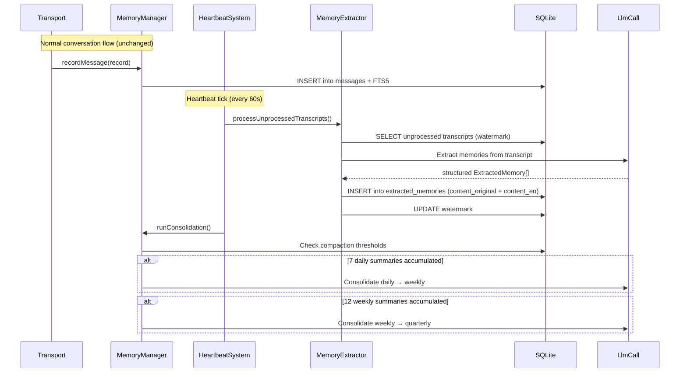
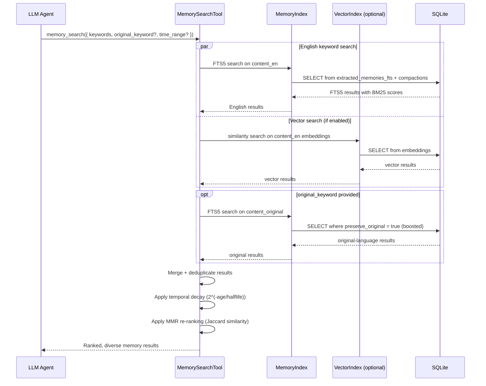

# Design Document — Memory Search Enhancements (4+1 Tier Architecture)

## Overview

This design evolves the AgentBridge memory system from a reactive search-on-every-message model to a 4+1 tier architecture with background memory extraction, English-normalized storage, agent-initiated recall, temporal decay ranking, and MMR diversity re-ranking.

The current system stores raw conversation messages and searches them with FTS5. This fails for Hungarian (agglutinative word forms defeat token matching), produces noisy results (raw chat vs. distilled facts), and adds latency by searching on every message regardless of need.

The new architecture introduces:

- **Tier 2 enhancements**: English rolling summaries, context window monitoring with async compression, per-session injection of Tier 1+2 context
- **Tier 3 collection**: A heartbeat-driven background system that extracts meaningful memories from transcripts using LLM calls, stores them in English with dual-column original-language preservation, and runs simplified compaction (daily → weekly → quarterly)
- **Tier 3 recall**: An agent-initiated `memory_search` tool with English keyword search, original-language fallback, temporal decay scoring, and MMR diversity re-ranking
- **Tier 4 (future, documented only)**: Deep search with Pinecone for user-triggered exhaustive recall

Key design decisions:
1. **Decoupled memory collection** — Memory extraction happens in background via heartbeat, NOT inline during `recordMessage()`. The conversation flow just writes to buffer/transcripts.
2. **Per-conversation injection** — Tier 1+2 context injected only at session start, not every message. With 200K context windows, the LLM remembers within the session natively.
3. **English-first storage** — Extracted memories stored in English (`content_en`) for consistent FTS5/vector search. Original language preserved in `content_original`.
4. **Agent-initiated recall** — The agent calls `memory_search` when it needs to recall, rather than automatic search on every message.

## Architecture

### 4+1 Tier Architecture

```mermaid
graph TB
    subgraph "Tier 1 — Soul (No Changes)"
        CF[CoreFacts<br/>user_core_facts.md<br/>~500 tokens]
    end

    subgraph "Tier 2 — Working Memory (Enhanced)"
        RS[Rolling Summary<br/>English, async compressed]
        CWM[Context Window Monitor<br/>threshold-based compression]
        SI[Session Injection<br/>Tier 1+2 at session start only]
    end

    subgraph "Tier 3 — Collection (New)"
        HB[HeartbeatSystem<br/>periodic background tasks]
        ME[MemoryExtractor<br/>LLM-based extraction]
        DC[Dual-Column Storage<br/>content_original + content_en]
        CE[CompactionEngine<br/>daily → weekly → quarterly]
    end

    subgraph "Tier 3 — Recall (New)"
        MST[MemorySearchTool<br/>agent-initiated]
        EKS[English Keyword Search<br/>FTS5 + optional vector]
        OLF[Original-Language Fallback<br/>preserve_original boost]
        TD[Temporal Decay<br/>exponential half-life]
        MMR[MMR Re-Ranking<br/>Jaccard diversity]
    end

    subgraph "Tier 4 — Deep Search (Future)"
        DS[Pinecone Vector Search<br/>cross-channel, high latency]
    end

    HB --> ME
    HB --> CE
    ME --> DC
    MST --> EKS
    MST --> OLF
    EKS --> TD
    OLF --> TD
    TD --> MMR
    CWM --> RS
```



### Data Flow — Heartbeat-Driven Memory Extraction



### Data Flow — Agent-Initiated Memory Search



### Integration with Existing Components

```mermaid
graph TD
    subgraph "Existing (Modified)"
        MM[MemoryManager<br/>+ heartbeat lifecycle<br/>+ memory search tool]
        CA[ContextAssembler<br/>+ English summaries<br/>+ session injection<br/>+ context window monitor]
        MI[MemoryIndex<br/>+ extracted_memories FTS5]
        CE[CompactionEngine<br/>+ quarterly tier<br/>- monthly/yearly tiers]
        MC[MemoryConfig<br/>+ new env vars]
        MDB[memory-db.ts<br/>+ extracted_memories schema]
    end

    subgraph "New Components"
        HB[HeartbeatSystem]
        ME[MemoryExtractor]
        MST[MemorySearchTool]
        TDS[TemporalDecayScorer]
        MMRR[MMRReranker]
        CWM[ContextWindowMonitor]
    end

    MM --> HB
    MM --> MST
    HB --> ME
    HB --> CE
    MST --> MI
    MST --> TDS
    MST --> MMRR
    CA --> CWM
    ME --> MDB
    MST --> MDB
end
```

## Components and Interfaces

### HeartbeatSystem

**File**: `src/components/heartbeat-system.ts`

Periodic background task runner inspired by OpenClaw's heartbeat architecture. Executes registered tasks at a configurable interval with error isolation between tasks.

```typescript
export type HeartbeatTask = {
  name: string;
  execute: () => Promise<void>;
};

export type HeartbeatConfig = {
  enabled: boolean;
  intervalMs: number;
};

export class HeartbeatSystem {
  private timer: ReturnType<typeof setInterval> | null = null;
  private tasks: HeartbeatTask[] = [];
  private running = false;

  constructor(private config: HeartbeatConfig);

  /** Register a task to run on each heartbeat tick. */
  registerTask(task: HeartbeatTask): void;

  /** Start the heartbeat loop. Logs interval and registered task names. */
  start(): void;

  /** Stop the heartbeat loop and clean up timers. */
  stop(): void;

  /** Execute all registered tasks with error isolation. */
  private async tick(): Promise<void>;
}
```

Each task runs in its own try/catch — a failure in memory extraction does not prevent consolidation from running. The heartbeat logs each tick at debug level and errors at warn level.

### MemoryExtractor

**File**: `src/components/memory-extractor.ts`

Uses LLM calls to distill meaningful memories from raw conversation transcripts. Produces `ExtractedMemory` records with dual-column content.

```typescript
export type ExtractedMemory = {
  content_original: string;
  content_en: string;
  memory_type: "fact" | "decision" | "preference" | "event";
  source_chat_id: number;
  source_timestamp: number;
  preserve_original: boolean;
  preserved_keyword?: string;
};

export class MemoryExtractor {
  constructor(
    private db: Database.Database,
    private llmCall: (prompt: string, content: string) => Promise<string>,
  );

  /**
   * Process unprocessed transcript segments for a chat.
   * Uses a watermark (last processed timestamp per chat) to avoid reprocessing.
   * Processes segments in chronological order.
   */
  async processTranscripts(chatId: number): Promise<ExtractedMemory[]>;

  /**
   * Extract structured memories from a transcript segment using LLM.
   * Discards noise (greetings, filler, formatting artifacts).
   * Detects preserve_original intent from explicit user phrasing.
   */
  private async extractFromSegment(
    transcript: string,
    chatId: number,
    timestamp: number,
  ): Promise<ExtractedMemory[]>;

  /** Get the watermark (last processed timestamp) for a chat. */
  getWatermark(chatId: number): number;

  /** Update the watermark after successful processing. */
  private updateWatermark(chatId: number, timestamp: number): void;
}
```

The LLM prompt instructs the model to:
1. Extract facts, decisions, preferences, and notable events
2. Produce each memory in English (`content_en`) and original language (`content_original`)
3. Set `content_original = content_en` when conversation is already in English
4. Detect explicit keyword preservation intent (e.g., "remember if I say 'ribanc' it is Alexa") and set `preserve_original: true` with the `preserved_keyword` field
5. Discard greetings, filler, step-by-step reasoning, and formatting artifacts

### MemorySearchTool

**File**: `src/components/memory-search-tool.ts`

Agent-callable tool for memory recall. Searches extracted memories and compacted summaries with English keywords, optional original-language fallback, temporal decay, and MMR diversity.

```typescript
export type MemorySearchParams = {
  keywords: string[];
  original_keyword?: string;
  time_range?: { start: number; end: number };
};

export type MemorySearchResult = {
  content: string;
  content_original?: string;
  memory_type?: string;
  source_timestamp: number;
  tier: "extracted" | "weekly" | "quarterly";
  score: number;
};

export type MemorySearchToolConfig = {
  searchTimeoutMs: number;
  decayHalflifeDays: number;
  mmrLambda: number;
};

export class MemorySearchTool {
  constructor(
    private db: Database.Database,
    private memoryIndex: MemoryIndex,
    private vectorIndex: VectorIndex | null,
    private config: MemorySearchToolConfig,
  );

  /**
   * Execute a memory search. Returns ranked, diverse results.
   * Completes within searchTimeoutMs, returning whatever is available at timeout.
   */
  async search(
    params: MemorySearchParams,
    chatId: number,
  ): Promise<MemorySearchResult[]>;

  /**
   * Search extracted memories and compacted summaries by English keywords.
   * Uses FTS5 on content_en with OR-style matching.
   */
  private searchEnglish(
    keywords: string[],
    chatId: number,
    timeRange?: { start: number; end: number },
  ): MemorySearchResult[];

  /**
   * Search content_original for original-language keyword.
   * Boosts results where preserve_original is true.
   */
  private searchOriginalLanguage(
    keyword: string,
    chatId: number,
  ): MemorySearchResult[];

  /**
   * Merge and deduplicate English and original-language results.
   * Prefers higher-scored entries when duplicates exist.
   */
  private mergeResults(
    english: MemorySearchResult[],
    original: MemorySearchResult[],
  ): MemorySearchResult[];

  /**
   * Apply temporal decay multiplier: 2^(-age_in_days / half_life).
   * Applied as multiplier on base relevance score.
   */
  private applyTemporalDecay(
    results: MemorySearchResult[],
    now: number,
  ): MemorySearchResult[];

  /**
   * Apply MMR re-ranking using token-level Jaccard similarity.
   * Skipped when fewer than 2 results.
   */
  private applyMMR(results: MemorySearchResult[]): MemorySearchResult[];
}
```

The tool is exposed to the LLM agent via the system prompt at session start. The agent decides when to invoke it based on the user's message.

**Tool definition for the agent**:
```json
{
  "name": "memory_search",
  "description": "Search your memory for past conversations, facts, decisions, and preferences. Use when the user asks about something you discussed before, or when you need to recall specific information.",
  "parameters": {
    "keywords": { "type": "array", "items": { "type": "string" }, "description": "English search terms" },
    "original_keyword": { "type": "string", "description": "Optional original-language keyword for fallback search" },
    "time_range": {
      "type": "object",
      "properties": {
        "start": { "type": "number", "description": "Start timestamp (Unix ms)" },
        "end": { "type": "number", "description": "End timestamp (Unix ms)" }
      }
    }
  }
}
```

### ContextWindowMonitor

**File**: `src/components/context-window-monitor.ts`

Monitors context window token usage at prompt construction time and schedules async compression when threshold is exceeded.

```typescript
export class ContextWindowMonitor {
  constructor(
    private thresholdPct: number,
    private contextAssembler: ContextAssembler,
  );

  /**
   * Check if context window usage exceeds threshold.
   * Returns true if compression should be scheduled.
   */
  shouldCompress(currentTokens: number, maxTokens: number): boolean;

  /**
   * Schedule rolling summary compression to run after the LLM responds.
   * Does NOT block the current request.
   */
  scheduleCompression(channelKey: string): void;
}
```

The monitor is called during `ContextAssembler.assemble()`. If `shouldCompress()` returns true, compression is scheduled via `setImmediate()` / `process.nextTick()` to run after the current event loop cycle completes (i.e., after the LLM response is delivered).

### ContextAssembler Changes

**File**: `src/components/context-assembler.ts` (modified)

Changes to the existing ContextAssembler:

1. **English rolling summary**: The `updateRollingSummary` prompt is updated to instruct the LLM to produce summaries in English. The section label becomes `[ROLLING SUMMARY (English)]`.

2. **Per-session injection**: New `sessionInjectionState` map tracks whether Tier 1+2 has been injected for the current session per channel key. On first message of a session (or after staleness reset), CoreFacts and RollingSummary are injected. Subsequent messages within the same session omit them.

3. **Context window monitoring**: After assembling context, check token usage against threshold and schedule async compression if needed.

```typescript
// New fields
private sessionInjectionState: Map<string, boolean>; // channelKey → injected

// Modified assemble() signature — adds channelKey
async assemble(params: {
  chatId: number;
  channelKey: string;
  userInput: string;
  systemPrompt: string;
  workingMemory: MessageRecord[];
  isSessionStart?: boolean;
}): Promise<AssembledContext>;

/** Mark a session as needing re-injection (called on staleness reset). */
resetSessionInjection(channelKey: string): void;
```

### CompactionEngine Changes

**File**: `src/components/compaction-engine.ts` (modified)

1. **Tier simplification**: Support daily, weekly, and quarterly tiers only. The `MemoryTier` type is updated to `"daily" | "weekly" | "quarterly"`.
2. **Quarterly consolidation**: New threshold — consolidate weekly summaries into quarterly after 12 weekly summaries accumulate.
3. **English summaries**: All compaction prompts instruct the LLM to produce English summaries.
4. **Legacy preservation**: Existing monthly/yearly files are left in place, not deleted or reprocessed.

```typescript
// Updated MemoryTier type
export type MemoryTier = "daily" | "weekly" | "quarterly";

// Updated consolidation thresholds
const CONSOLIDATION_THRESHOLDS = {
  weekly: 7,      // 7 daily → 1 weekly
  quarterly: 12,  // 12 weekly → 1 quarterly
};
```

### MemoryIndex Changes

**File**: `src/components/memory-index.ts` (modified)

Extended to search the `extracted_memories` table and its FTS5 index.

```typescript
// New methods
/**
 * Search extracted memories by English content.
 * Uses FTS5 on extracted_memories_fts (content_en).
 */
searchExtracted(
  query: string,
  opts?: { chatId?: number; startTime?: number; endTime?: number; limit?: number },
): MemorySearchResult[];

/**
 * Search extracted memories by original-language content.
 * Optionally boosts results where preserve_original is true.
 */
searchOriginal(
  query: string,
  opts?: { chatId?: number; limit?: number; boostPreserved?: boolean },
): MemorySearchResult[];

/**
 * Index an extracted memory in the FTS5 index.
 * Indexes content_en always; indexes content_original when preserve_original is true.
 */
indexExtractedMemory(memory: ExtractedMemory & { id: number }): void;
```

### MemoryConfig Changes

**File**: `src/components/memory-config.ts` (modified)

```typescript
// New config sections added to MemoryConfig type
export type MemoryConfig = {
  // ... existing fields ...

  heartbeat: {
    enabled: boolean;       // MEMORY_HEARTBEAT_ENABLED, default true
    intervalMs: number;     // MEMORY_HEARTBEAT_INTERVAL_MS, default 60000
  };

  searchEnhancements: {
    searchTimeoutMs: number;      // MEMORY_SEARCH_TIMEOUT_MS, default 1000
    decayHalflifeDays: number;    // MEMORY_DECAY_HALFLIFE_DAYS, default 30
    mmrLambda: number;            // MEMORY_MMR_LAMBDA, default 0.7
    compactThresholdPct: number;  // MEMORY_COMPACT_THRESHOLD_PCT, default 85
  };
};
```

All new env vars parsed using existing `parseNumberEnvSafe` and `parseBooleanEnv` helpers. Invalid values log a warning and use defaults.

| Variable | Type | Default | Description |
|---|---|---|---|
| `MEMORY_HEARTBEAT_ENABLED` | boolean | `true` | Enable/disable heartbeat system |
| `MEMORY_HEARTBEAT_INTERVAL_MS` | number | `60000` | Heartbeat tick interval |
| `MEMORY_SEARCH_TIMEOUT_MS` | number | `1000` | Memory search timeout |
| `MEMORY_DECAY_HALFLIFE_DAYS` | number | `30` | Temporal decay half-life |
| `MEMORY_MMR_LAMBDA` | number | `0.7` | MMR relevance vs. diversity balance |
| `MEMORY_COMPACT_THRESHOLD_PCT` | number | `85` | Context window compression threshold |

### MemoryManager Changes

**File**: `src/components/memory-manager.ts` (modified)

The coordinator is extended to own the HeartbeatSystem lifecycle and expose the MemorySearchTool.

```typescript
// New fields
private heartbeat: HeartbeatSystem | null = null;
private memoryExtractor: MemoryExtractor | null = null;
private memorySearchTool: MemorySearchTool | null = null;

// New methods

/** Initialize and start the heartbeat system. Called after setLlmCall(). */
startHeartbeat(): void;

/** Stop the heartbeat system. Called from close(). */
stopHeartbeat(): void;

/** Get the memory search tool for agent invocation. */
getMemorySearchTool(): MemorySearchTool | null;

/**
 * Execute a memory search (delegates to MemorySearchTool).
 * Returns empty results on error for graceful degradation.
 */
async memorySearch(params: MemorySearchParams, chatId: number): Promise<MemorySearchResult[]>;
```

## Data Models

### New Types (`src/types/memory.ts`)

```typescript
/** A structured memory extracted from conversation transcripts by the MemoryExtractor. */
export type ExtractedMemory = {
  id?: number;
  chat_id: number;
  content_original: string;
  content_en: string;
  memory_type: "fact" | "decision" | "preference" | "event";
  source_timestamp: number;
  preserve_original: boolean;
  preserved_keyword?: string;
  created_at: number;
};

/** Parameters for the agent-initiated memory search tool. */
export type MemorySearchParams = {
  keywords: string[];
  original_keyword?: string;
  time_range?: { start: number; end: number };
};

/** A single result from the memory search tool. */
export type MemorySearchResult = {
  content: string;
  content_original?: string;
  memory_type?: string;
  source_timestamp: number;
  tier: "extracted" | "weekly" | "quarterly";
  score: number;
};

/** Heartbeat task definition. */
export type HeartbeatTask = {
  name: string;
  execute: () => Promise<void>;
};
```

### Updated Types

```typescript
/** Updated MemoryTier — quarterly replaces monthly, no yearly yet. */
export type MemoryTier = "daily" | "weekly" | "quarterly";
```

The existing `"monthly"` and `"yearly"` values are kept in the union type for backward compatibility with existing data, but new compactions only produce `"daily"`, `"weekly"`, or `"quarterly"`.

### SQLite Schema Changes

**File**: `src/components/memory-db.ts` (modified)

New tables and indexes added to `initializeDatabase()`:

```sql
-- Extracted memories table (Tier 3 Collection)
CREATE TABLE IF NOT EXISTS extracted_memories (
  id INTEGER PRIMARY KEY AUTOINCREMENT,
  chat_id INTEGER NOT NULL,
  content_original TEXT NOT NULL,
  content_en TEXT NOT NULL,
  memory_type TEXT NOT NULL DEFAULT 'fact',
  source_timestamp INTEGER NOT NULL,
  preserve_original INTEGER NOT NULL DEFAULT 0,
  preserved_keyword TEXT,
  created_at INTEGER NOT NULL
);
CREATE INDEX IF NOT EXISTS idx_extracted_memories_chat_ts
  ON extracted_memories(chat_id, source_timestamp DESC);
CREATE INDEX IF NOT EXISTS idx_extracted_memories_preserve
  ON extracted_memories(preserve_original) WHERE preserve_original = 1;

-- FTS5 index over extracted memories (English content)
CREATE VIRTUAL TABLE IF NOT EXISTS extracted_memories_fts USING fts5(
  content_en,
  content=extracted_memories,
  content_rowid=id,
  tokenize='porter unicode61'
);

-- Triggers to keep extracted memories FTS in sync
CREATE TRIGGER IF NOT EXISTS extracted_memories_ai AFTER INSERT ON extracted_memories BEGIN
  INSERT INTO extracted_memories_fts(rowid, content_en) VALUES (new.id, new.content_en);
END;

CREATE TRIGGER IF NOT EXISTS extracted_memories_ad AFTER DELETE ON extracted_memories BEGIN
  INSERT INTO extracted_memories_fts(extracted_memories_fts, rowid, content_en)
    VALUES('delete', old.id, old.content_en);
END;

-- FTS5 index for original-language content (only for preserve_original memories)
-- This is a separate FTS table to allow targeted original-language search
CREATE VIRTUAL TABLE IF NOT EXISTS extracted_memories_original_fts USING fts5(
  content_original,
  content=extracted_memories,
  content_rowid=id,
  tokenize='unicode61'
);

CREATE TRIGGER IF NOT EXISTS extracted_memories_orig_ai AFTER INSERT ON extracted_memories
  WHEN new.preserve_original = 1
BEGIN
  INSERT INTO extracted_memories_original_fts(rowid, content_original)
    VALUES (new.id, new.content_original);
END;

CREATE TRIGGER IF NOT EXISTS extracted_memories_orig_ad AFTER DELETE ON extracted_memories
  WHEN old.preserve_original = 1
BEGIN
  INSERT INTO extracted_memories_original_fts(extracted_memories_original_fts, rowid, content_original)
    VALUES('delete', old.id, old.content_original);
END;

-- Extraction watermark table (tracks last processed timestamp per chat)
CREATE TABLE IF NOT EXISTS extraction_watermarks (
  chat_id INTEGER PRIMARY KEY,
  last_processed_timestamp INTEGER NOT NULL
);
```

**Design decision on original-language FTS**: We use a separate FTS5 virtual table (`extracted_memories_original_fts`) rather than a multi-column FTS5 table because:
1. The original-language FTS uses `unicode61` tokenizer (no porter stemming — stemming is English-specific)
2. The trigger only fires for `preserve_original = 1` rows, keeping the index small
3. Broader `content_original` search (for non-preserved memories) uses the main `extracted_memories` table with LIKE/substring matching

### File System Layout (Extended)

```
~/.agentbridge/memory/
├── memory.db                                    # SQLite (extended schema)
├── transcripts/{chatId}/{sessionId}.jsonl       # existing (unchanged)
├── memory/daily/{chatId}/YYYY-MM-DD.md          # existing
├── memory/weekly/{chatId}/YYYY-Wxx.md           # existing
├── memory/quarterly/{chatId}/YYYY-Qx.md         # NEW
├── memory/monthly/{chatId}/YYYY-MM.md           # LEGACY (preserved, not created)
├── memory/yearly/{chatId}/YYYY.md               # LEGACY (preserved, not created)
├── scratchpads/{chatId}/scratchpad.md           # existing (unchanged)
└── core/{chatId}/user_core_facts.md             # existing (unchanged)
```

## Correctness Properties

*A property is a characteristic or behavior that should hold true across all valid executions of a system — essentially, a formal statement about what the system should do. Properties serve as the bridge between human-readable specifications and machine-verifiable correctness guarantees.*

### Property 1: English Rolling Summary Prompt Instruction

*For any* set of conversation messages passed to `updateRollingSummary`, the prompt string sent to the `llmCall` callback SHALL contain an explicit instruction to produce the summary in English (e.g., the word "English" in the prompt).

**Validates: Requirements 1.1**

### Property 2: Rolling Summary Section Label

*For any* non-empty rolling summary text included in an assembled context, the output string SHALL contain the exact prefix `[ROLLING SUMMARY (English)]` immediately before the summary content.

**Validates: Requirements 1.2**

### Property 3: Summary Failure Retains Previous

*For any* existing valid rolling summary and any `llmCall` that throws an error or returns a non-English/empty result, the `updateRollingSummary` method SHALL return the previous valid summary unchanged, and the assembled context SHALL use that previous summary.

**Validates: Requirements 1.4, 16.4**

### Property 4: Context Window Threshold Comparison

*For any* `currentTokens` and `maxTokens` where `(currentTokens / maxTokens) * 100 > thresholdPct`, the `ContextWindowMonitor.shouldCompress()` SHALL return `true`. Conversely, *for any* values where usage is at or below the threshold, it SHALL return `false`.

**Validates: Requirements 2.3**

### Property 5: Per-Session Context Injection

*For any* channel key, the first call to `assemble()` with `isSessionStart: true` SHALL include CoreFacts and RollingSummary sections in the output. *For any* subsequent call to `assemble()` on the same channel key without a session reset, the output SHALL NOT include CoreFacts or RollingSummary sections. After `resetSessionInjection(channelKey)` is called, the next `assemble()` SHALL re-include them. Different channel keys SHALL have independent injection state.

**Validates: Requirements 3.1, 3.2, 3.3, 3.4**

### Property 6: Heartbeat Task Error Isolation

*For any* set of registered heartbeat tasks where one or more tasks throw errors, all non-throwing tasks SHALL still execute to completion during the same tick. The number of tasks that executed should equal the total number of registered tasks.

**Validates: Requirements 4.1, 4.4**

### Property 7: ExtractedMemory Structural Invariant

*For any* `ExtractedMemory` record produced by the `MemoryExtractor` and stored in the database, the record SHALL have non-empty `content_original`, non-empty `content_en`, a valid `memory_type` (one of "fact", "decision", "preference", "event"), a positive `source_timestamp`, and a boolean `preserve_original` field.

**Validates: Requirements 5.3, 6.1**

### Property 8: Watermark Monotonicity and Failure Safety

*For any* sequence of successful `processTranscripts` calls for a given chat, the watermark SHALL monotonically increase (each call's watermark >= previous call's watermark). *For any* `processTranscripts` call where the LLM call fails, the watermark SHALL remain unchanged from its value before the call.

**Validates: Requirements 5.4, 5.5**

### Property 9: Chronological Processing Order

*For any* set of unprocessed transcript segments for a given chat, the `MemoryExtractor` SHALL process them in ascending `source_timestamp` order. The timestamps of processed segments in a single `processTranscripts` call SHALL form a non-decreasing sequence.

**Validates: Requirements 5.6**

### Property 10: FTS5 Round-Trip for Extracted Memories

*For any* `ExtractedMemory` record inserted into the database, searching the `extracted_memories_fts` index with any non-trivial token from the memory's `content_en` field SHALL return a result set that includes that memory.

**Validates: Requirements 6.2, 10.1**

### Property 11: Dual FTS5 Indexing for Preserved Originals

*For any* `ExtractedMemory` with `preserve_original: true`, searching by tokens from `content_en` SHALL find the memory, AND searching by tokens from `content_original` SHALL also find the memory. *For any* memory with `preserve_original: false`, searching by `content_original` tokens in the original-language FTS index SHALL NOT find the memory.

**Validates: Requirements 7.2**

### Property 12: Preserved Keyword Field Invariant

*For any* `ExtractedMemory` with `preserve_original: true`, the `preserved_keyword` field SHALL be a non-null, non-empty string. *For any* memory with `preserve_original: false`, the `preserved_keyword` field SHALL be null or undefined.

**Validates: Requirements 7.4**

### Property 13: Compaction Consolidation Thresholds

*For any* chat with N daily summaries where N >= 7, a consolidation run SHALL produce at least one weekly summary. *For any* chat with M weekly summaries where M >= 12, a consolidation run SHALL produce at least one quarterly summary. *For any* counts below these thresholds, no consolidation SHALL occur for that tier.

**Validates: Requirements 8.2, 8.3**

### Property 14: No Monthly or Yearly Compactions Created

*For any* consolidation run, the resulting compacted summaries SHALL have tier values of only "daily", "weekly", or "quarterly". No compaction with tier "monthly" or "yearly" SHALL be created.

**Validates: Requirements 8.4, 8.5**

### Property 15: Search Results Ordered by Score

*For any* `MemorySearchTool.search()` call that returns 2 or more results, the results SHALL be ordered by `score` in descending order (highest score first).

**Validates: Requirements 9.4**

### Property 16: Search Error Returns Empty Results

*For any* error condition during `MemorySearchTool.search()` (database error, timeout, internal exception), the method SHALL return an empty result array rather than throwing. The error SHALL be logged but not propagated to the caller.

**Validates: Requirements 9.6, 16.3**

### Property 17: OR-Style Multi-Keyword FTS5 Matching

*For any* set of 2 or more English keywords and a set of stored extracted memories where each memory matches exactly one keyword, the search SHALL return all memories that match ANY of the provided keywords (union, not intersection).

**Validates: Requirements 10.4**

### Property 18: Original-Language Search Finds Matches

*For any* `original_keyword` parameter and stored extracted memories whose `content_original` contains that keyword, the `MemorySearchTool` SHALL include those memories in the result set.

**Validates: Requirements 11.1**

### Property 19: Merge Deduplication Prefers Higher Scores

*For any* two result arrays containing entries with the same memory ID but different scores, the merged output SHALL contain no duplicate memory IDs, and each retained entry SHALL have the maximum score from the input arrays.

**Validates: Requirements 11.2**

### Property 20: Preserve-Original Score Boost

*For any* search result from a memory with `preserve_original: true` that matches the `original_keyword`, its score SHALL be strictly greater than the score of an otherwise-identical memory with `preserve_original: false` and the same base relevance score.

**Validates: Requirements 11.4**

### Property 21: Cross-Tier Search Coverage

*For any* search query, the `MemorySearchTool` SHALL search across extracted memories, weekly compacted summaries, and quarterly compacted summaries. Each result SHALL include a `tier` field accurately reflecting its source ("extracted", "weekly", or "quarterly").

**Validates: Requirements 12.1, 12.2, 12.3**

### Property 22: Temporal Decay Formula

*For any* memory with `source_timestamp` and current time `now`, the temporal decay multiplier SHALL equal `2^(-age_in_days / half_life)` where `age_in_days = (now - source_timestamp) / 86400000`. The final score SHALL equal `base_score * decay_multiplier`. Consequently: a memory 0 days old has multiplier 1.0, a memory exactly `half_life` days old has multiplier 0.5, and *for any* two memories with the same base score, the newer one SHALL have a higher or equal final score.

**Validates: Requirements 13.1, 13.2, 13.3, 13.4**

### Property 23: MMR Diversity Re-Ranking

*For any* result set of 2 or more entries, after MMR re-ranking: (a) the first result SHALL be the highest-scored entry from the input, (b) *for any* two candidate results with equal relevance scores, the one with lower Jaccard similarity to already-selected results SHALL be preferred, and (c) the Jaccard similarity between token sets of `content_en` fields SHALL be computed as `|intersection| / |union|`.

**Validates: Requirements 14.1, 14.2, 14.4**

### Property 24: Configuration Resilience

*For any* combination of environment variable values (valid numbers, invalid strings, empty strings, or missing) for `MEMORY_COMPACT_THRESHOLD_PCT`, `MEMORY_HEARTBEAT_INTERVAL_MS`, `MEMORY_SEARCH_TIMEOUT_MS`, `MEMORY_DECAY_HALFLIFE_DAYS`, and `MEMORY_MMR_LAMBDA`, the `loadMemoryConfig()` function SHALL return a config object where all fields are populated with either the parsed valid value or the documented default — never `undefined`, `NaN`, `Infinity`, or `null`.

**Validates: Requirements 2.5, 4.7, 13.5, 15.2, 15.3**

### Property 25: Graceful Degradation for Decay and MMR

*For any* search execution where the temporal decay or MMR computation throws an error, the `MemorySearchTool` SHALL return results with their base relevance scores only (no decay or diversity adjustments applied), rather than failing the entire search.

**Validates: Requirements 16.5**

### Property 26: Extraction Failure Preserves Raw Data

*For any* `MemoryExtractor` failure (LLM error, parsing error), the raw messages in the `messages` table and the `messages_fts` FTS5 index SHALL remain intact and searchable. No data SHALL be deleted or corrupted by a failed extraction attempt.

**Validates: Requirements 16.2**

## Error Handling

### HeartbeatSystem Errors

- **Task failure**: Each registered task runs in its own try/catch. If a task throws (e.g., MemoryExtractor LLM call fails), the error is logged at warn level and the remaining tasks continue. The heartbeat loop itself never stops due to a task failure.
- **Start failure**: If the HeartbeatSystem fails to start (e.g., invalid config), the MemoryManager logs a warning and continues without background processing. The existing inline search pipeline remains functional.
- **Stop/cleanup**: `stop()` clears the interval timer and sets `running = false`. If called multiple times, it's idempotent.

### MemoryExtractor Errors

- **LLM call failure**: If the LLM call throws during extraction, the error is logged and the transcript segment is left unprocessed (watermark not advanced). The next heartbeat tick will retry.
- **JSON parsing failure**: If the LLM returns malformed JSON (not valid ExtractedMemory array), the extractor logs a warning and skips the segment. The watermark is not advanced.
- **Database write failure**: If the INSERT into `extracted_memories` fails, the transaction is rolled back and the watermark is not advanced. The raw messages table is unaffected.

### MemorySearchTool Errors

- **FTS5 query failure**: If the FTS5 search throws (e.g., malformed query after sanitization), the tool returns an empty result set. The error is logged.
- **Vector search failure**: If vector search throws, the tool falls back to FTS5-only results. Consistent with the existing `hybridSearch` error handling pattern.
- **Timeout**: The tool tracks elapsed time. If the timeout is reached, it returns whatever results have been collected so far. No search stage is interrupted mid-execution — the check happens between stages.
- **Temporal decay failure**: If the decay computation throws (e.g., invalid timestamps), results are returned with base scores only.
- **MMR failure**: If MMR re-ranking throws, results are returned in their pre-MMR order (sorted by decayed score).

### ContextAssembler Errors

- **English summary generation failure**: If the LLM call for rolling summary generation fails, the previous valid summary is retained. If no previous summary exists, the summary section is omitted from the context.
- **Session injection state loss**: If the injection state map is empty (e.g., after restart), the assembler defaults to injecting CoreFacts and RollingSummary (fail-safe).
- **Context window monitor failure**: If `shouldCompress()` throws, compression is not scheduled and the current request proceeds normally.

### Configuration Errors

- **Invalid env vars**: All numeric env vars are parsed via `parseNumberEnvSafe`, which logs a warning and returns the default. Boolean env vars use `parseBooleanEnv` with the same pattern. This is consistent with the existing configuration approach.
- **Out-of-range values**: Values like `MEMORY_MMR_LAMBDA=5.0` or `MEMORY_COMPACT_THRESHOLD_PCT=-10` are accepted as-is (the parser only checks for finite numbers). Semantic validation is the responsibility of the consuming component, which should clamp to valid ranges.

### Database Migration Errors

- **Schema creation failure**: If the new tables/indexes fail to create (e.g., disk full), the `initializeDatabase()` function throws and the MemoryManager fails to initialize. This is consistent with existing behavior — the system cannot operate without a valid database.
- **FTS5 trigger failure**: If triggers fail to create, FTS5 search over extracted memories will not work, but the raw `extracted_memories` table remains queryable via direct SQL.

## Testing Strategy

### Dual Testing Approach

Both unit tests and property-based tests are required for comprehensive coverage:

- **Unit tests**: Verify specific examples, edge cases, integration points, and error conditions
- **Property tests**: Verify universal properties across randomly generated inputs using `fast-check`

Together they provide comprehensive coverage — unit tests catch concrete bugs at integration boundaries, property tests verify general correctness across the input space.

### Property-Based Testing Configuration

- **Library**: `fast-check` (already available in the project's test ecosystem via vitest)
- **Minimum iterations**: 100 per property test
- **Tag format**: Each test is annotated with a comment referencing the design property:
  ```typescript
  // Feature: memory-search-enhancements, Property 1: English Rolling Summary Prompt Instruction
  ```
- **Each correctness property is implemented by a single property-based test**

### Property Test Plan

| Property | Test Description | Generator Strategy |
|---|---|---|
| P1: English Summary Prompt | Generate random message arrays, verify llmCall prompt contains "English" | `fc.array(fc.record({role: fc.constantFrom('user','assistant'), content: fc.string()}))` |
| P2: Summary Section Label | Generate random summary strings, verify assembled output contains `[ROLLING SUMMARY (English)]` | `fc.string({minLength: 1})` for summary text |
| P3: Summary Failure Retains Previous | Generate random previous summaries + error-throwing llmCall, verify previous returned | `fc.string()` for previous summary, mock throwing llmCall |
| P4: Threshold Comparison | Generate random currentTokens/maxTokens/threshold, verify boolean result | `fc.integer({min:0})` for tokens, `fc.integer({min:1,max:100})` for threshold |
| P5: Session Injection | Generate random channel keys + message sequences, verify injection/omission pattern | `fc.string()` for channelKey, `fc.array(fc.boolean())` for isSessionStart |
| P6: Task Error Isolation | Generate random task arrays with random failures, verify all tasks attempted | `fc.array(fc.boolean())` for which tasks throw |
| P7: ExtractedMemory Structure | Generate random ExtractedMemory records, verify all required fields present and valid | Custom `fc.record()` for ExtractedMemory fields |
| P8: Watermark Monotonicity | Generate random sequences of timestamps, verify watermark never decreases | `fc.array(fc.integer({min:0}))` for timestamps |
| P9: Chronological Order | Generate random unordered transcript segments, verify processing order is ascending | `fc.array(fc.record({timestamp: fc.integer({min:0})}))` |
| P10: FTS5 Round-Trip | Generate random content_en strings, insert, search by token, verify found | `fc.string({minLength: 4})` for content |
| P11: Dual FTS5 Indexing | Generate memories with random preserve_original flag, verify search behavior | `fc.boolean()` for preserve_original, `fc.string()` for content |
| P12: Preserved Keyword Invariant | Generate memories with random preserve_original, verify keyword field | `fc.boolean()` for flag, `fc.option(fc.string())` for keyword |
| P13: Compaction Thresholds | Generate random counts of daily/weekly summaries, verify consolidation trigger | `fc.integer({min:0, max:30})` for counts |
| P14: No Monthly/Yearly | Generate consolidation runs, verify no monthly/yearly tiers in output | Mock compaction engine with random inputs |
| P15: Score Ordering | Generate random result arrays, verify descending score order | `fc.array(fc.record({score: fc.float({min:0, max:1})}))` |
| P16: Error Returns Empty | Generate random error conditions, verify empty array returned | `fc.constantFrom('db_error', 'timeout', 'parse_error')` |
| P17: OR-Style Matching | Generate keyword sets + memories matching individual keywords, verify union | `fc.array(fc.string({minLength:3}), {minLength:2})` for keywords |
| P18: Original-Language Search | Generate original keywords + matching memories, verify found | `fc.string({minLength:3})` for keyword |
| P19: Merge Dedup | Generate overlapping result arrays with different scores, verify max kept | Two `fc.array(searchResultArb)` with shared IDs |
| P20: Preserve-Original Boost | Generate pairs of results (preserved vs not), verify preserved has higher score | `fc.float({min:0.1, max:1})` for base scores |
| P21: Cross-Tier Search | Generate data across all tiers, verify all tiers searched and labeled | Insert into extracted, weekly, quarterly; verify tier labels |
| P22: Temporal Decay Formula | Generate random ages and half-lives, verify formula `2^(-age/halflife)` | `fc.float({min:0, max:365})` for age, `fc.float({min:1, max:365})` for halflife |
| P23: MMR Diversity | Generate result sets with varying similarity, verify first=highest and diversity | `fc.array(fc.record({content_en: fc.string(), score: fc.float()}), {minLength:2})` |
| P24: Config Resilience | Generate random env var strings, verify config has no undefined/NaN | `fc.record({...})` with `fc.oneof(fc.string(), fc.constant(""), fc.constant(undefined))` |
| P25: Decay/MMR Graceful Degradation | Generate results + error-throwing decay/MMR, verify base scores returned | Mock throwing implementations |
| P26: Extraction Failure Preserves Data | Generate messages, fail extraction, verify messages table intact | `fc.array(messageRecordArb)` + throwing extractor |

### Unit Test Plan

**HeartbeatSystem** (`src/components/__tests__/heartbeat-system.test.ts`):
- Start/stop lifecycle: start sets interval, stop clears it
- Tick executes all registered tasks
- Task failure does not stop other tasks
- Invalid interval config uses default 60000
- Double-start is idempotent
- Double-stop is idempotent
- Logs interval and task names on start

**MemoryExtractor** (`src/components/__tests__/memory-extractor.test.ts`):
- Extracts memories from a simple English transcript
- Extracts memories from a Hungarian transcript (dual-column)
- Detects preserve_original intent: "remember if I say 'ribanc' it is Alexa"
- Skips greetings and filler
- Watermark advances after successful extraction
- Watermark does not advance on LLM failure
- Processes segments in chronological order
- Empty transcript produces no memories

**MemorySearchTool** (`src/components/__tests__/memory-search-tool.test.ts`):
- English keyword search returns matching extracted memories
- Original-language fallback finds preserved keywords
- Temporal decay: recent memory scores higher than old memory
- MMR: near-duplicate results are diversified
- Timeout: returns partial results when timeout reached
- Error: returns empty array on database error
- OR-style: multiple keywords find memories matching any keyword
- Merge dedup: overlapping results deduplicated, higher score kept
- Preserve-original boost: preserved keyword match scores higher
- Cross-tier: results from extracted, weekly, quarterly all returned
- Empty keywords: returns empty results
- Single result: MMR skipped

**ContextAssembler** (`src/components/__tests__/context-assembler.test.ts`):
- English rolling summary: prompt contains "English" instruction
- Summary section labeled `[ROLLING SUMMARY (English)]`
- Session start: CoreFacts + RollingSummary injected
- Subsequent message: CoreFacts + RollingSummary omitted
- Session reset: re-injects on next message
- LLM failure: retains previous summary
- Unknown channel key: defaults to injection

**ContextWindowMonitor** (`src/components/__tests__/context-window-monitor.test.ts`):
- Usage above threshold: shouldCompress returns true
- Usage at threshold: shouldCompress returns false
- Usage below threshold: shouldCompress returns false
- Default threshold is 85
- Invalid config uses default 85

**CompactionEngine** (`src/components/__tests__/compaction-engine.test.ts`):
- 7 daily summaries trigger weekly consolidation
- 6 daily summaries do not trigger weekly
- 12 weekly summaries trigger quarterly consolidation
- 11 weekly summaries do not trigger quarterly
- Compacted summaries have English content
- No monthly or yearly tiers created
- Legacy monthly/yearly files not deleted

**MemoryConfig** (`src/components/__tests__/memory-config.test.ts`):
- All new env vars parsed with correct defaults
- Valid env var overrides work
- Invalid env var values use defaults and log warnings
- Heartbeat section present with correct defaults
- SearchEnhancements section present with correct defaults

**MemoryIndex** (`src/components/__tests__/memory-index.test.ts`):
- Insert extracted memory, search by content_en token → found
- Insert with preserve_original=true, search by content_original → found
- Insert with preserve_original=false, search by content_original → not found
- FTS5 sanitization handles special characters

**Integration Tests**:
- Full heartbeat cycle: tick → extract → store → search → find
- Agent tool invocation: memory_search with keywords → results
- Context assembly with session injection state tracking
- Compaction pipeline: daily → weekly → quarterly
