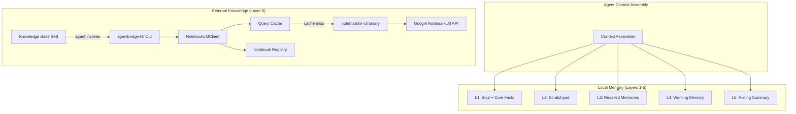
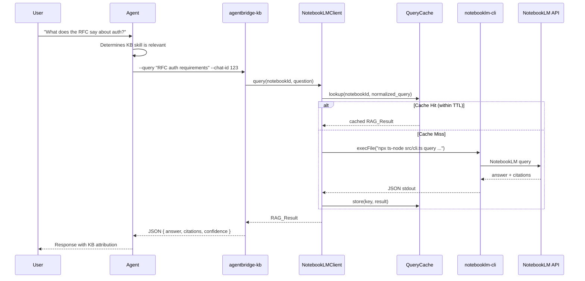
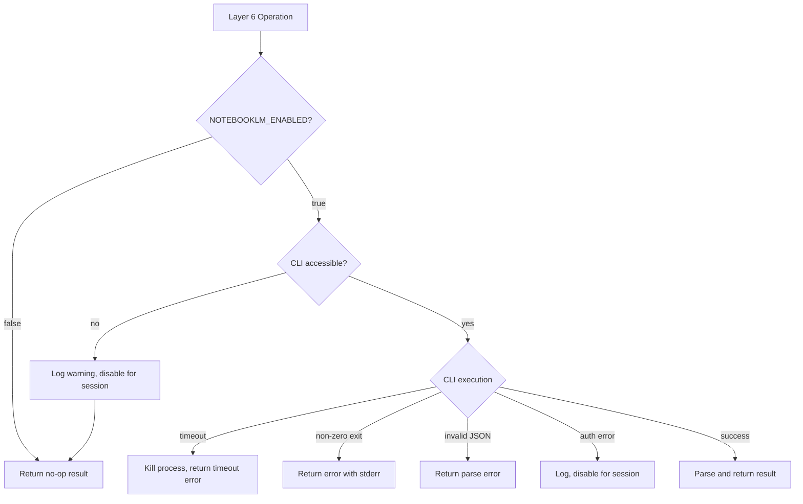

# Design Document: NotebookLM RAG Integration (Layer 6)

## Overview

This design adds a Layer 6 persistent RAG knowledge base to the agent's memory architecture, powered by Google NotebookLM and accessed via the `notebooklm-cli` command-line tool. Layer 6 complements the existing local memory tiers (Layers 1–5) by providing cloud-backed retrieval over user-curated reference material — documents, guides, and research that are too large for local context windows.

The integration follows the same patterns established by the existing memory system:
- **Component**: `NotebookLMClient` in `src/components/notebooklm-client.ts` wraps CLI invocations
- **CLI command**: `agentbridge-kb` in `src/cli/agentbridge-kb.ts` provides the agent-facing entry point
- **Skill**: `skills/knowledge-base/SKILL.md` teaches the agent when and how to query Layer 6
- **Registry**: `.agentbridge/notebooklm/registry.json` maps notebook names to IDs
- **Configuration**: Environment variables following the `NOTEBOOKLM_*` prefix convention

The design is intentionally decoupled — Layer 6 is entirely optional. When disabled (`NOTEBOOKLM_ENABLED=false`, the default), all code paths are no-ops and the agent operates exactly as before.

### Design Decisions

1. **CLI-based, not MCP**: The `notebooklm-cli` is invoked via `child_process.execFile` rather than running as an MCP server. This keeps the integration simple, stateless per-invocation, and avoids long-running process management.
2. **Skill-driven, not automatic**: The agent decides when to query Layer 6 based on the SKILL.md guidance. No automatic per-message queries — this mirrors how `memory-search` works.
3. **Graceful degradation**: All Layer 6 failures are caught and logged. The agent continues with Layers 1–5. This follows the MemoryManager pattern where all public methods are wrapped in try/catch.
4. **In-memory cache**: Query results are cached with a configurable TTL to avoid redundant API calls. Cache uses normalized keys for better hit rates.

## Architecture

### Memory Tier Diagram



### Integration Flow



## Components and Interfaces

### 1. NotebookLMClient (`src/components/notebooklm-client.ts`)

The core wrapper around the `notebooklm-cli` binary. Follows the same pattern as `MemoryManager` — constructor takes config, `initialize()` validates the CLI path, all public methods catch exceptions and return structured results.

```typescript
export class NotebookLMClient {
  constructor(config: NotebookLMConfig);

  /** Validate CLI path exists and is accessible. Throws on failure. */
  async initialize(): Promise<void>;

  /** Query a notebook. Returns cached result if within TTL. */
  async query(notebookId: string, question: string): Promise<RAGResult>;

  /** List all notebooks from the CLI. */
  async listNotebooks(): Promise<NotebookInfo[]>;

  /** Create a new notebook. */
  async createNotebook(name: string): Promise<string>; // returns notebook ID

  /** Add a source to a notebook. */
  async addSource(notebookId: string, source: SourceDescriptor): Promise<SourceInfo>;

  /** List sources in a notebook. */
  async listSources(notebookId: string): Promise<SourceInfo[]>;

  /** Delete a source from a notebook. */
  async deleteSource(notebookId: string, sourceId: string): Promise<void>;

  /** Get cache statistics for observability. */
  getCacheStats(): { size: number; hits: number; misses: number };

  /** Shut down — clear cache, no persistent state to close. */
  close(): void;
}
```

**Internal details:**
- Uses `child_process.execFile` with `AbortController` for timeout enforcement
- CLI invocation pattern: `npx ts-node src/cli.ts <command> [args]` from the configured `cliPath` directory
- All CLI output is expected as JSON on stdout; stderr is captured for error reporting
- Query cache is a `Map<string, { result: RAGResult; timestamp: number }>` with LRU eviction at 100 entries

### 2. Notebook Registry (`src/components/notebook-registry.ts`)

A simple JSON file manager for mapping notebook names to IDs. Follows the pattern of `TranscriptWriter` — synchronous file I/O, creates directories on first use.

```typescript
export class NotebookRegistry {
  constructor(registryDir: string); // default: ~/.agentbridge/notebooklm/

  /** Load registry from disk. Creates empty registry if file doesn't exist. */
  load(): NotebookRegistryData;

  /** Save registry to disk. */
  save(data: NotebookRegistryData): void;

  /** Resolve a notebook name to its ID. Returns null if not found. */
  resolve(name: string): string | null;

  /** Register a new notebook. */
  register(entry: NotebookRegistryEntry): void;

  /** List all registered notebooks. */
  list(): NotebookRegistryEntry[];
}
```

**File location:** `.agentbridge/notebooklm/registry.json`

### 3. agentbridge-kb CLI (`src/cli/agentbridge-kb.ts`)

The agent-facing CLI command. Follows the exact pattern of `agentbridge-store.ts` and `agentbridge-recall.ts`:
- Parses args manually (no external arg parser — matches existing convention)
- Outputs JSON to stdout for all results (success and error)
- Exits with code 0 even on errors (to avoid breaking agent tool invocation flow)
- Exports `parseArgs` and `validateArgs` for unit testing

**Subcommands:**

| Subcommand | Args | Description |
|---|---|---|
| `query` | `--query`, `--notebook` (opt), `--chat-id` | Query a notebook |
| `notebooks list` | (none) | List registered notebooks |
| `notebooks create` | `--name`, `--description` (opt) | Create a notebook |
| `sources list` | `--notebook` | List sources in a notebook |
| `sources add` | `--notebook`, `--type`, `--identifier` | Add a source |
| `sources remove` | `--notebook`, `--source-id` | Remove a source |

### 4. Knowledge Base Skill (`skills/knowledge-base/SKILL.md`)

Follows the YAML frontmatter + markdown format of existing skills (`memory-search`, `instant-store`, `topic-save`). Teaches the agent:
- How to invoke `agentbridge-kb query`
- When to use (reference material, documentation, research)
- When NOT to use (conversation context, personal memory, real-time info)
- How to interpret and attribute results

### 5. Telegram Command Handler (extension to `src/main.ts`)

Adds `/kb` command handling in the existing Telegram update handler, following the pattern of `/memory`, `/ingest`, `/reflect`, etc.

| Command | Action |
|---|---|
| `/kb list` | List registered notebooks |
| `/kb create <name>` | Create a new notebook |
| `/kb sources <notebook>` | List sources in a notebook |
| `/kb query <question>` | Query the default notebook |

### 6. Configuration Loading

Extends the existing environment variable loading pattern. NotebookLM config is loaded separately (like `loadMemoryConfig()`) to keep concerns isolated.

```typescript
// src/components/notebooklm-config.ts
export function loadNotebookLMConfig(): NotebookLMConfig;
```

## Data Models

### New Types (`src/types/notebooklm.ts`)

```typescript
/** Configuration for the NotebookLM Layer 6 integration. */
export type NotebookLMConfig = {
  enabled: boolean;
  cliPath: string;
  timeoutMs: number;
  defaultNotebook: string;
  queryCacheTtlMs: number;
};

/** A structured response from a NotebookLM RAG query. */
export type RAGResult = {
  answer: string;
  citations: RAGCitation[];
  confidence: "high" | "medium" | "low" | "none";
  notebookId: string;
  query: string;
};

/** A citation from a RAG query result. */
export type RAGCitation = {
  sourceId: string;
  sourceName: string;
  excerpt: string;
};

/** Descriptor for a source to upload to a notebook. */
export type SourceDescriptor = {
  type: "url" | "pdf" | "text" | "markdown";
  identifier: string; // URL or file path
};

/** Information about a source in a notebook. */
export type SourceInfo = {
  id: string;
  name: string;
  type: string;
  addedAt: number; // Unix timestamp ms
};

/** Information about a notebook. */
export type NotebookInfo = {
  id: string;
  name: string;
};

/** A single entry in the notebook registry. */
export type NotebookRegistryEntry = {
  name: string;
  notebookId: string;
  description: string;
  createdAt: number; // Unix timestamp ms
  sourceCount: number;
};

/** The full registry file structure. */
export type NotebookRegistryData = {
  version: 1;
  notebooks: NotebookRegistryEntry[];
};

/** Result of an agentbridge-kb query command (JSON output). */
export type KBQueryResult = {
  answer: string;
  citations: RAGCitation[];
  confidence: string;
  notebookName: string;
  cached: boolean;
};

/** Error result from agentbridge-kb (JSON output). */
export type KBErrorResult = {
  error: string;
};
```

### Type Exports

Add to `src/types/index.ts`:

```typescript
export type {
  NotebookLMConfig,
  RAGResult,
  RAGCitation,
  SourceDescriptor,
  SourceInfo,
  NotebookInfo,
  NotebookRegistryEntry,
  NotebookRegistryData,
  KBQueryResult,
  KBErrorResult,
} from "./notebooklm.js";
```

### Environment Variables

| Variable | Type | Default | Description |
|---|---|---|---|
| `NOTEBOOKLM_ENABLED` | boolean | `false` | Enable/disable Layer 6 |
| `NOTEBOOKLM_CLI_PATH` | string | `/mnt/c/Users/qakosal/workspace/openclaw/notebooklm-mcp-cli` | Path to notebooklm-cli project |
| `NOTEBOOKLM_TIMEOUT_MS` | number | `30000` | CLI command timeout |
| `NOTEBOOKLM_DEFAULT_NOTEBOOK` | string | `""` | Default notebook ID for queries |
| `NOTEBOOKLM_QUERY_CACHE_TTL_MS` | number | `300000` | Cache TTL (5 minutes) |

### Registry File Format

```json
{
  "version": 1,
  "notebooks": [
    {
      "name": "research",
      "notebookId": "abc-123",
      "description": "Research papers and notes",
      "createdAt": 1720000000000,
      "sourceCount": 5
    }
  ]
}
```

### package.json Addition

```json
{
  "bin": {
    "agentbridge-kb": "dist/cli/agentbridge-kb.js"
  }
}
```


## Correctness Properties

*A property is a characteristic or behavior that should hold true across all valid executions of a system — essentially, a formal statement about what the system should do. Properties serve as the bridge between human-readable specifications and machine-verifiable correctness guarantees.*

### Property 1: CLI Output Parsing Round-Trip

*For any* valid JSON string conforming to the NotebookLM CLI output schema, parsing it through `NotebookLMClient`'s internal parser should produce a typed `RAGResult` (or `NotebookInfo[]`, `SourceInfo[]`, etc.) whose fields match the original JSON values. *For any* invalid or malformed JSON string, the parser should return a structured error object (never throw).

**Validates: Requirements 1.9, 1.1**

### Property 2: Configuration Boolean Parsing

*For any* string value of the `NOTEBOOKLM_ENABLED` environment variable, `loadNotebookLMConfig()` should return `enabled: true` only when the value is exactly `"true"` or `"1"`, and `enabled: false` for all other values including empty string and undefined.

**Validates: Requirements 2.1**

### Property 3: Disabled State No-Ops

*For any* Layer 6 operation (query, listNotebooks, createNotebook, addSource, listSources, deleteSource) invoked when `NotebookLMConfig.enabled` is `false`, the operation should return immediately without invoking any CLI subprocess, and should return a well-defined empty/error result.

**Validates: Requirements 2.3**

### Property 4: Registry Register-Then-Resolve

*For any* valid `NotebookRegistryEntry` with a unique name, after calling `registry.register(entry)`, calling `registry.resolve(entry.name)` should return `entry.notebookId`. The resolve operation should be case-sensitive on the name.

**Validates: Requirements 3.2, 3.3**

### Property 5: Registry JSON Round-Trip

*For any* valid `NotebookRegistryData` object, calling `registry.save(data)` followed by `registry.load()` should produce an object deeply equal to the original.

**Validates: Requirements 3.5**

### Property 6: CLI Argument Parsing

*For any* valid combination of `--query`, `--notebook`, `--chat-id` argument strings (non-empty query, optional notebook, numeric chat-id), `parseArgs()` should extract each value correctly. The extracted `query` should equal the input query string, `notebook` should equal the input notebook string (or be undefined if omitted), and `chatId` should be the numeric parse of the input.

**Validates: Requirements 4.3, 5.2**

### Property 7: CLI Subcommand Routing

*For any* valid subcommand string from the set {`"query"`, `"notebooks list"`, `"notebooks create"`, `"sources list"`, `"sources add"`, `"sources remove"`}, the CLI argument parser should correctly identify the subcommand and route to the appropriate handler. *For any* string not in this set, the parser should produce a validation error.

**Validates: Requirements 5.1**

### Property 8: CLI Output Always Valid JSON

*For any* execution of the `agentbridge-kb` command (whether the subcommand succeeds or fails), the stdout output should be a valid JSON string parseable by `JSON.parse()`. Error outputs should contain an `error` field.

**Validates: Requirements 5.3, 5.4**

### Property 9: CLI Validation Errors for Missing Parameters

*For any* subcommand that requires parameters (e.g., `query` requires `--query` and `--chat-id`), invoking the command with any subset of required parameters missing should produce a JSON error result with a descriptive `error` field mentioning the missing parameter name.

**Validates: Requirements 5.5**

### Property 10: Cache Idempotence Within TTL

*For any* query `(notebookId, question)` pair, if the first call returns result `R` and a second call with the same pair occurs within the configured TTL, the second call should return a result deeply equal to `R` without invoking the CLI.

**Validates: Requirements 6.2, 6.6**

### Property 11: Cache Expiry After TTL

*For any* cached query entry, if the elapsed time since caching exceeds the configured TTL, the next query with the same key should not return the cached result (should invoke the CLI for a fresh result).

**Validates: Requirements 6.3**

### Property 12: Cache Key Normalization

*For any* two query strings that differ only in letter casing and/or whitespace (leading, trailing, or internal multiple spaces), the cache should treat them as the same key. Specifically, `normalizeKey(q1) === normalizeKey(q2)` when `q1.toLowerCase().replace(/\s+/g, ' ').trim() === q2.toLowerCase().replace(/\s+/g, ' ').trim()`.

**Validates: Requirements 6.4**

### Property 13: Cache Max Size Invariant

*For any* sequence of N cache insertions (where N > 100), the cache size should never exceed 100 entries. After each insertion, `cache.size <= 100`.

**Validates: Requirements 6.5**

### Property 14: Disabled KB Telegram Response

*For any* `/kb` subcommand string (list, create, sources, query, or any other), when `NotebookLMConfig.enabled` is `false`, the Telegram handler should respond with exactly "📚 Knowledge base is disabled."

**Validates: Requirements 9.5**

### Property 15: Exception Safety

*For any* CLI invocation that throws an exception (including `ENOENT`, `EACCES`, timeout `AbortError`, or any `Error` subclass), the `NotebookLMClient` method should catch the exception and return a structured error object with a descriptive `error` field, never propagating the exception to the caller.

**Validates: Requirements 10.6**

## Error Handling

### Error Categories and Responses

| Category | Trigger | Response | Recovery |
|---|---|---|---|
| CLI Not Found | `ENOENT` on `execFile` | Log error, disable Layer 6 for session | User re-enables or fixes path |
| CLI Timeout | `AbortError` after configured timeout | Kill child process, return timeout error | Agent informs user, user may retry |
| CLI Non-Zero Exit | Exit code ≠ 0 | Return error with stderr content | Agent informs user |
| CLI Invalid JSON | stdout is not valid JSON | Return parse error with raw output snippet | Log for debugging |
| Auth Error | CLI returns auth-related error | Log error, disable Layer 6 for session | User fixes credentials |
| Registry Corrupt | JSON.parse fails on registry file | Log warning, create fresh empty registry | Notebooks must be re-registered |
| Network Error | CLI reports network/API failure | Return error to agent | Agent falls back to Layers 1–5 |

### Error Propagation Strategy

Following the `MemoryManager` pattern:
1. All `NotebookLMClient` public methods wrap their body in try/catch
2. Errors are logged via `logError(TAG, message, err)`
3. Structured error objects are returned (never thrown)
4. The agent receives JSON with an `error` field and decides how to respond to the user
5. The `agentbridge-kb` CLI always exits with code 0, outputting error JSON to stdout

### Graceful Degradation Flow



## Testing Strategy

### Dual Testing Approach

This feature uses both unit tests and property-based tests for comprehensive coverage:

- **Unit tests** (vitest): Specific examples, edge cases, error conditions, integration points
- **Property tests** (fast-check + vitest): Universal properties across generated inputs

The project already uses `vitest` and `fast-check` (both in `devDependencies`).

### Property-Based Testing Configuration

- Library: `fast-check` (already installed)
- Runner: `vitest` (already installed)
- Minimum iterations: 100 per property test
- Each property test must reference its design document property with a tag comment:
  ```typescript
  // Feature: notebooklm-rag-integration, Property 5: Registry JSON Round-Trip
  ```

### Test File Organization

| Test File | Scope |
|---|---|
| `src/components/notebooklm-client.test.ts` | Properties 1, 3, 10, 11, 12, 13, 15 |
| `src/components/notebook-registry.test.ts` | Properties 4, 5 |
| `src/components/notebooklm-config.test.ts` | Property 2 |
| `src/cli/agentbridge-kb.test.ts` | Properties 6, 7, 8, 9 |
| `src/components/notebooklm-telegram.test.ts` | Property 14 |

### Unit Test Coverage

Unit tests should cover:
- Each CLI subcommand with valid inputs (happy path examples)
- Edge cases: empty strings, missing parameters, corrupted registry, CLI not found
- Error conditions: timeout, non-zero exit, invalid JSON, auth errors
- Integration: Telegram `/kb` command routing, `/memory` Layer 6 status line
- Source type validation (url, pdf, text, markdown)

### Property Test → Design Property Mapping

Each correctness property (Properties 1–15) maps to exactly one property-based test. The test generates random inputs using fast-check arbitraries and verifies the universal property holds across all generated cases.

**Key generators needed:**
- `arbRAGResultJSON`: Random valid CLI JSON output strings
- `arbNotebookRegistryData`: Random valid registry data with 0–20 notebooks
- `arbCLIArgs`: Random valid/invalid CLI argument arrays
- `arbQueryString`: Random query strings with varying case and whitespace
- `arbNotebookRegistryEntry`: Random valid registry entries

### Mocking Strategy

- CLI invocations (`child_process.execFile`) are mocked in all tests — no real CLI calls
- File system operations for registry tests use a temp directory
- Timer/clock mocking for cache TTL tests (vitest fake timers)
