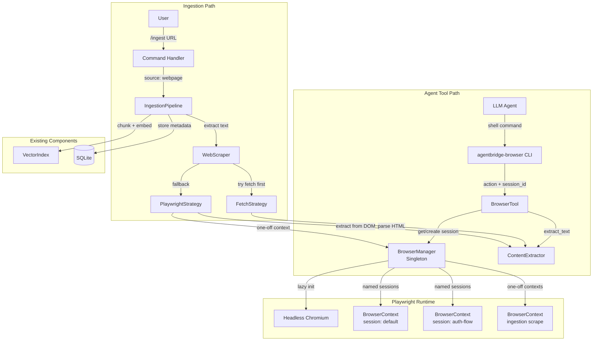
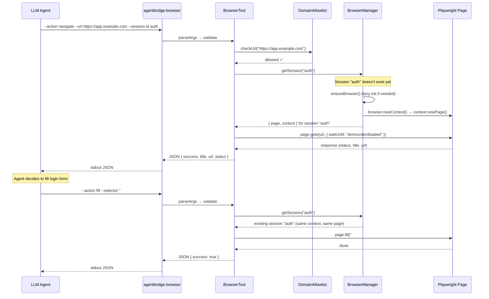
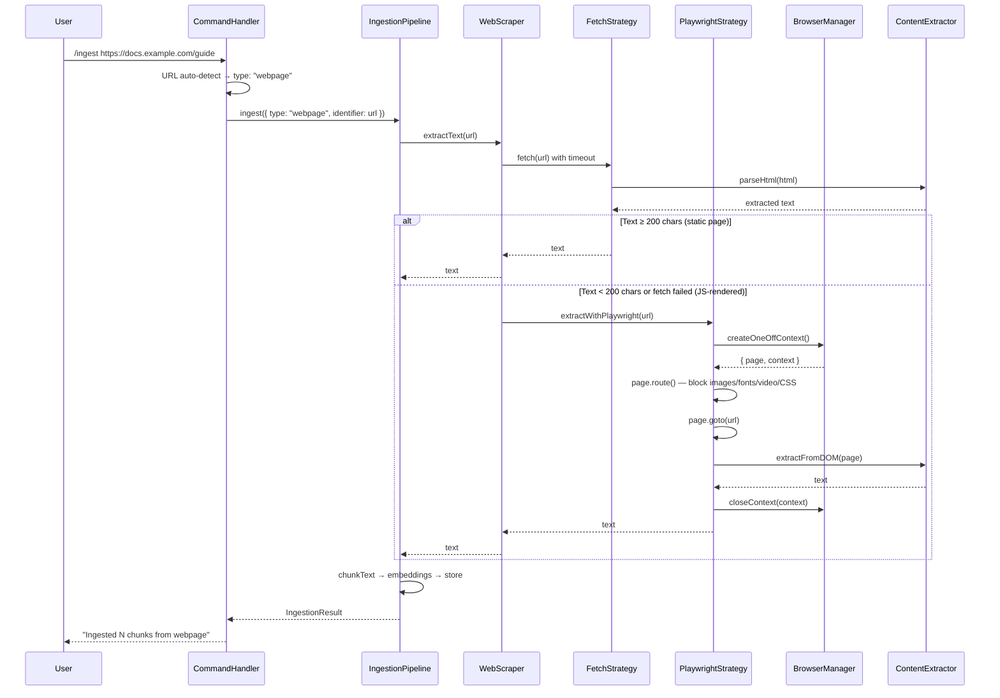
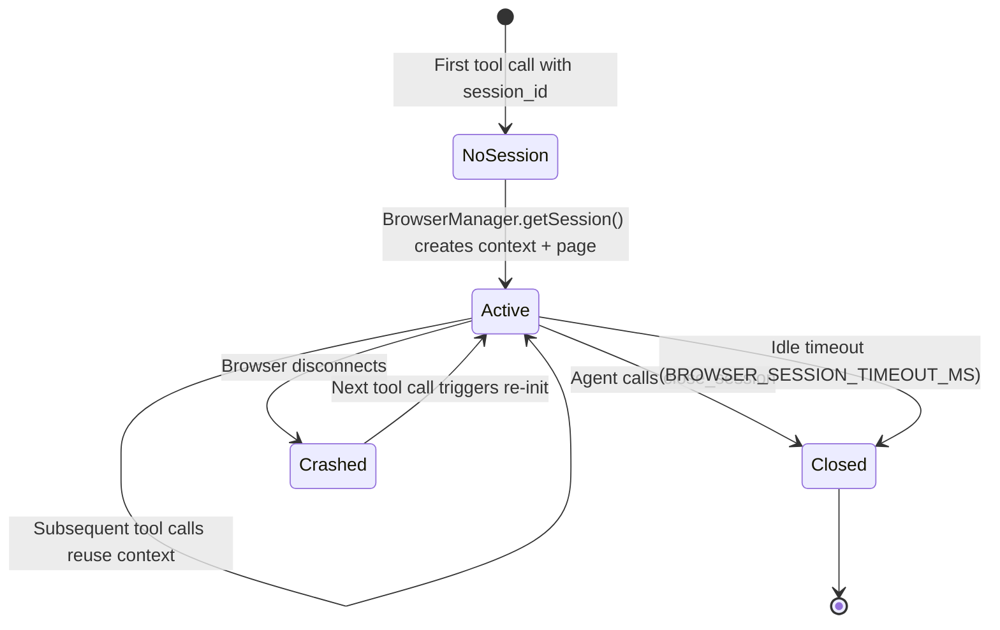

# Design Document: Playwright Web Ingestion & Agent Browser Tool

## Overview

This feature adds two capabilities to AgentBridge:

1. **Agent-callable browser tool** (`agentbridge-browser`) — a CLI command that gives the LLM agent direct control over a headless Chromium browser. The agent can navigate pages, fill forms, click elements, extract text, take screenshots, and manage persistent sessions. This enables complex multi-step workflows like authentication flows (login → fill credentials → submit → read authenticated content). Follows the same pattern as `agentbridge-recall` and `agentbridge-store`.

2. **Webpage ingestion** — extends the existing `/ingest` command to accept HTTP/HTTPS URLs. Uses a hybrid fetch-first strategy: try lightweight `fetch()` + HTML parsing first, fall back to Playwright for JavaScript-rendered pages. Delegates to the same Browser_Manager singleton for Playwright operations.

Both capabilities share a singleton `BrowserManager` that lazily initializes a headless Chromium instance, manages named sessions for the agent tool, provides one-off contexts for ingestion scrapes, and shuts down gracefully.

## Architecture



### Agent Tool Call Flow



### Ingestion Flow



### Session Lifecycle



## Components and Interfaces

### Component 1: BrowserManager (Singleton)

**File**: `src/components/browser-manager.ts`

**Purpose**: Manages the Playwright browser lifecycle — lazy initialization, named session management, one-off contexts for ingestion, idle timeout cleanup, and graceful shutdown.

**Interface**:
```typescript
class BrowserManager {
  /** Get or create a named session. Returns the Page for that session. */
  async getSession(sessionId: string): Promise<BrowserSession>;

  /** Close a specific named session and release its resources. */
  async closeSession(sessionId: string): Promise<void>;

  /** Create a one-off BrowserContext for ingestion scrapes (no session tracking). */
  async createOneOffContext(): Promise<{ context: BrowserContext; page: Page }>;

  /** Close a one-off context after scraping. */
  async closeContext(context: BrowserContext): Promise<void>;

  /** Shut down everything: all sessions, the browser, cleanup timers. */
  async shutdown(): Promise<void>;

  /** Number of active named sessions. */
  get activeSessionCount(): number;
}
```

**Responsibilities**:
- Lazy-launch headless Chromium on first request (`chromium.launch()`)
- Detect browser disconnection and re-launch on next request
- Track named sessions in a `Map<string, BrowserSession>`
- Enforce max concurrent sessions (`BROWSER_MAX_SESSIONS`, default 3)
- Run an idle-check interval that closes sessions exceeding `BROWSER_SESSION_TIMEOUT_MS` (default 5 min)
- Launch Chromium with `--no-sandbox` for WSL/Docker compatibility
- Set configurable User-Agent on all contexts

### Component 2: BrowserTool

**File**: `src/components/browser-tool.ts`

**Purpose**: Implements the seven browser actions (navigate, click, fill, extract_text, screenshot, get_page_info, close_session). Pure action dispatch — receives parsed args, calls BrowserManager + Playwright APIs, returns structured JSON.

**Interface**:
```typescript
class BrowserTool {
  constructor(browserManager: BrowserManager, domainAllowlist: DomainAllowlist);

  /** Execute a browser action and return a JSON-serializable result. */
  async execute(action: BrowserAction): Promise<BrowserToolResult>;
}
```

**Actions**:
| Action | Required Params | Optional Params | Returns |
|--------|----------------|-----------------|---------|
| `navigate` | `url` | `sessionId` | `{ success, title, url, status }` |
| `click` | `selector` | `sessionId` | `{ success, navigated, title?, url? }` |
| `fill` | `selector`, `value` | `sessionId` | `{ success }` |
| `extract_text` | — | `selector`, `sessionId` | `{ success, text, truncated }` |
| `screenshot` | — | `fullPage`, `sessionId` | `{ success, filePath }` |
| `get_page_info` | — | `sessionId` | `{ success, url, title, elements[] }` |
| `close_session` | — | `sessionId` | `{ success }` |

### Component 3: BrowserTool CLI

**File**: `src/cli/agentbridge-browser.ts`

**Purpose**: CLI entry point following the same pattern as `agentbridge-recall.ts` and `agentbridge-store.ts`. Parses argv, validates, instantiates BrowserManager + BrowserTool, executes, prints JSON to stdout.

**Interface**: Shell command
```bash
agentbridge-browser --action navigate --url "https://example.com" --session-id default
agentbridge-browser --action fill --selector "#email" --value "[email]" --session-id auth
agentbridge-browser --action click --selector "text=Sign In" --session-id auth
agentbridge-browser --action extract_text --session-id auth
agentbridge-browser --action screenshot --full-page --session-id auth
agentbridge-browser --action get_page_info --session-id auth
agentbridge-browser --action close_session --session-id auth
```

**Note on singleton persistence**: Unlike `agentbridge-recall` (which opens a read-only DB, queries, and exits), the browser tool needs session persistence across invocations. The BrowserManager singleton will be managed by the main AgentBridge process (`src/main.ts`), and the CLI will communicate with it via a lightweight IPC mechanism (Unix domain socket at `~/.agentbridge/browser.sock`). If the main process isn't running, the CLI falls back to launching its own ephemeral browser instance (sessions won't persist across calls in this mode).

### Component 4: DomainAllowlist

**File**: `src/components/domain-allowlist.ts`

**Purpose**: Validates URLs against a configurable allowlist of domain patterns. Prevents the agent from navigating to arbitrary domains.

**Interface**:
```typescript
class DomainAllowlist {
  constructor(patterns: string[]);

  /** Check if a URL's hostname matches the allowlist. Returns true if allowed. */
  isAllowed(url: string): boolean;

  /** Get the list of configured patterns (for error messages). */
  get patterns(): string[];

  /** True if no patterns configured (open mode). */
  get isOpenMode(): boolean;
}
```

**Pattern matching**:
- `*.example.com` → matches any subdomain of example.com
- `example.com` → exact match only
- Empty list → open mode (all domains allowed)

### Component 5: ContentExtractor

**File**: `src/components/content-extractor.ts`

**Purpose**: Strips non-content HTML elements and returns clean plain text. Shared by both the agent tool's `extract_text` action and the ingestion pipeline's WebScraper.

**Interface**:
```typescript
/** Parse raw HTML string and return clean text. */
function extractTextFromHtml(html: string): string;

/** Extract clean text from a live Playwright Page (runs in browser context). */
async function extractTextFromPage(page: Page, selector?: string): Promise<string>;
```

**Stripping rules**:
- Remove elements: `script`, `style`, `nav`, `footer`, `header`, `aside`
- Remove elements with `role="navigation"` or `role="banner"`
- Collapse consecutive whitespace into single spaces/newlines
- Decode HTML entities: `&amp;`, `&lt;`, `&gt;`, `&quot;`, `&#39;`, `&nbsp;`
- Strip all remaining HTML tags
- Return empty string → treated as extraction failure by callers

### Component 6: WebScraper

**File**: `src/components/web-scraper.ts`

**Purpose**: Implements the hybrid fetch-first / Playwright-fallback strategy for the ingestion pipeline.

**Interface**:
```typescript
class WebScraper {
  constructor(browserManager: BrowserManager);

  /** Extract text content from a URL. Tries fetch first, falls back to Playwright. */
  async extractText(url: string): Promise<string>;
}
```

**Strategy**:
1. `fetch(url)` with `WEB_SCRAPE_FETCH_TIMEOUT_MS` timeout and `WEB_SCRAPE_USER_AGENT`
2. Parse HTML response with `ContentExtractor.extractTextFromHtml()`
3. If extracted text ≥ 200 chars → return (static page, done)
4. If text < 200 chars or fetch failed → fall back to Playwright
5. Playwright: create one-off context, block heavy resources, navigate, extract from DOM, close context
6. If Playwright also fails → throw descriptive error

### Component 7: SKILL.md

**File**: `skills/browser/SKILL.md`

**Purpose**: Skill definition file that teaches the LLM agent how and when to use the browser tool. Follows the same frontmatter + sections structure as `skills/memory-search/SKILL.md` and `skills/instant-store/SKILL.md`.

## Data Models

### New Types (`src/types/browser.ts`)

```typescript
/** Actions the browser tool supports. */
export type BrowserActionType =
  | "navigate"
  | "click"
  | "fill"
  | "extract_text"
  | "screenshot"
  | "get_page_info"
  | "close_session";

/** Parsed browser tool action from CLI args. */
export type BrowserAction = {
  action: BrowserActionType;
  sessionId: string;       // default: "default"
  url?: string;            // for navigate
  selector?: string;       // for click, fill, extract_text
  value?: string;          // for fill
  fullPage?: boolean;      // for screenshot
};

/** Result returned by the browser tool (JSON to stdout). */
export type BrowserToolResult = {
  success: boolean;
  error?: string;
  // navigate
  title?: string;
  url?: string;
  status?: number;
  // click
  navigated?: boolean;
  // extract_text
  text?: string;
  truncated?: boolean;
  // screenshot
  filePath?: string;
  // get_page_info
  elements?: PageElement[];
};

/** An interactive element on the page (for get_page_info). */
export type PageElement = {
  tag: string;             // "a", "button", "input", etc.
  selector: string;        // CSS selector to target this element
  text?: string;           // visible text content
  type?: string;           // input type (for form elements)
  name?: string;           // input name attribute
  placeholder?: string;    // input placeholder
  href?: string;           // link href (for anchors)
};

/** Internal session state tracked by BrowserManager. */
export type BrowserSession = {
  sessionId: string;
  context: import("playwright").BrowserContext;
  page: import("playwright").Page;
  createdAt: number;
  lastActivityAt: number;
};
```

### Extended IngestionSource Type

The existing `IngestionSource` type in `src/types/memory.ts` gains a new source type:

```typescript
export type IngestionSource = {
  type: "youtube" | "pdf" | "text" | "markdown" | "webpage";
  identifier: string;
};
```

### Environment Variables

| Variable | Type | Default | Used By |
|----------|------|---------|---------|
| `BROWSER_ALLOWED_DOMAINS` | string (comma-separated) | `""` (open mode) | DomainAllowlist |
| `BROWSER_SESSION_TIMEOUT_MS` | number | `300000` (5 min) | BrowserManager |
| `BROWSER_MAX_SESSIONS` | number | `3` | BrowserManager |
| `WEB_SCRAPE_FETCH_TIMEOUT_MS` | number | `15000` | WebScraper (FetchStrategy) |
| `WEB_SCRAPE_PLAYWRIGHT_TIMEOUT_MS` | number | `30000` | WebScraper (PlaywrightStrategy) |
| `WEB_SCRAPE_USER_AGENT` | string | `"Mozilla/5.0 (compatible; AgentBridge/1.0)"` | WebScraper, BrowserManager |


## Correctness Properties

*A property is a characteristic or behavior that should hold true across all valid executions of a system — essentially, a formal statement about what the system should do. Properties serve as the bridge between human-readable specifications and machine-verifiable correctness guarantees.*

### Property 1: CLI action validation

*For any* string passed as the `--action` parameter, the CLI argument parser accepts it if and only if it is one of `navigate`, `click`, `fill`, `extract_text`, `screenshot`, `get_page_info`, or `close_session`. All other strings are rejected with an error.

**Validates: Requirements 1.2**

### Property 2: JSON output structure invariant

*For any* browser tool execution (whether success or failure), the output written to stdout is valid JSON containing at minimum a `success` boolean field. On failure, it additionally contains an `error` string field.

**Validates: Requirements 1.4**

### Property 3: Domain allowlist matching

*For any* URL and any set of domain patterns (including the empty set):
- If the pattern set is empty (open mode), the URL is allowed.
- If the pattern set is non-empty, the URL is allowed if and only if its hostname matches at least one pattern, where `*.X` matches any hostname ending in `.X` and a bare pattern `X` matches the hostname exactly equal to `X`.
- When a URL is rejected, the error response contains the rejected hostname and the full list of allowed patterns.

**Validates: Requirements 2.3, 9.2, 9.3, 9.4, 9.5**

### Property 4: ContentExtractor produces clean text

*For any* HTML string, the output of `extractTextFromHtml()` contains no HTML tags, no content from `script`/`style`/`nav`/`footer`/`header`/`aside` elements, no consecutive whitespace characters (spaces, tabs, newlines are collapsed to single separators), and all common HTML entities (`&amp;`, `&lt;`, `&gt;`, `&quot;`, `&#39;`, `&nbsp;`) are decoded to their plain text equivalents.

**Validates: Requirements 5.3, 14.2, 17.1, 17.2, 17.3, 17.4**

### Property 5: Text truncation at 4000 characters

*For any* extracted text string, if its length exceeds 4000 characters, the browser tool response text is at most 4000 characters and the `truncated` flag is `true`. If the length is 4000 or fewer, the full text is returned and `truncated` is `false`.

**Validates: Requirements 5.4**

### Property 6: Interactive element list capped at 50

*For any* page with N interactive elements, the `get_page_info` response contains at most 50 elements in the `elements` array.

**Validates: Requirements 7.2**

### Property 7: Session create-or-reuse idempotence

*For any* session ID string, the first call to `BrowserManager.getSession(id)` creates a new session, and any subsequent call to `BrowserManager.getSession(id)` returns the same `BrowserSession` object (same context, same page) without creating a new one.

**Validates: Requirements 8.1, 8.2**

### Property 8: Session close removes session

*For any* active session ID, after calling `BrowserManager.closeSession(id)`, the session no longer exists in the manager's session map, and a subsequent `getSession(id)` call creates a fresh session (different context).

**Validates: Requirements 8.3**

### Property 9: Idle timeout cleanup

*For any* session whose `lastActivityAt` timestamp is older than `BROWSER_SESSION_TIMEOUT_MS` milliseconds ago, the idle-check sweep closes that session and removes it from the session map.

**Validates: Requirements 8.4**

### Property 10: Max sessions enforcement

*For any* positive integer N configured as `BROWSER_MAX_SESSIONS`, when N sessions are already active, attempting to create session N+1 with a new session ID returns an error and does not increase the active session count.

**Validates: Requirements 8.5**

### Property 11: Credential masking

*For any* `fill` action targeting a password-type input field, the password value never appears in log output or in the JSON response. Log entries contain the action name, session ID, and target URL, but password values are replaced with `"***"`.

**Validates: Requirements 10.1, 10.2, 10.3**

### Property 12: Browser singleton reuse

*For any* sequence of `getSession()` or `createOneOffContext()` calls, the BrowserManager uses the same underlying Chromium browser instance for all calls (no duplicate launches), as long as the browser remains connected.

**Validates: Requirements 11.3**

### Property 13: Webpage ingestion metadata

*For any* successful webpage ingestion, the record stored in the `ingested_documents` table has `source_type` equal to `"webpage"` and `identifier` equal to the original URL string.

**Validates: Requirements 12.3**

### Property 14: URL auto-detection

*For any* string passed to the `/ingest` command:
- If it starts with `http://` or `https://` and the hostname matches `youtube.com`, `www.youtube.com`, `m.youtube.com`, or `youtu.be`, the detected source type is `"youtube"`.
- If it starts with `http://` or `https://` and the hostname does not match any YouTube domain, the detected source type is `"webpage"`.
- If it does not start with `http://` or `https://`, the existing file-extension detection logic applies unchanged.

**Validates: Requirements 13.1, 13.2, 13.3**

### Property 15: Fetch-first fallback threshold

*For any* URL processed by the WebScraper, the Playwright fallback is invoked if and only if the fetch strategy either failed (network error, non-2xx status, timeout) or produced extracted text with a trimmed length of fewer than 200 characters.

**Validates: Requirements 14.3, 14.4**

### Property 16: Environment variable parsing with defaults

*For any* combination of environment variable values (set, unset, or invalid), each configuration parameter resolves to either the parsed env var value (when valid) or the documented default value (when unset or invalid). Invalid values trigger a log warning.

**Validates: Requirements 18.1, 18.5**

### Property 17: Error responses include URL

*For any* navigation failure, ingestion failure, or Playwright extraction failure involving a URL, the error message string contains the URL that caused the failure.

**Validates: Requirements 2.4, 12.4, 15.5**

## Error Handling

### Browser Launch Failure

**Condition**: Playwright fails to launch Chromium (missing binary, missing system deps, sandbox issues).
**Response**: BrowserManager throws a descriptive error including the underlying Playwright error message. The CLI outputs a JSON error response suggesting `npx playwright install chromium` and `npx playwright install-deps chromium`.
**Recovery**: User installs dependencies and retries.

### Browser Crash / Disconnection

**Condition**: The Chromium process crashes or disconnects mid-operation.
**Response**: BrowserManager detects disconnection via Playwright's `browser.on('disconnected')` event. All active sessions are marked as invalid. The next `getSession()` or `createOneOffContext()` call launches a new browser instance.
**Recovery**: Automatic. Agent receives an error for the in-flight operation and can retry.

### Navigation Timeout

**Condition**: `page.goto()` exceeds the configured timeout (`WEB_SCRAPE_PLAYWRIGHT_TIMEOUT_MS`).
**Response**: BrowserTool catches the timeout error and returns a JSON error response including the URL and timeout duration.
**Recovery**: Agent can retry with a different URL or the user can increase the timeout via env var.

### Domain Allowlist Rejection

**Condition**: Agent attempts to navigate to a URL not in the allowlist.
**Response**: BrowserTool returns a JSON error listing the rejected domain and all allowed patterns. No browser navigation occurs.
**Recovery**: Agent adjusts its approach or the operator adds the domain to the allowlist.

### Session Limit Reached

**Condition**: Agent requests a new session when `BROWSER_MAX_SESSIONS` are already active.
**Response**: BrowserManager returns an error suggesting the agent close an existing session first. The error includes the list of active session IDs.
**Recovery**: Agent calls `close_session` on an unused session, then retries.

### Selector Not Found

**Condition**: A `click`, `fill`, or `extract_text` action targets a CSS/text selector that matches no element.
**Response**: BrowserTool catches Playwright's timeout/not-found error and returns a JSON error indicating the selector didn't match. Includes the selector string in the error.
**Recovery**: Agent can use `get_page_info` to discover available elements, then retry with a corrected selector.

### Fetch Strategy Failure (Ingestion)

**Condition**: `fetch()` fails with network error, non-2xx status, or timeout during ingestion.
**Response**: WebScraper logs the fetch failure at debug level and silently falls back to the Playwright strategy.
**Recovery**: Automatic fallback. If Playwright also fails, the error propagates to the user.

### Empty Content After Extraction

**Condition**: ContentExtractor produces empty text after stripping all non-content elements.
**Response**: ContentExtractor returns empty string. Callers (WebScraper, BrowserTool) treat this as extraction failure and throw/return an error indicating no content was found at the URL.
**Recovery**: User tries a different URL or the page may require authentication (agent can use the browser tool to log in first).

### Invalid Environment Variables

**Condition**: An env var like `BROWSER_MAX_SESSIONS` contains a non-numeric value.
**Response**: Config loader logs a warning and uses the default value. The system continues operating.
**Recovery**: Operator fixes the env var value.

## Testing Strategy

### Unit Testing

Unit tests cover pure logic and isolated component behavior:

- **CLI argument parsing** (`agentbridge-browser`): valid actions accepted, invalid rejected, default session-id applied, missing required params produce errors
- **DomainAllowlist**: wildcard matching, exact matching, open mode, rejection error messages
- **ContentExtractor**: tag stripping, entity decoding, whitespace collapsing, non-content element removal, empty input handling
- **URL auto-detection**: YouTube URLs → "youtube", non-YouTube HTTP URLs → "webpage", file paths → existing logic
- **BrowserToolResult serialization**: all result types produce valid JSON with required fields
- **Environment variable parsing**: valid values, missing values (defaults), invalid values (defaults + warning)
- **Text truncation**: texts above/below 4000 char threshold, truncated flag correctness
- **Credential masking**: password values replaced in logs, absent from JSON responses

### Property-Based Testing

**Library**: `fast-check`

Each property test runs a minimum of 100 iterations with randomly generated inputs. Each test is tagged with a comment referencing its design document property.

Property tests to implement:

- **Property 1** (CLI action validation): Generate random strings, verify only the 7 valid actions are accepted
  - Tag: `Feature: playwright-web-ingestion, Property 1: CLI action validation`
- **Property 3** (Domain allowlist matching): Generate random URLs and pattern sets, verify matching logic
  - Tag: `Feature: playwright-web-ingestion, Property 3: Domain allowlist matching`
- **Property 4** (ContentExtractor clean text): Generate random HTML strings with script/style/nav elements, verify output is clean
  - Tag: `Feature: playwright-web-ingestion, Property 4: ContentExtractor produces clean text`
- **Property 5** (Text truncation): Generate random strings of varying lengths, verify truncation behavior
  - Tag: `Feature: playwright-web-ingestion, Property 5: Text truncation at 4000 characters`
- **Property 7** (Session create-or-reuse): Generate random session ID strings, verify idempotent retrieval
  - Tag: `Feature: playwright-web-ingestion, Property 7: Session create-or-reuse idempotence`
- **Property 10** (Max sessions): Generate random max-session limits, verify enforcement
  - Tag: `Feature: playwright-web-ingestion, Property 10: Max sessions enforcement`
- **Property 14** (URL auto-detection): Generate random URLs (YouTube and non-YouTube) and file paths, verify classification
  - Tag: `Feature: playwright-web-ingestion, Property 14: URL auto-detection`
- **Property 16** (Env var parsing): Generate random env var values (valid, invalid, missing), verify defaults
  - Tag: `Feature: playwright-web-ingestion, Property 16: Environment variable parsing with defaults`
- **Property 17** (Error responses include URL): Generate random URLs, simulate failures, verify URL in error message
  - Tag: `Feature: playwright-web-ingestion, Property 17: Error responses include URL`

### Integration Testing

Integration tests require a real Playwright browser instance:

- **Full navigation flow**: navigate → extract_text → verify content
- **Session persistence**: navigate + login → new tool call with same session → verify authenticated state
- **Ingestion pipeline**: `/ingest <url>` → verify chunks stored in DB with correct metadata
- **Fetch-first fallback**: mock a JS-rendered page (empty body from fetch) → verify Playwright fallback triggers
- **Resource blocking**: verify ingestion scrapes block images/fonts/CSS, agent sessions do not
- **Idle timeout**: create session → wait past timeout → verify session cleaned up
- **Browser crash recovery**: disconnect browser → next call re-launches
- **WSL compatibility**: headless mode works without display server, `--no-sandbox` applied
